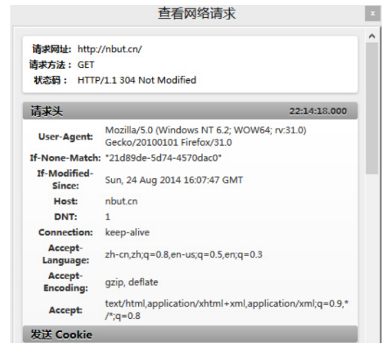

[TOC]

## 计算机网络

#### 1.由下往上说出 OSI 七层模型、TCP/IP 五层模型以及各层的代表协议

##### OSI：

**OSI 七层模型** 是国际标准化组织提出一个网络分层模型，其大体结构以及每一层提供的功能如下图所示：


每一层都专注做一件事情，并且每一层都需要使用下一层提供的功能比如传输层需要使用网络层提供的路有和寻址功能，这样传输层才知道把数据传输到哪里去。

**OSI 的七层体系结构概念清楚，理论也很完整，但是它比较复杂而且不实用，而且有些功能在多个层中重复出现。**

上面这种图可能比较抽象，再来一个比较生动的图片。下面这个图片是我在国外的一个网站上看到的，非常赞！


**既然 OSI 七层模型这么厉害，为什么干不过 TCP/IP 四 层模型呢？**

的确，OSI 七层模型当时一直被一些大公司甚至一些国家政府支持。这样的背景下，为什么会失败呢？我觉得主要有下面几方面原因：

1. OSI 的专家缺乏实际经验，他们在完成 OSI 标准时缺乏商业驱动力
2. OSI 的协议实现起来过分复杂，而且运行效率很低
3. OSI 制定标准的周期太长，因而使得按 OSI 标准生产的设备无法及时进入市场（20 世纪 90 年代初期，虽然整套的 OSI 国际标准都已经制定出来，但基于 TCP/IP 的互联网已经抢先在全球相当大的范围成功运行了）
4. OSI 的层次划分不太合理，有些功能在多个层次中重复出现。

OSI 七层模型虽然失败了，但是却提供了很多不错的理论基础。为了更好地去了解网络分层，OSI 七层模型还是非常有必要学习的。

最后再分享一个关于 OSI 七层模型非常不错的总结图片！


##### TCP/IP：

**TCP/IP 四层模型** 是目前被广泛采用的一种模型,我们可以将 TCP / IP 模型看作是 OSI 七层模型的精简版本，由以下 4 层组成：

1. 应用层
2. 传输层
3. 网络层
4. 网络接口层

需要注意的是，我们并不能将 TCP/IP 四层模型 和 OSI 七层模型完全精确地匹配起来，不过可以简单将两者对应起来，如下图所示：


###### 应用层（Application layer）

**应用层位于传输层之上，主要提供两个终端设备上的应用程序之间信息交换的服务，它定义了信息交换的格式，消息会交给下一层传输层来传输。** 我们把应用层交互的数据单元称为报文。


应用层协议定义了网络通信规则，对于不同的网络应用需要不同的应用层协议。在互联网中应用层协议很多，如支持 Web 应用的 HTTP 协议，支持电子邮件的 SMTP 协议等等。


###### 传输层（Transport layer）

**传输层的主要任务就是负责向两台终端设备进程之间的通信提供通用的数据传输服务。** 应用进程利用该服务传送应用层报文。“通用的”是指并不针对某一个特定的网络应用，而是多种应用可以使用同一个运输层服务。

**运输层主要使用以下两种协议：**

1. **传输控制协议 TCP**（Transmisson Control Protocol）--提供**面向连接**的，**可靠的**数据传输服务。
2. **用户数据协议 UDP**（User Datagram Protocol）--提供**无连接**的，尽最大努力的数据传输服务（**不保证数据传输的可靠性**）。


###### 网络层（Network layer）

**网络层负责为分组交换网上的不同主机提供通信服务。** 在发送数据时，网络层把运输层产生的报文段或用户数据报封装成分组和包进行传送。在 TCP/IP 体系结构中，由于网络层使用 IP 协议，因此分组也叫 IP 数据报，简称数据报。

注意 ⚠️：**不要把运输层的“用户数据报 UDP”和网络层的“IP 数据报”弄混**。

**网络层的还有一个任务就是选择合适的路由，使源主机运输层所传下来的分株，能通过网络层中的路由器找到目的主机。**

这里强调指出，网络层中的“网络”二字已经不是我们通常谈到的具体网络，而是指计算机网络体系结构模型中第三层的名称。

互联网是由大量的异构（heterogeneous）网络通过路由器（router）相互连接起来的。互联网使用的网络层协议是无连接的网际协议（Intert Prococol）和许多路由选择协议，因此互联网的网络层也叫做**网际层**或**IP 层**。


###### 网络接口层（Network interface layer）

我们可以把网络接口层看作是数据链路层和物理层的合体。

1. 数据链路层(data link layer)通常简称为链路层（ 两台主机之间的数据传输，总是在一段一段的链路上传送的）。**数据链路层的作用是将网络层交下来的 IP 数据报组装成帧，在两个相邻节点间的链路上传送帧。每一帧包括数据和必要的控制信息（如同步信息，地址信息，差错控制等）。**
2. **物理层的作用是实现相邻计算机节点之间比特流的透明传送，尽可能屏蔽掉具体传输介质和物理设备的差异**


#### 1（2）.（小牛肉博客版）由下往上说出 OSI 七层模型、TCP/IP 五层模型以及各层的代表协议

###### **1. 五层协议参考模型**

**所谓通信协议就是通信双方都必须要遵守的通信规则**。如果没有网络通信协议，计算机的数据将无法发送到网络上，更无法到达对方计算机，即使能够到达，对方也未必能读懂。**有了通信协议，网络通信才能够发生**。

一般我们用**五层协议参考模型**来进行计算机网络的学习：

- 应用层
- 运输层
- 网络层
- 数据链路层
- 物理层

上述各层的作用会在下文详细讲解，我们首先要明白**为什么要分层**：

协议的实现是很复杂的。因为协议要把人读得懂的数据，如网页、电子邮件等加工转化成可以在网络上传输的信号，需要进行的处理工作非常多。

两个系统中实体间的通信是一个十分复杂的过程。为了减少协议设计和调试过程的复杂性，网络协议通常都按**结构化**的层次方式来进行组织，每一层完成一定功能，每一层又都建立在它的下层之上。不同的网络协议，其层的数量、各层的名字、和功能不尽相同。

👍 也就是说，**每一层都是在下一层的基础上，通过层间接口向上一层提供一定的服务**，而把 “这种服务是如何实现的” **细节对上层加以屏蔽**。

❓ 那么，我们将一个大型网络体系分成了若干个层，**各个层之间是如何进行通信的呢**？

- 1）**对等层之间通信**（不同开放系统中的相同层次之间的通信，对等层实体之间的信息交换）：OSI 标准为每一层的通信都严格定义了 **协议数据单元 PDU**的格式。 **对等层之间的通信是目的**，对等层实体的协作保证该层功能和服务的实现
- 2）**相邻层之间通信**（相邻的上下层之间的通信，属于局部问题）：**相邻层之间的通信是手段**，保证对等层实体之间的通信得以实施

⭐ 假设网络协议分为若干层，那么 **A、B 两节点通信，实际是节点 A 的第 n 层与节点 B 的第 n 层进行通信**，故协议总是指某一层的协议，例如物理层协议、传输层协议、应用层协议。每一相邻层协议间有一接口，下层通过该接口向上一层提供服务。


###### **2. 物理层**

两台计算机之间要进行通信，必然需要**传输介质/物理媒介**来连接两台计算机，这样，我们才能把数据传输过去。传输介质分为：

- 导向型传输介质

  ：

  - 双绞线：适用于近距离
  - 同轴电缆（抗干扰性强）：适用于远距离
  - 光纤：带宽远远大于其他传输媒体

- 非导向型传输介质

  ：

  - 无线电波
  - 微波
  - 红外线、激光

⭐ 也就是说，**物理层的作用就是实现计算机之间的数据传送**，这个数据其实是**比特流**，物理层需要尽可能屏蔽掉具体传输介质和物理设备的差异， 使其上面的数据链路层不必考虑网络的具体传输介质是什么，即实现**比特流的透明传输**。

###### **3. 数据链路层**

物理层只是简单的把计算机连接起来并在上面传输比特流，它还是存在着很多问题的：

- 1）物理连接是有差错和不可靠的
- 2）物理设备之间可能存在传输速度不匹配问题

也就是说**仅仅靠物理层是无法保证数据传输的正确性的**。

⭐ 这样，数据链路层的主要作用就是**加强物理层传输原始比特流的功能，将物理层提供的可能出错的物理连接改造成为逻辑上无差错的数据链路，使之对网络层表现为一条无差错的链路**。在物理层提供服务的基础上，数据链路层还肩负着**为网络层提供服务**的责任，其最基本的服务是将来自网络层的 IP 数据报**封装成帧**，可靠的传输到相邻结点的目标网络层。

###### **① 封装成帧**

首先了解一下**为什么需要封装成帧**：前面说了，物理层它只是简单的把计算机连接起来并在上面传输比特流（0、1 序列），如果这些 0，1 组合的传送毫无规则的话，计算机是解读不了的。因此，我们需要制定一套规则来进行 0、1 的传送，让计算能够读懂这些序列。

⭐ 封装成帧就是：发送端的数据链路层接收到上层网络层传过来的 IP 数据报后，在其前后部分**添加**首部、尾部，这样就构成了一个**帧**。接收端在收到物理层上交的比特流后，就能根据首部和尾部的标记，从收到的比特流中识别帧的开始和结束。


把一台计算的的数据通过物理层和链路层发送给另一台计算机，究竟是谁发给谁的，计算机与计算机之间如何区分，你总得给他们一个唯一的标识吧？

于是，MAC 地址出现了 👇

###### **② MAC 地址**

MAC 地址就是链路层地址，长度为 6 字节（48 位），**用于唯一标识网络适配器（网卡）。**计算机之间的数据传送，就是通过 MAC 地址来唯一寻找、传送的。

**一台主机拥有多少个网络适配器就有多少个 MAC 地址**。例如笔记本电脑普遍存在无线网络适配器和有线网络适配器，因此就有两个 MAC 地址。

❓ 那么，一台计算机它是如何知道另一台计算机的 MAC 地址的呢？这是网络层的 ARP 地址解析协议做的事情，详见下文 👇

###### **4. 网络层**

在 计算机网络中进行通信的两个计算机之间可能会经过很多个数据链路，也可能还要经过很多通信子网。

**网络层的任务就是选择合适的网间路由和交换结点， 确保数据及时传送**。 在发送数据时，网络层把运输层产生的报文段或用户数据报封装成分组和包进行传送。

在 TCP/IP 体系结构中，由于网络层使用 IP 协议，因此分组也叫 IP 数据报 ，简称数据报。

###### **① IP 协议**

IP 协议用于**屏蔽下层物理网络的差异，为上层提供统一的 IP 数据报**。


IP 协议定义的地址，我们称之为 **IP 地址**。**IP 数据报中含有发/收方的 IP 地址**。

IP 协议提供无连接的、不可靠的、尽力的数据报投递服务

- 1）**无连接**的投递服务

  发送端可于任何时候自由发送数据，而接收端永远不知道自己会在何时从哪里接收到数据。每个数据报独立处理和传输， **一台主机发出的数据报序列，可能取不同的路径**， 甚至其中的一部分数据报会在传输过程中丢失；

- 2）**不可靠**的投递服务

  IP 协议本身不保证数据报投递的结果。 在传输的过程中，数据报可能会丢失、重复、延迟和乱序等， IP协议不对内容作任何检测，也不将这些结果通知收发双方； **I 数据报的丢失，通过路由器发 `ICMP报文` 告知**； 必要时，由高层实体（如TCP）负责差错恢复动作。

- 3）**尽力**投递服务

  执行数据报的分段和封装，以适应具体的传输网络， 由最终结点的IP模块进行合段处理

  不同物理网络对传输的帧 /分组的体积有不同的规定； 当数据报长度 > **MTU（最大传输单元 MTU**—Maximun Transfer Unit ）时，需对数据报分段 。

###### **② ARP 地址解析协议**

OK，有了上面 IP 协议的知识，我们来讲解一台计算机它是如何知道另一台计算机的 MAC 地址的，这就是网络层的 ARP 地址解析协议做的事情。

网络层实现主机之间的通信，而链路层实现具体每段链路之间的通信。因此**在通信过程中，IP 数据报的源地址和目的地址始终不变，而 MAC 地址随着链路的改变而改变**。

⭐ **ARP（Address Resolution Protocol ）协议就可以实现由 IP 地址得到 MAC 地址。**


每个主机都有一个 **ARP 高速缓存**，里面有本局域网上的各主机和路由器的 **IP 地址到 MAC 地址的映射表**。

如果主机 A 知道主机 B 的 IP 地址，但是 ARP 高速缓存中没有该 IP 地址到 MAC 地址的映射，此时主机 A 通过**广播**的方式发送 **ARP 请求分组**（该分组携带自己的 IP 地址 和 MAC 地址 以及 目标主机的 IP 地址），主机 B 收到该请求后会发送 **ARP 响应分组** 给主机 A 告知其 MAC 地址，随后主机 A 向其高速缓存中写入主机 B 的 IP 地址到 MAC 地址的映射。


> 💡 对应的，RARP 协议可以实现由 MAC地址转化为 IP 地址

❓ 那么，我们如何知道对方计算机的 IP 地址呢，这是 **DNS 协议**做的事情，在应用层我们会详细讲解。

###### **5. 传输层**

通过物理层、数据链路层以及网络层的互相作用，我们已经把数据成功从计算机 A 传送到计算机 B 了，可是，计算机 B 里面有各种各样的应用程序，**计算机 B 该如何知道这些数据是给哪个应用程序的呢**？

所以，我们在从计算机 A 传数据给计算表 B 的时候，还得指定一个**端口（Port）**，以供特定的应用程序来接受处理。即 **IP 地址 + 端口号就可以唯一确定某个主机上的某个应用进程**

⭐ 也就是说，**网络层的功能是建立主机到主机的通信，而传输层的功能就是建立端口到端口的通信（也可以说是进程到进程之间的通信）**

传输层最常见的两大协议是 TCP 协议和 UDP 协议，其中 TCP 协议与 UDP 最大的不同就是 TCP 提供可靠的传输，而 UDP 提供的是不可靠传输。

- 1）**用户数据报协议 UDP（User Datagram Protocol）**

  **UDP 在传送数据之前不需要先建立连接**，远程主机在收到 UDP 报文后，不需要给出任何确认。虽然

  UDP **不提供可靠交付**，但在某些情况下 UDP 确是一种最有效的工作方式（**一般用于即时通信），比**

  如： QQ 语音、 QQ 视频 、直播等等

- 2）**传输控制协议 TCP（Transmission Control Protocol）**

  TCP 提供**面向连接**的服务。在传送数据之前必须先建立连接，数据传送结束后要释放连接。

  TCP 不提供广播或多播服务。由于 TCP 要提供**可靠**的，面向连接的传输服务（TCP 的可靠体现在 TCP 在传递数据之前，会有三次握手来建立连接，而且在数据传递时，有确认、窗口、重传、流量控制、拥塞控制机制，在数据传完后，还会断开连接用来节约系统资源。这不仅使协议数据单元的首部增大很多，还要占用许多处理机资源。TCP **一般用于文件传输、发送和接收邮件、远程登录等场景**。

###### **6. 应用层**

应用层最接近于用于，它的任务就是通过**应用进程间的交互**来完成特定网络应用。

应用层协议定义的是应用进程间的通信和交互的规则。由于传输层传来的数据五花八门，有 html 格式的，有 mp4 格式等等，所以**对于不同的网络应用需要不同的应用层协议**。在互联网中应用层协议很多，如域名系统 DNS，支持万维网应用的 HTTP 协议，支持电子邮件的 SMTP 协议等等。我们把应用层交互的数据单元称为**报文**。

由于本文的关键就是讲解计算机之间的通信，所以其他协议我们就不讲了，只讲解一下 **DNS 协议是如何将域名转化为 IP 地址的**。

###### **DNS 域名解析协议**

域名系统 Domain Name System 缩写 DNS，是因特网的一项核心服务，它作为可以**将域名和 IP 地址相互映射的一个分布式数据库** (这里的分布式数据库是指，每个站点只保留它自己的那部分数据)，**能够使人更方便的访问互联网，而不用去记住能够被机器直接读取的 IP 地址**。

域名具有层次结构，从上到下依次为：根域名、顶级域名、二级域名。


DNS 可以使用 UDP 或者 TCP 进行传输，使用的端口号都为 53。

**大多数情况下 DNS 使用 UDP 进行传输**，这就要求域名解析器和域名服务器都必须自己处理超时和重传从而保证可靠性。

域名解析方式：

- **递归查询**
- **迭代查询**


**基本原理**：

1）浏览器搜索**自己的 DNS 缓存**，缓存中维护一张域名与 IP 地址的对应表；

2）若没有，则搜索**操作系统的 DNS 缓存**；

3）若没有，则操作系统将域名发送至**本地域名服务器**（递归查询方式），本地域名服务器查询自己的 DNS 缓存，查找成功则返回结果，否则，通过以下方式迭代查找：

- 本地域名服务器向根域名服务器发起请求，根域名服务器返回 com 域的顶级域名服务器的地址；
- 本地域名服务器向 com 域的顶级域名服务器发起请求，返回权限域名服务器地址
- 本地域名服务器向权限域名服务器发起请求，得到 IP 地址

4）本地域名服务器将得到的 IP 地址返回给操作系统，同时自己将 IP 地址缓存起来

5）操作系统将 IP 地址返回给浏览器，同时自己也将 IP 地址缓存起来

至此，浏览器已经得到了域名对应的 IP 地址。

#### 2.为什么网络要分层

在这篇文章的最后，我想聊聊：“为什么网络要分层？”。

说到分层，我们先从我们平时使用框架开发一个后台程序来说，我们往往会按照每一层做不同的事情的原则将系统分为三层（复杂的系统分层会更多）:

1. Repository（数据库操作）
2. Service（业务操作）
3. Controller（前后端数据交互）

**复杂的系统需要分层，因为每一层都需要专注于一类事情。网络分层的原因也是一样，每一层只专注于做一类事情。**

好了，再来说回：“为什么网络要分层？”。我觉得主要有 3 方面的原因：

1. **各层之间相互独立**：各层之间相互独立，各层之间不需要关心其他层是如何实现的，只需要知道自己如何调用下层提供好的功能就可以了（可以简单理解为接口调用）**。这个和我们对开发时系统进行分层是一个道理。**
2. **提高了整体灵活性** ：每一层都可以使用最适合的技术来实现，你只需要保证你提供的功能以及暴露的接口的规则没有改变就行了。**这个和我们平时开发系统的时候要求的高内聚、低耦合的原则也是可以对应上的。**
3. **大问题化小** ： 分层可以将复杂的网络间题分解为许多比较小的、界线比较清晰简单的小问题来处理和解决。这样使得复杂的计算机网络系统变得易于设计，实现和标准化。 **这个和我们平时开发的时候，一般会将系统功能分解，然后将复杂的问题分解为容易理解的更小的问题是相对应的，这些较小的问题具有更好的边界（目标和接口）定义。**

我想到了计算机世界非常非常有名的一句话，这里分享一下：

> 计算机科学领域的任何问题都可以通过增加一个间接的中间层来解决，计算机整个体系从上到下都是按照严格的层次结构设计的。

#### 3.TCP 三次握手和四次挥手的过程

为了准确无误地把数据送达目标处，TCP 协议采用了三次握手策略。

如下图所示，下面的两个机器人通过 3 次握手确定了对方能正确接收和发送消息(图片来源：《图解 HTTP》)。


**简单示意图：**


- 客户端–发送带有 SYN 标志的数据包–一次握手–服务端
- 服务端–发送带有 SYN/ACK 标志的数据包–二次握手–客户端
- 客户端–发送带有带有 ACK 标志的数据包–三次握手–服务端

**详细示意图（图片来源不详）**


第一次握手：客户端要向服务端发起连接请求，首先客户端随机生成一个起始序列号ISN(比如是100)，那客户端向服务端发送的报文段包含SYN标志位(也就是SYN=1)，序列号seq=100。

第二次握手：服务端收到客户端发过来的报文后，发现SYN=1，知道这是一个连接请求，于是将客户端的起始序列号100存起来，并且随机生成一个服务端的起始序列号(比如是300)。然后给客户端回复一段报文，回复报文包含SYN和ACK标志(也就是SYN=1,ACK=1)、序列号seq=300、确认号ack=101(客户端发过来的序列号+1)。

第三次握手：客户端收到服务端的回复后发现ACK=1并且ack=101,于是知道服务端已经收到了序列号为100的那段报文；同时发现SYN=1，知道了服务端同意了这次连接，于是就将服务端的序列号300给存下来。然后客户端再回复一段报文给服务端，报文包含ACK标志位(ACK=1)、ack=301(服务端序列号+1)、seq=101(第一次握手时发送报文是占据一个序列号的，所以这次seq就从101开始，需要注意的是不携带数据的ACK报文是不占据序列号的，所以后面第一次正式发送数据时seq还是101)。当服务端收到报文后发现ACK=1并且ack=301，就知道客户端收到序列号为300的报文了，就这样客户端和服务端通过TCP建立了连接。

#### 4.为什么需要三次握手

**三次握手的目的是建立可靠的通信信道，说到通讯，简单来说就是数据的发送与接收，而三次握手最主要的目的就是双方确认自己与对方的发送与接收是正常的。**

第一次握手：Client 什么都不能确认；Server 确认了对方发送正常，自己接收正常

第二次握手：Client 确认了：自己发送、接收正常，对方发送、接收正常；Server 确认了：对方发送正常，自己接收正常

第三次握手：Client 确认了：自己发送、接收正常，对方发送、接收正常；Server 确认了：自己发送、接收正常，对方发送、接收正常

所以三次握手就能确认双方收发功能都正常，缺一不可。

#### 5.第 2 次握手传回了 ACK，为什么还要传回 SYN？

接收端传回发送端所发送的 ACK 是为了告诉客户端，我接收到的信息确实就是你所发送的信号了，这表明从客户端到服务端的通信是正常的。而回传 SYN 则是为了建立并确认从服务端到客户端的通信。”

> SYN 同步序列编号(Synchronize Sequence Numbers) 是 TCP/IP  建立连接时使用的握手信号。在客户机和服务器之间建立正常的 TCP 网络连接时，客户机首先发出一个 SYN 消息，服务器使用 SYN-ACK  应答表示接收到了这个消息，最后客户机再以 ACK(Acknowledgement）消息响应。这样在客户机和服务器之间才能建立起可靠的 TCP  连接，数据才可以在客户机和服务器之间传递。

#### 6.TCP为什么是四次挥手？


比如客户端初始化的序列号ISA=100，服务端初始化的序列号ISA=300。TCP连接成功后客户端总共发送了1000个字节的数据，服务端在客户端发FIN报文前总共回复了2000个字节的数据。

第一次挥手：当客户端的数据都传输完成后，客户端向服务端发出连接释放报文(当然数据没发完时也可以发送连接释放报文并停止发送数据)，释放连接报文包含FIN标志位(FIN=1)、序列号seq=1101(100+1+1000，其中的1是建立连接时占的一个序列号)。需要注意的是客户端发出FIN报文段后只是不能发数据了，但是还可以正常收数据；另外FIN报文段即使不携带数据也要占据一个序列号。

第二次挥手：服务端收到客户端发的FIN报文后给客户端回复确认报文，确认报文包含ACK标志位(ACK=1)、确认号ack=1102(客户端FIN报文序列号1101+1)、序列号seq=2300(300+2000)。此时服务端处于关闭等待状态，而不是立马给客户端发FIN报文，这个状态还要持续一段时间，因为服务端可能还有数据没发完。

第三次挥手：服务端将最后数据(比如50个字节)发送完毕后就向客户端发出连接释放报文，报文包含FIN和ACK标志位(FIN=1,ACK=1)、确认号和第二次挥手一样ack=1102、序列号seq=2350(2300+50)。

第四次挥手：客户端收到服务端发的FIN报文后，向服务端发出确认报文，确认报文包含ACK标志位(ACK=1)、确认号ack=2351、序列号seq=1102。注意客户端发出确认报文后不是立马释放TCP连接，而是要经过2MSL(最长报文段寿命的2倍时长)后才释放TCP连接。而服务端一旦收到客户端发出的确认报文就会立马释放TCP连接，所以服务端结束TCP连接的时间要比客户端早一些。


断开一个 TCP 连接则需要“四次挥手”：

- 客户端-发送一个 FIN，用来关闭客户端到服务器的数据传送
- 服务器-收到这个 FIN，它发回一 个 ACK，确认序号为收到的序号加 1 。和 SYN 一样，一个 FIN 将占用一个序号
- 服务器-关闭与客户端的连接，发送一个 FIN 给客户端
- 客户端-发回 ACK 报文确认，并将确认序号设置为收到序号加 1

任何一方都可以在数据传送结束后发出连接释放的通知，待对方确认后进入半关闭状态。当另一方也没有数据再发送的时候，则发出连接释放通知，对方确认后就完全关闭了 TCP 连接。

举个例子：A 和 B 打电话，通话即将结束后，A 说“我没啥要说的了”，B 回答“我知道了”，但是 B 可能还会有要说的话，A 不能要求 B  跟着自己的节奏结束通话，于是 B 可能又巴拉巴拉说了一通，最后 B 说“我说完了”，A 回答“知道了”，这样通话才算结束。

#### 7.TCP 初始序列号为什么是随机值

考虑场景，B是服务器，A是一个合法的客户端，C假冒A（比如模拟IP等）和B进行通信。

**由于ISN是随机的，最终C无法传递数据到B。**

 


C假冒A，B接受后把ACK会直接发给A

由于A没有发送过seq=ISN _C的请求，当A收到ISN_C的ack后直接发送reset 给B，最终关闭了链接。

**加入初始序列号不是随机的，而是可以推测的，那么C就可以拿到ISN_B，然后模拟一个ACK过去，B最终会建立链接，**

C开始传递数据，这就会产生非常严重的安全问题，所以ISN随机是必须的。


#### 8.TCP 超时重传时间设置

TCP 使用超时重传来实现可靠传输：如果一个已经发送的报文段在超时时间内没有收到确认，那么就重传这个报文段。

一个报文段从发送再到接收到确认所经过的时间称为往返时间 RTT，加权平均往返时间 RTTs 计算如下：

[](https://camo.githubusercontent.com/4b31b44c078c2a6fe1354e38006e624c3ae5af66ad3f982d3d73e220a120ab98/68747470733a2f2f6c617465782e636f6465636f67732e636f6d2f6769662e6c617465783f525454733d28312d61292a2852545473292b612a525454)


 其中，0 ≤ a ＜ 1，RTTs 随着 a 的增加更容易受到 RTT 的影响。

超时时间 RTO 应该略大于 RTTs，TCP 使用的超时时间计算如下：

[](https://camo.githubusercontent.com/ae415414727a193c7c23b73199e5ca6c1caa84df9822bf02f8483f8a359605e0/68747470733a2f2f6c617465782e636f6465636f67732e636f6d2f6769662e6c617465783f52544f3d525454732b342a5254545f64)


 其中 RTTd 为偏差的加权平均值。

TCP设有一个保活计时器，客户端如果出现故障，服务器不能一直等下去，白白浪费资源。服务器每收到一次客户端的请求后都会重新复位这个计时器，时间通常是设置为2小时，若两小时还没有收到客户端的任何数据，服务器就会发送一个探测报文段，以后每隔75秒钟发送一次。若一连发送10个探测报文仍然没反应，服务器就认为客户端出了故障，接着就关闭连接。

#### 9.TCP 怎么保证可靠传输（校验和、序列号和确认应答机制、重传机制、滑动窗口机制、流量控制、拥塞控制）

1. 一句话：通过`校验和`、`序列号`、`确认应答`、`超时重传`、`连接管理`、`流量控制`、`拥塞控制`等机制来保证可靠性。

   **（1）校验和**

   在数据传输过程中，将发送的数据段都当做一个16位的整数，将这些整数加起来，并且前面的进位不能丢弃，补在最后，然后取反，得到校验和。

   发送方：在发送数据之前计算校验和，并进行校验和的填充。接收方：收到数据后，对数据以同样的方式进行计算，求出校验和，与发送方进行比较。

   **（2）序列号**

   TCP 传输时将每个字节的数据都进行了编号，这就是序列号。序列号的作用不仅仅是应答作用，有了序列号能够将接收到的数据根据序列号进行排序，并且去掉重复的数据。

   **（3）确认应答**

   TCP 传输过程中，每次接收方接收到数据后，都会对传输方进行确认应答，也就是发送 ACK 报文，这个 ACK 报文中带有对应的确认序列号，告诉发送方，接收了哪些数据，下一次数据从哪里传。

   **（4）超时重传**

   在进行 TCP 传输时，由于存在确认应答与序列号机制，也就是说发送方发送一部分数据后，都会等待接收方发送的 ACK 报文，并解析 ACK 报文，判断数据是否传输成功。如果发送方发送完数据后，迟迟都没有接收到接收方传来的 ACK 报文，那么就对刚刚发送的数据进行重发。

   **（5）连接管理**

   就是指三次握手、四次挥手的过程。

   **（6）流量控制**

   如果发送方的发送速度太快，会导致接收方的接收缓冲区填充满了，这时候继续传输数据，就会造成大量丢包，进而引起丢包重传等等一系列问题。TCP 支持根据接收端的处理能力来决定发送端的发送速度，这就是流量控制机制。

   具体实现方式：接收端将自己的接收缓冲区大小放入 TCP 首部的『窗口大小』字段中，通过 ACK 通知发送端。

   **（7）拥塞控制**

   TCP 传输过程中一开始就发送大量数据，如果当时网络非常拥堵，可能会造成拥堵加剧。所以 TCP 引入了`慢启动机制`，在开始发送数据的时候，先发少量的数据探探路。

#### 10.TCP 中有哪些定时器

(1)超时重传定时器
tcp的靠谱特性，通过确认机制，保证每一个包都被对方收到，那么什么时候需要重传呢？就是靠这个超时重传定时器，每次发送报文前都启动这个定时器，如果定时器超时之前收到了应答则关闭定时器，如果没收到就重发该报文，并重置定时器。

(2)建连定时器
和重传定时器类似，发送syn时，为了防止被丢弃，一段时间不回复ack也会重传。

(3)TIME_WAIT(2MSL)定时器

主动发送fin的一端，在接收到对端的ack报文后会进入TIME_WAIT等待自状态，一方面是防止自己回复对方fin的ack被丢掉了，对方无法释放资源，给对方一次重新发送fin的机会（对方等1MSL发现没回+又发送fin（最多耗时1MSL收到）），另一方面是防止刚释放的端口被新建立的连接用上，刚好又有老连接的报文迟到被新连接误用。tcp是一群讲究公平的生物，他们总是期望两边的资源尽量对等，一端释放的时候尽量确保对方也释放，但有时候对端死活没响应，那也不能死等。通常的做法是，我想释放资源了，那么我告诉你一声，等收到你回复了，我就知道你已经释放了，那么我也释放资源。但是有时候，等了一段时间还没收到回复，那就认为是中间传话的系统出问题了，那我再通知一次，再过一段时间，还不回复，那就认为你自己偷偷释放资源了，所以我也不等了，释放资源。TIME_WAIT为了确定对方能释放资源，多等一会儿自己再释放。

(4)坚持定时器

如果发送方数据发送的比较快，接收方处理的比较慢，那么接收方的缓存队列可能会满，这时没法接收新数据了，会将窗口值为0通知给发送方，而发送方将不再发送数据。过一段时间接收方处理完了，队列有了空闲，又把窗口调大，通知给发送方，但这个报文可能被不可靠的链路丢掉，而这个是不会确认和重传的，这样发送方就一直认为接收方的窗口为0，一直等待下去了。为此有了坚持定时器，发送方接收到0窗口就会启动该定时器，定期的询问窗口值变为多少了。

(5)保活定时器
不懂为什么起名叫保活定时器，其实是起的探测作用，定时发送探测报文，探测对端是否还活着，防止资源被白白占用。如客户端和服务器建立连接，客户端直接断电，那么如果没有这个探测，那么服务器会认为这个客户端还在，对应连接的资源就不会释放。有了这个探测，如果客户端已经重启了，会直接回复复位报文给服务器，服务器就会释放原来的资源，新建立连接，如果客户端关机不重启，服务器探测几次之后也知道对方挂了，会释放资源。

(6)延迟确认定时器
为了提高利用率，接收到报文，不立即回复ack，而是延时一段时间，将ack捎带在其他报文里。

#### 11.TCP 窗口糊涂综合症

对于服务器来讲，如果处理的速度过于缓慢，他会将通告窗口的值设置的越来越小，甚至是小于报文头，这种情况下，通信的效率极其低下，这种情况称作糊涂窗口综合症。

#### 12.如何解决窗口糊涂综合征

###### 发送端产生的症状

如果发送端为产生数据很慢的应用程序服务，例如，一次产生一个字节。这个应用程序一次将一个字节的数据写入发送端的TCP的缓存。如果发送端的TCP没有特定的指令，它就产生只包括一个字节数据的报文段。结果有很多41字节的IP数据报就在互连网中传来传去。

解决的方法是防止发送端的TCP逐个字节地发送数据。必须强迫发送端的TCP收集数据，然后用一个更大的数据块来发送。发送端的TCP要等待多长时间呢？如果它等待过长，它就会使整个的过程产生较长的时延。如果它的等待时间不够长，它就可能发送较小的报文段。Nagle找到了一个很好的解决方法。

###### Nagle算法

Nagle算法非常简单，但它能解决问题。这个算法是为发送端的TCP用的：

1. 发送端的TCP将它从发送应用程序收到的第一块数据发送出去，哪怕只有一个字节。
2. 在发送第一个报文段（即报文段1）以后，发送端的TCP就在输出缓存中积累数据，并等待：或者接收端的TCP发送出一个确认，或者数据已积累到可以装成一个最大的报文段。在这个时候，发送端的TCP就可以发送这个报文段。
3. 对剩下的传输，重复步骤2。这就是：如果收到了对报文段x的确认，或者数据已积累到可以装成一个最大的报文段，那么就发送下一个报文段(x + 1)。

###### 接收端产生的症状

接收端的TCP可能产生糊涂窗口综合症，如果它为消耗数据很慢的应用程序服务，例如，一次消耗一个字节。假定发送应用程序产生了1000字节的数据块，但接收应用程序每次只吸收1字节的数据。再假定接收端的TCP的输入缓存为4000字节。发送端先发送第一个4000字节的数据。接收端将它存储在其缓存中。现在缓存满了。它通知窗口大小为零，这表示发送端必须停止发送数据。接收应用程序从接收端的TCP的输入缓存中读取第一个字节的数据。在入缓存中现在有了1字节的空间。接收端的TCP宣布其窗口大小为1字节，这表示正渴望等待发送数据的发送端的TCP会把这个宣布当作一个好消息，并发送只包括一个字节数据的报文段。这样的过程一直继续下去。一个字节的数据被消耗掉，然后发送只包含一个字节数据的报文段。这又是一个效率问题和糊涂窗口综合症.

对于这种糊涂窗口综合症，即应用程序消耗数据比到达的慢，有两种建议的解决方法。

###### Clark解决方法

Clark解决方法是只要有数据到达就发送确认，但宣布的窗口大小为零，直到或者缓存空间已能放入具有最大长度的报文段，或者缓存空间的一半已经空了。

###### 延迟的确认

第二个解决方法是延迟一段时间后再发送确认。这表示当一个报文段到达时并不立即发送确认。接收端在确认收到的报文段之前一直等待，直到入缓存有足够的空间为止。延迟的确认防止了发送端的TCP滑动其窗口。当发送端的TCP发送完其数据后，它就停下来了。这样就防止了这种症状。

迟延的确认还有另一个优点：它减少了通信量。接收端不需要确认每一个报文段。但它也有一个缺点，就是迟延的确认有可能迫使发送端重传其未被确认的报文段。

#### 13.TCP 粘包问题 怎么解决 都有什么好处和坏处 如果设置长度而当前没收到这么多怎么办

通过图解法来描述一下分包和粘包，这样客户更清晰直观的了解：


下面对上面的图进行解释：

1.正常情况：如果Socket Client 发送的数据包，在Socket Server端也是一个一个完整接收的，那个就不会出现粘包和分包情况，数据正常读取。

2.粘包情况：Socket Client发送的数据包，在客户端发送和服务器接收的情况下都有可能发送，因为客户端发送的数据都是发送的一个缓冲buffer，然后由缓冲buffer最后刷到数据链路层的，那么就有可能把数据包2的一部分数据结合数据包1的全部被一起发送出去了，这样在服务器端就有可能出现这样的情况，导致读取的数据包包含了数据包2的一部分数据，这就产生粘包，当然也有可能把数据包1和数据包2全部读取出来。

3.分包情况：意思就是把数据包2或者数据包1都有可能被分开一部分发送出去，接着发另外的部分，在服务器端有可能一次读取操作只读到一个完整数据包的一部分。

4.在数据包发送的情况下，有可能后面的数据包分开成2个或者多个，但是最前面的部分包，黏住在前面的一个完整或者部分包的后面，也就是粘包和分包同时产生了。

二：产生上情况的内部原因有下面几点：

1.数据发送端发送数据给缓冲buffer太大，导致发送一个完整的数据包被分几次发送给缓存buffer，然而缓冲buffer等到数据满了以后会自动把数据发送的数据链路层去，这样就导致分包了。

2.TCP协议定义有一个选项叫做最大报文段长度（MSS，Maximum Segment Size），该选项用于在TCP连接建立时，收发双方协商通信时每一个报文段所能承载的最大数据长度。在一定程度上MSS应该能尽可能多地承载用户数据，用于在传输通路上又可能避免分片，但是在复杂的网络环境下确定这个长度值非常困难，那么在这样的情况下在传输过程中产生分包，粘包就很常见了

3.以太网，IP,TCP,UDP数据包分析

4.数据帧的有效载荷(payload)比以太网的最大传输单元（MTU）大的时候，进行了IP分片。

三：解决数据分包和粘包的基本策略如下

1.固定包长的数据包
顾名思义，即每个协议包的长度都是固定的。举个例子,例如我们可以规定每个协议包的大是64个字节，每次收满64个字节，就取出来解析(如果不够,就先存起来)。

这种通信协议的格式简单但灵活性差。如果包内容不足指定的字节数,剩余的空间需要填充特殊的信息,如\0 (如果不充特殊内容,如何区分包里面的正常内容与琉信息呢? ) ;如果包内容超过指定字节数，又得分包分片，需要增加额外处理逻辑一在发送端进行分包分片 ，在接收端重新组装包片(分包和分片内容在接下来会详细介绍)。

2.以指定字符(串)为包的结束标志这种协议包比较常见，即字节流中遇到特殊的符号值时就认为到一个包的末尾了。例如，我们熟悉的FTP协议，发邮件的SMTP协议,一个命令或者-段数据后面加 上"\r\n" (即所谓的**CRLF**)表示一个包的结束。对端收到后，每遇到一个" \r\n”就把之 前的数据当做一个数据包。
这种协议一般用于包含各种命令控制的应用中，不足之处就是如果协议数据包内容部分要使用包结束标志字符，就需要对这些字符做转码或者转义 操作,以免被接收方错误地当成包结束标志而误解析。

3.读取缓存的数据是不定长的，所以我们把读取到的数据添加到我们自己的一个byte[]数组中，然后根据我们的业务逻辑来找到指定的特殊协议头部，协议长度，协议尾部，然后从我们的byte[]中获取一个完整的数据包，然后再对数据包进行业务解析就可以得到正确结果。
这种格式的包一般分为两部分，即包头和包体，包头是固定大小的，且包头中必须含有一个字段来说明接下来的包体有多大。

设置长度没有收到怎么办：缓存区会根据设置长度进行截取

#### 14.怎么快速回收 TCP 资源

Linux实现了一个TIME_WAIT状态快速回收的机制，即无需等待两倍的MSL这么久的时间，而是等待一个Retrans时间即释放，也就是等待一个重传时间(一般超级短，以至于你都来不及能在netstat -ant中看到TIME_WAIT状态)随即释放。

#### 15.TCP 和 UDP 的区别

先上一张对比图：


**总结**

- TCP 向上层提供面向连接的可靠服务 ，UDP 向上层提供无连接不可靠服务。
- UDP 没有 TCP 传输可靠，但是可以在实时性要求搞的地方有所作为。
- 对数据准确性要求高，速度可以相对较慢的，可以选用TCP。

#### 16、说说 TCP 协议如何提高传输效率？

一句话：TCP 协议提高效率的方式有`滑动窗口`、`快重传`、`延迟应答`、`捎带应答`等。

**（1）滑动窗口**

如果每一个发送的数据段，都要收到 ACK 应答之后再发送下一个数据段，这样的话我们效率很低，大部分时间都用在了等待 ACK 应答上了。

为了提高效率我们可以一次发送多条数据，这样就能使等待时间大大减少，从而提高性能。窗口大小指的是无需等待确认应答而可以继续发送数据的最大值。

**（2）快重传**

`快重传`也叫`高速重发控制`。

那么如果出现了丢包，需要进行重传。一般分为两种情况：

情况一：数据包已经抵达，ACK被丢了。这种情况下，部分ACK丢了并不影响，因为可以通过后续的ACK进行确认；

情况二：数据包直接丢了。发送端会连续收到多个相同的 ACK 确认，发送端立即将对应丢失的数据重传。

**（3）延迟应答**

如果接收数据的主机立刻返回ACK应答，这时候返回的窗口大小可能比较小。

- 假设接收端缓冲区为1M，一次收到了512K的数据；如果立刻应答，返回的窗口就是512K；
- 但实际上可能处理端处理速度很快，10ms之内就把512K的数据从缓存区消费掉了；
- 在这种情况下，接收端处理还远没有达到自己的极限，即使窗口再放大一些，也能处理过来；
- 如果接收端稍微等一会在应答，比如等待200ms再应答，那么这个时候返回的窗口大小就是1M；

窗口越大，网络吞吐量就越大，传输效率就越高；我们的目标是在保证网络不拥塞的情况下尽量提高传输效率。

**（4）捎带应答**

在延迟应答的基础上，很多情况下，客户端服务器在应用层也是一发一收的。这时候常常采用捎带应答的方式来提高效率，而ACK响应常常伴随着数据报文共同传输。如：三次握手。

#### 17.你知道 TCP 如何处理拥塞吗？

在某段时间，若对网络中某一资源的需求超过了该资源所能提供的可用部分，网络的性能就要变坏。这种情况就叫拥塞。拥塞控制就是为了防止过多的数据注入到网络中，这样就可以使网络中的路由器或链路不致过载。拥塞控制所要做的都有一个前提，就是网络能够承受现有的网络负荷。拥塞控制是一个全局性的过程，涉及到所有的主机，所有的路由器，以及与降低网络传输性能有关的所有因素。相反，流量控制往往是点对点通信量的控制，是个端到端的问题。流量控制所要做到的就是抑制发送端发送数据的速率，以便使接收端来得及接收。

为了进行拥塞控制，TCP 发送方要维持一个 **拥塞窗口(cwnd)** 的状态变量。拥塞控制窗口的大小取决于网络的拥塞程度，并且动态变化。发送方让自己的发送窗口取为拥塞窗口和接收方的接受窗口中较小的一个。

TCP 的拥塞控制采用了四种算法，即 **慢开始** 、 **拥塞避免** 、**快重传** 和 **快恢复**。在网络层也可以使路由器采用适当的分组丢弃策略（如主动队列管理 AQM），以减少网络拥塞的发生。

- **慢开始：**  慢开始算法的思路是当主机开始发送数据时，如果立即把大量数据字节注入到网络，那么可能会引起网络阻塞，因为现在还不知道网络的符合情况。经验表明，较好的方法是先探测一下，即由小到大逐渐增大发送窗口，也就是由小到大逐渐增大拥塞窗口数值。cwnd 初始值为 1，每经过一个传播轮次，cwnd 加倍。
- **拥塞避免：** 拥塞避免算法的思路是让拥塞窗口 cwnd 缓慢增大，即每经过一个往返时间 RTT 就把发送放的 cwnd 加 1.
- **快重传与快恢复：** 在 TCP/IP 中，快速重传和恢复（fast retransmit and  recovery，FRR）是一种拥塞控制算法，它能快速恢复丢失的数据包。没有 FRR，如果数据包丢失了，TCP  将会使用定时器来要求传输暂停。在暂停的这段时间内，没有新的或复制的数据包被发送。有了  FRR，如果接收机接收到一个不按顺序的数据段，它会立即给发送机发送一个重复确认。如果发送机接收到三个重复确认，它会假定确认件指出的数据段丢失了，并立即重传这些丢失的数据段。有了 FRR，就不会因为重传时要求的暂停被耽误。  当有单独的数据包丢失时，快速重传和恢复（FRR）能最有效地工作。当有多个数据信息包在某一段很短的时间内丢失时，它则不能很有效地工作。

#### 18.滑动窗口和流量控制

**TCP 利用滑动窗口实现流量控制。流量控制是为了控制发送方发送速率，保证接收方来得及接收。** 接收方发送的确认报文中的窗口字段可以用来控制发送方窗口大小，从而影响发送方的发送速率。将窗口字段设置为 0，则发送方不能发送数据。

#### 19. ARQ 协议

**自动重传请求**（Automatic Repeat-reQuest，ARQ）是 OSI  模型中数据链路层和传输层的错误纠正协议之一。它通过使用确认和超时这两个机制，在不可靠服务的基础上实现可靠的信息传输。如果发送方在发送后一段时间之内没有收到确认帧，它通常会重新发送。ARQ 包括停止等待 ARQ 协议和连续 ARQ 协议。

###### 停止等待 ARQ 协议

停止等待协议是为了实现可靠传输的，它的基本原理就是每发完一个分组就停止发送，等待对方确认（回复 ACK）。如果过了一段时间（超时时间后），还是没有收到 ACK 确认，说明没有发送成功，需要重新发送，直到收到确认后再发下一个分组。

在停止等待协议中，若接收方收到重复分组，就丢弃该分组，但同时还要发送确认。

**优缺点：**

- **优点：** 简单
- **缺点：** 信道利用率低，等待时间长

**1) 无差错情况:**

发送方发送分组, 接收方在规定时间内收到, 并且回复确认. 发送方再次发送。

**2) 出现差错情况（超时重传）:**

停止等待协议中超时重传是指只要超过一段时间仍然没有收到确认，就重传前面发送过的分组（认为刚才发送过的分组丢失了）。因此每发送完一个分组需要设置一个超时计时器，其重传时间应比数据在分组传输的平均往返时间更长一些。这种自动重传方式常称为 **自动重传请求 ARQ** 。另外在停止等待协议中若收到重复分组，就丢弃该分组，但同时还要发送确认。**连续 ARQ 协议** 可提高信道利用率。发送维持一个发送窗口，凡位于发送窗口内的分组可连续发送出去，而不需要等待对方确认。接收方一般采用累积确认，对按序到达的最后一个分组发送确认，表明到这个分组位置的所有分组都已经正确收到了。

**3) 确认丢失和确认迟到**

- **确认丢失** ：确认消息在传输过程丢失。当 A 发送 M1 消息，B 收到后，B 向 A 发送了一个 M1 确认消息，但却在传输过程中丢失。而 A  并不知道，在超时计时过后，A 重传 M1 消息，B 再次收到该消息后采取以下两点措施：1. 丢弃这个重复的 M1 消息，不向上层交付。 2. 向 A 发送确认消息。（不会认为已经发送过了，就不再发送。A 能重传，就证明 B 的确认消息丢失）。
- **确认迟到** ：确认消息在传输过程中迟到。A 发送 M1 消息，B 收到并发送确认。在超时时间内没有收到确认消息，A 重传 M1 消息，B  仍然收到并继续发送确认消息（B 收到了 2 份 M1）。此时 A 收到了 B 第二次发送的确认消息。接着发送其他数据。过了一会，A 收到了 B  第一次发送的对 M1 的确认消息（A 也收到了 2 份确认消息）。处理如下：1. A 收到重复的确认后，直接丢弃。2. B 收到重复的 M1  后，也直接丢弃重复的 M1。

######  连续 ARQ 协议

连续 ARQ 协议可提高信道利用率。发送方维持一个发送窗口，凡位于发送窗口内的分组可以连续发送出去，而不需要等待对方确认。接收方一般采用累积确认，对按序到达的最后一个分组发送确认，表明到这个分组为止的所有分组都已经正确收到了。

**优缺点：**

- **优点：** 信道利用率高，容易实现，即使确认丢失，也不必重传。
- **缺点：** 不能向发送方反映出接收方已经正确收到的所有分组的信息。 比如：发送方发送了 5 条 消息，中间第三条丢失（3  号），这时接收方只能对前两个发送确认。发送方无法知道后三个分组的下落，而只好把后三个全部重传一次。这也叫 Go-Back-N（回退  N），表示需要退回来重传已经发送过的 N 个消息。

#### 20.为什么需要 DNS 协议？(DNS 原理、DNS 协议有啥用)

😎 **小牛肉**：由于 IP 地址具有不方便记忆并且不能显示地址组织的名称和性质等缺点，人们设计出了域名，并通过域名解析协议（DNS，Domain Name System）来将域名和 IP 地址相互映射，使我们可以更方便地访问互联网，而不用去记住能够被机器直接读取的 IP 地址数串。

DNS 工作过程是这样的：

1）首先搜索浏览器的 DNS 缓存，缓存中维护一张域名与 IP 地址的对应表；

2）若没有命中，则继续搜索操作系统的 DNS 缓存；

3）若仍然没有命中，则操作系统将域名发送至本地域名服务器，本地域名服务器查询自己的 DNS 缓存，查找成功则返回结果（主机和本地域名服务器之间的查询方式是递归查询）；

4）若本地域名服务器的 DNS 缓存没有命中，则本地域名服务器向上级域名服务器进行查询，通过以下方式进行迭代查询（本地域名服务器和其他域名服务器之间的查询方式是迭代查询，防止根域名服务器压力过大）：

- 首先本地域名服务器向根域名服务器发起请求，根域名服务器是最高层次的，它并不会直接指明这个域名对应的 IP 地址，而是返回顶级域名服务器的地址，也就是说给本地域名服务器指明一条道路，让他去这里寻找答案
- 本地域名服务器拿到这个顶级域名服务器的地址后，就向其发起请求，获取权限域名服务器的地址
- 本地域名服务器根据权限域名服务器的地址向其发起请求，最终得到该域名对应的 IP 地址

4）本地域名服务器将得到的 IP 地址返回给操作系统，同时自己将 IP 地址缓存起来

5）操作系统将 IP 地址返回给浏览器，同时自己也将 IP 地址缓存起来

6）至此，浏览器就得到了域名对应的 IP 地址，并将 IP 地址缓存起来

#### 21.DNS 协议基于 TCP 还是 UDP？

###### DNS区域传输的时候使用TCP协议：

1.辅域名服务器会定时（一般3小时）向主域名服务器进行查询以便了解数据是否有变动。如有变动，会执行一次区域传送，进行数据同步。区域传送使用TCP而不是UDP，因为数据同步传送的数据量比一个请求应答的数据量要多得多。

2.TCP是一种可靠连接，保证了数据的准确性。

###### 域名解析时使用UDP协议：

客户端向DNS服务器查询域名，一般返回的内容都不超过512字节，用UDP传输即可。不用经过三次握手，这样DNS服务器负载更低，响应更快。理论上说，客户端也可以指定向DNS服务器查询时用TCP，但事实上，很多DNS服务器进行配置的时候，仅支持UDP查询包。

DNS在进行区域传输的时候使用TCP协议，其它时候则使用UDP协议；
DNS的规范规定了2种类型的DNS服务器，一个叫主DNS服务器，一个叫辅助DNS服务器。在一个区中主DNS服务器从自己本机的数据文件中读取该区的DNS数据信息，而辅助DNS服务器则从区的主DNS服务器中读取该区的DNS数据信息。当一个辅助DNS服务器启动时，它需要与主DNS服务器通信，并加载数据信息，这就叫做区传送（zone transfer）。

###### **为什么既使用TCP又使用UDP？**

 首先了解一下TCP与UDP传送字节的长度限制：
 UDP报文的最大长度为512字节，而TCP则允许报文长度超过512字节。当DNS查询超过512字节时，协议的TC标志出现删除标志，这时则使用TCP发送。通常传统的UDP报文一般不会大于512字节。

#### 22.假设你连续访问两次百度官网，会进行几次 DNS 解析？

😎 **小牛肉**：如果每次上网的时候都去访问域名服务器获取 IP 地址显然是不实际的，解决方法就是使用缓存保存域名和 IP 地址的映射。

计算机中 DNS 记录在本地有两种缓存方式：浏览器缓存和操作系统缓存。

在浏览器中进行访问的时候，会优先查询浏览器缓存，如果未命中则继续查询操作系统缓存，最后再查询本地域名服务器，然后本地域名服务器会递归的查找域名记录，最后返回结果。

#### 23.DNS 解析一个地址时候会返回多个 IP 吗？

一个域名可以解析到多个IP地址，这样做可以实现DNS的负载均衡以及线路的智能选择。比如，网站遭受攻击导致某个服务器宕机时，DNS就可以将域名指向备用的IP地址，确保站点的连续可用性。或者，当某个服务器因为流量过大导致线路拥堵时，DNS就可以根据权重将流量分摊至不同的IP地址，确保每条线路的畅通。域名解析到多个IP地址的方法也很简单，您可以在设置域名解析时，选择需要解析的域名增加多条 A 记录，不同的主机记录对应不同的 IP 地址。如果是来自不同线路的 IP 地址，只需在解析线路选择对应线路即可。

（CDN）

#### 24.HTTP 状态码（HTTP 访问一个下载地址时怎么知道是要下载文件？）

😎 **小牛肉**：状态码由 3 位数字组成，第一个数字定义了响应的类别：

🔶 **2xx**：请求正常处理完毕

- `200 OK`：客户端请求成功

  

- `204 No Content`：无内容。服务器成功处理，但未返回内容。一般用在只是客户端向服务器发送信息，而服务器不用向客户端返回什么信息的情况。不会刷新页面。

  

- `206 Partial Content`：服务器已经完成了部分 GET 请求（客户端进行了范围请求）。响应报文中包含 Content-Range 指定范围的实体内容

  

🔶 **3xx**：需要进行附加操作以完成请求（重定向）

- `301 Moved Permanently`：永久重定向，表示请求的资源已经永久的搬到了其他位置。
- `302 Found`：临时重定向，表示请求的资源临时搬到了其他位置
- `303 See Other`：临时重定向，应使用GET定向获取请求资源。303功能与302一样，区别只是303明确客户端应该使用GET访问
- `304 Not Modified`：表示客户端发送附带条件的请求（GET方法请求报文中的IF…）时，条件不满足。返回304时，不包含任何响应主体。虽然304被划分在3XX，但和重定向一毛钱关系都没有
- `307 Temporary Redirect`：临时重定向，和302有着相同含义。POST不会变成GET

🔶 **4xx**：客户端错误

- `400 Bad Request`：客户端请求有语法错误，服务器无法理解。
- `401 Unauthorized`：请求未经授权，这个状态代码必须和 WWW-Authenticate 报头域一起使用。
- `403 Forbidden`：服务器收到请求，但是拒绝提供服务
- `404 Not Found`：请求资源不存在。比如，输入了错误的 URL
- `415 Unsupported media type`：不支持的媒体类型

🔶 **5xx**：服务器端错误，服务器未能实现合法的请求。

- `500 Internal Server Error`：服务器发生不可预期的错误。
- `503 Server Unavailable`：服务器当前处于超负载或正在停机维护，暂时不能处理客户端的请求，一段时间后可能恢复正常

#### 25.什么是HTTP

HTTP 传输的内容就是**超文本**：

- 我们先来理解「文本」：在互联网早期的时候只是简单的字符文字，但随着技术的发展，现在「文本」的涵义已经可以扩展为图片、视频、压缩包等，在 HTTP 眼里这些都算做「文本」。

- 再来理解「超文本」：它就是超越了普通文本的文本，它是文字、图片、视频等的混合体。最关键有**超链接**，能从一个超文本跳转到另外一个超文本。

  HTML 就是最常见的超文本了，它本身只是纯文字文件，但内部用很多标签定义了图片、视频等的链接，在经过浏览器的解析，呈现给我们的就是一个文字、有画面的网页了。

OK，下面我们正式介绍什么是 HTTP？

**HTTP：超文本传输协议**（HyperText Transfer Protocol）是当今互联网上应用最为广泛的一种网络协议。所有的 WWW（万维网） 文件都必须遵守这个标准。HTTP 和 TCP/IP 协议簇中的众多协议一样，用于客户端和服务器端之间的通信。


#### 26.区分 URL 和 URI

与 URI（**统一资源标识符**） 相比，大家应该更熟悉 URL（Uniform Resource Location，**统一资源定位符**），URL 就是我们使用 Web 浏览器访问 Web 页面时需要输入的网页地址。比如 `http://baidu.com`。

URI 是 Uniform Resource Identifier 的缩写，RFC 2386 分别对这三个单词进行如下定义：

- Uniform：统一规定的格式可方便处理多种不同类型的资源
- Resource：资源的定义是可标识的任何东西。不仅可以是单一的，也可以是一个集合
- Identifier：标识可标识的对象。也称为标识符

综上，URI 就是由某个协议方法表示的资源的定位标识符。比如说，采用 HTTP 协议时，协议方案就是 `http`，除此之外，还有 `ftp`、`telnet` 等，标准的 URI 协议方法有 30 种左右。

URI 有两种格式，相对 URI 和绝对 URI。

- **相对 URI**：指从浏览器中基本 URI 处指定的 URL，形如 `/user/logo.png`

- **绝对 URI**：使用涵盖全部必要信息

  

总结来说：**URI 用字符串标识某一处互联网资源，而 URL 标识资源的地点（互联网上所处的位置），可见 URL 是 URI 的子集**。

#### 27.HTTP 请求报文

HTTP 请求报文由 3 大部分组成：

1）请求行（必须在 HTTP 请求报文的第一行）

2）请求头（从第二行开始，到第一个空行结束。请求头和请求体之间存在一个空行）

3）请求体（通常以键值对 `{key:value}`方式传递数据）

举个请求报文的例子：


请求行开头的 `POST` 表示请求访问服务器的类型，称为方法（method）。随后的字符串 `/form/login` 指明了请求访问的资源对象，也叫做请求 URI（request-URI）。最后的 `HTTP/1.1` 即 HTTP 的版本号，用来提示客户端使用的 HTTP  协议功能。

综上来看，这段请求的意思就是：请求访问某台 HTTP 服务器上的 `/form/login` 页面资源，并附带参数 name = veal、age = 37。

> 注意，无论是 HTTP 请求报文还是 HTTP 响应报文，请求头/响应头和请求体/响应体之间都会有一个空行，且请求体/响应体并不是必须的。

#### 28.HTTP 请求方法

请求行中的方法的作用在于可以指定请求的资源按照期望产生某种行为，即**使用方法给服务器下命令**。

包括（HTTP 1.1）：`GET`、`POST`、`PUT`、`HEAD`、`DELETE`、`OPTIONS`、`CONNECT`、`TRACE`。当然，我们在开发中最常见也最常使用的就只有前面三个。

###### 1）**GET 获取资源**

GET 方法用来请求访问已被 URI 识别的资源。指定的资源经服务器端解析后返回响应内容


使用 GET 方法请求-响应的例子：


###### 2）**POST 传输实体主体**

POST 主要用来传输数据，而 GET 主要用来获取资源。


使用 POST 方法请求-响应的例子：


###### 3）**PUT 传输文件**

PUT 方法用来传输文件，由于自身**不带验证机制，任何人都可以上传文件**，因此存在安全性问题，一般不使用该方法。


使用 PUT 方法请求-响应的例子：


###### 4）**HEAD 获取报文首部**

和 GET 方法类似，但是不返回报文实体主体部分。主要用于确认 URI 的有效性以及资源更新的日期时间等。


使用 HEAD 方法请求-响应的例子：


###### 5）**DELETE 删除文件**

与 PUT 功能相反，用来删除文件，并且同样不带验证机制，按照请求 URI 删除指定的资源。


使用 DEELTE 方法请求-响应的例子：


###### 6）**OPTIONS 查询支持的方法**

用于**获取当前 URI 所支持的方法**。若请求成功，会在 HTTP 响应头中包含一个名为 “`Allow`” 的字段，值是所支持的方法，如 “GET, POST”。


使用 OPTIONS 方法请求-响应的例子：


#### 29.HTTP请求头

请求头用于补充请求的附加信息、客户端信息、对响应内容相关的优先级等内容。以下列出常见请求头：

1）**Referer**：表示这个请求是从哪个 URI 跳过来的。比如说通过百度来搜索淘宝网，那么在进入淘宝网的请求报文中，Referer 的值就是：[www.baidu.com](notion://www.notion.so/flying-veal/www.baidu.com)。如果是直接访问就不会有这个头。这个字段通常用于防盗链。


2）**Accept**：告诉服务端，该请求所能支持的响应数据类型。（对应的，HTTP 响应报文中也有这样一个类似的字段 `Content-Type`，用于表示服务端发送的数据类型，如果 `Accept` 指定的类型和服务端返回的类型不一致，就会报错）


上图中的 `text/plain;q = 0.3` 表示对于 `text/plain` 媒体类型的数据优先级/权重为 0.3（q 的范围 0 ~ 1）。不指定权重的，默认为 1.0。

数据格式类型如下图：


3）**Host**：告知服务器请求的资源所处的互联网主机名和端口号。该字段是 HTTP/1.1 规范中唯一一个必须被	包含在请求头中的字段。

4）**Cookie**：客户端的 Cookie 就是通过这个报文头属性传给服务端的！

```
 Cookie: JSESSIONID=15982C27F7507C7FDAF0F97161F634B5
```

5）**Connection**：表示客户端与服务连接类型；Keep-Alive 表示持久连接，close 已关闭

6）**Content-Length**：请求体的长度

7）**Accept-Language**：浏览器通知服务器，浏览器支持的语言

8）**Range**：对于只需获取部分资源的范围请求，包含首部字段 Range 即可告知服务器资源的指定范围

#### 30.HTTP响应报文

HTTP的响应报文也由三部分组成：

- 响应行（必须在 HTTP 响应报文的第一行）
- 响应头（从第二行开始，到第一个空行结束。响应头和响应体之间存在一个空行）
- 响应体


在响应行开头的 HTTP 1.1 表示服务器对应的 HTTP 版本。紧随的 200 OK 表示请求的处理结果的**状态码**和**原因短语**。

#### 31.HTTP响应头

响应头也是用键值对 k：v，用于补充响应的附加信息、服务器信息，以及对客户端的附加要求等。


这里着重说明一下 `Location` 这个字段，可以将响应接收方引导至与某个 URI 位置不同的资源。通常来说，该字段会配合 `3xx:Redirection` 的响应，提供重定向的 URI。


#### 32.HTTP链接管理

###### **① 短连接（非持久连接）**

在 HTTP 协议的初始版本（**HTTP/1.0**）中，**客户端和服务器每进行一次 HTTP 会话，就建立一次连接，任务结束就中断连接**。当客户端浏览器访问的某个 HTML 或其他类型的 Web 页中包含有其他的 Web 资源（如JavaScript 文件、图像文件、CSS文件等），每遇到这样一个 Web 资源，浏览器就会重新建立一个 HTTP 会话。这种方式称为**短连接**（也称**非持久连接**）。

也就是说每次 HTTP 请求都要重新建立一次连接。由于 HTTP 是基于 TCP/IP 协议的，所以连接的每一次建立或者断开都需要 TCP 三次握手或者 TCP 四次挥手的开销。


显然，这种方式存在巨大的弊端。比如访问一个包含多张图片的 HTML 页面，每请求一张图片资源就会造成无谓的 TCP 连接的建立和断开，大大增加了通信量的开销


###### **② 长连接（持久连接）**

从 **HTTP/1.1** 起，默认使用**长连接**也称**持久连接 keep-alive**。使用长连接的 HTTP 协议，会在响应头加入这行代码：`Connection:keep-alive`

在使用长连接的情况下，当一个网页打开完成后，客户端和服务器之间用于传输 HTTP 数据的 TCP 连接不会关闭，客户端再次访问这个服务器时，会继续使用这一条已经建立的连接。**Keep-Alive 不会永久保持连接，它有一个保持时间，可以在不同的服务器软件（如 Apache）中设定这个时间**。实现长连接需要客户端和服务端都支持长连接。


> HTTP 协议的长连接和短连接，实质上是 TCP 协议的长连接和短连接。

###### **③ 流水线（管线化）**

默认情况下，HTTP 请求是按顺序发出的，下一个请求只有在当前请求收到响应之后才会被发出。由于受到网络延迟和带宽的限制，在下一个请求被发送到服务器之前，可能需要等待很长时间。

持久连接使得多数请求以**流水线**（管线化 pipeline）方式发送成为可能，即在**同一条持久连接上连续发出请求，而不用等待响应返回后再发送**，这样就可以做到同时**并行**发送多个请求，而不需要一个接一个地等待响应了。


#### **33. HTTP 断点续传**

所谓断点续传指的是下载传输文件可以中断，之后重新下载时可以接着中断的地方开始下载，而不必从头开始下载。断点续传需要客户端和服务端都支持。

这是一个非常常见的功能，原理很简单，其实就是 HTTP 请求头中的字段 `Range` 和响应头中的字段 `Content-Range` 的简单使用。客户端一块一块的请求数据，最后将下载回来的数据块拼接成完整的数据。

#### 34.说一说 HTTP 请求的过程（从输入域名到浏览器看见页面经历了什么过程）

首先是查找浏览器缓存，浏览器会保存一段时间你之前访问过的一些网址的DNS信息，不同浏览器保存的时常不等。

如果没有找到对应的记录，这个时候浏览器会尝试调用系统缓存来继续查找这个网址的对应DNS信息。

如果还是没找到对应的IP，那么接着会发送一个请求到路由器上，然后路由器在自己的路由器缓存上查找记录，路由器一般也存有DNS信息。

如果还是没有，这个请求就会被发送到ISP（注：Internet Service Provider，互联网服务提供商，就是那些拉网线到你家里的运营商，中国电信中国移动什么的），ISP也会有相应的ISP DNS服务器，一听中国电信就知道这个DNS服务器的规模肯定不会小，所以基本上都能在这里找得到。

如果还是没有的话， 你的ISP的DNS服务器会将请求发向根域名服务器进行搜索。根域名服务器就是面向全球的顶级DNS服务器，共有13台逻辑上的服务器，从A到M命名，真正的实体服务器则有几百台，分布于全球各大洲。所以这些服务器有真正完整的DNS数据库。如果到了这里还是找不到域名的对应信息，那只能说明一个问题：这个域名本来就不存在，它没有在网上正式注册过。或者卖域名的把它回收掉了（通常是因为欠费）。

这也就是为什么打开一个新页面会有点慢，因为本地没什么缓存，要这样递归地查询下去。

多说一句，例如"mp3.baidu.com"，域名先是解析出这是个.com的域名，然后跑到管理.com域名的服务器上进行进一步查询，然后是.baidu，最后是mp3，所以域名结构为：三级域名.二级域名.一级域名。

浏览器终于得到了IP以后，浏览器接着给这个IP的服务器发送了一个http请求，方式为get，例如访问nbut.cn



这个get请求包含了主机（host）、用户代理(User-Agent)，用户代理就是自己的浏览器，它是你的"代理人"，Connection（连接属性）中的keep-alive表示浏览器告诉对方服务器在传输完现在请求的内容后不要断开连接，不断开的话下次继续连接速度就很快了。其他的顾名思义就行了。还有一个重点是Cookies，Cookies保存了用户的登陆信息，在每次向服务器发送请求的时候会重复发送给服务器。Corome上的F12与Firefox上的firebug(快捷键shift+F5)均可查看这些信息。

发送完请求接下来就是等待回应了

当然了，服务器收到浏览器的请求以后（其实是WEB服务器接收到了这个请求，WEB服务器有iis、apache等），它会解析这个请求（读请求头），然后生成一个响应头和具体响应内容。接着服务器会传回来一个响应头和一个响应，响应头告诉了浏览器一些必要的信息，例如重要的Status Code，2开头如200表示一切正常，3开头表示重定向，4开头，如404，浏览器先读了关于这个响应的说明书（响应头），然后开始解析这个响应并在页面上显示出来。在下一次CF的时候，由于经常难以承受几千人的同时访问，所以CF页面经常会出现崩溃页面，到时候可以点开火狐的firebug或是Chrome的F12看看状态，不过这时候一般都急着看题和提交代码，似乎根本就没心情理会这个状态吧-.-。

如果是个静态页面，那么基本上到这一步就没了，但是如今的网站几乎没有静态的了吧，基本全是动态的。所以这时候事情还没完，根据我们的经验，浏览器打开一个网址的时候会慢慢加载这个页面，一部分一部分的显示，直到完全显示，最后标签栏上的圈圈就不转了。


这是因为，主页（index）页面框架传送过来以后，浏览器还要继续向服务器发送请求，请求的内容是主页里面包含的一些资源，如图片，视频，css样式等等。这些"非静态"的东西要一点点地请求过来，所以标签栏转啊转，内容刷啊刷，最后全部请求并加载好了就终于好了。

需要说明的是，对于静态的页面内容，浏览器通常会进行缓存，而对于动态的内容，浏览器通常不会进行缓存。缓存的内容通常也不会保存很久，因为难保网站不会被改动。

#### 35.HTTP 的缓存机制

缓存技术通过避免用户与源服务器的频繁交互，节约了大量的网络带宽，降低了用户接收信息的延迟。

###### HTTP/1.0

HTTP/1.0提供的缓存机制非常简单。服务器端使用`Expires`标签来标志（时间）一个响应体，在`Expires`标志时间内的请求，都会获得该响应体缓存。服务器端在初次返回给客户端的响应体中，有一个`Last-Modified`标签，该标签标记了被请求资源在服务器端的最后一次修改。在请求头中，使用`If-Modified-Since`标签，该标签标志一个时间，意为客户端向服务器进行问询：“该时间之前，我要请求的资源是否有被修改过？”通常情况下，请求头中的`If-Modified-Since`的值即为上一次获得该资源时，响应体中的`Last-Modified`的值。

如果服务器接收到了请求头，并判断`If-Modified-Since`时间后，资源确实没有修改过，则返回给客户端一个`304 not modified`响应头，表示”缓冲可用，你从浏览器里拿吧！”。

如果服务器判断`If-Modified-Since`时间后，资源被修改过，则返回给客户端一个`200 OK`的响应体，并附带全新的资源内容，表示”你要的我已经改过的，给你一份新的”。


###### HTTP/1.1

HTTP/1.1的缓存机制在HTTP/1.0的基础上，大大增加了灵活性和扩展性。基本工作原理和HTTP/1.0保持不变，而是增加了更多细致的特性。其中，请求头中最常见的特性就是`Cache-Control`，详见MDN Web文档 [Cache-Control](https://developer.mozilla.org/zh-CN/docs/Web/HTTP/Headers/Cache-Control)

#### 36.get和post区别

（1）GET 一般用来从服务器上获取资源，POST 一般用来创建资源；

（2）GET 是幂等的，即读取同一个资源，总是得到相同的数据，而 POST 不是幂等的。GET 不会改变服务器上的资源，而 POST 会对服务器资源进行改变；

（3）从请求参数形式上看，GET 请求的数据会附在`URL之后`；而 POST 请求会把提交的数据则放置在是HTTP请求报文的`请求体`中。

（4）POST 的安全性要比 GET 的安全性高，因为 GET 请求提交的数据将明文出现在 URL 上，而 POST 请求参数则被包装到请求体中，相对更安全。

（5）GET 请求的长度受限于浏览器或服务器对URL长度的限制，允许发送的数据量比较小，而POST请求则是没有大小限制的。

#### 37.我们知道post和get主要区别有一个幂等性嘛对吧，那我们现在如果不小心提交了两次重复的数据，要怎么解决（如何保证幂等性？）

为需要保证幂等性的每一次请求创建一个唯一标识`token`, 先获取`token`, 并将此`token`存入redis

请求接口时, 将此`token`放到header或者作为请求参数请求接口, 后端接口判断redis中是否存在此`token`:

- 如果存在, 正常处理业务逻辑, 并从redis中删除此`token`, 那么, 如果是重复请求, 由于`token`已被删除, 则不能通过校验, 返回`请勿重复操作`提示
- 如果不存在, 说明参数不合法或者是重复请求, 返回提示即可

#### 38.session 和 cookie，token

HTTP协议本身是无状态的。什么是无状态呢，即服务器无法判断用户身份。

###### 什么是cookie

cookie是由Web服务器保存在用户浏览器上的小文件（key-value格式），包含用户相关的信息。客户端向服务器发起请求，如果服务器需要记录该用户状态，就使用response向客户端浏览器颁发一个Cookie。客户端浏览器会把Cookie保存起来。当浏览器再请求该网站时，浏览器把请求的网址连同该Cookie一同提交给服务器。服务器检查该Cookie，以此来辨认用户身份。

###### 什么是session

session是依赖Cookie实现的。session是服务器端对象

session 是浏览器和服务器会话过程中，服务器分配的一块储存空间。服务器默认为浏览器在cookie中设置 sessionid，浏览器在向服务器请求过程中传输cookie 包含 sessionid ，服务器根据 sessionid 获取出会话中存储的信息，然后确定会话的身份信息。

###### cookie与session区别

存储位置与安全性：cookie数据存放在客户端上，安全性较差，session数据放在服务器上，安全性相对更高；sessionId 当然可以被劫持，因为是存在 cookie 中的， 劫持了 sessionId，可以伪造身份，但是恶意程序无法获取到sessionId 对应的 value，更不可能篡改。所以 session 是相对安全的。cookie 是存在浏览器本地的，恶意程序可以访问甚至篡改 value，所以 cookie 不是那么安全。sessionId 是存在 cookie 中的，如果 cookie 设置了有效期，暂时不会失效的。

存储空间：单个cookie保存的数据不能超过4K，很多浏览器都限制一个站点多保存20个cookie，session无此限制

占用服务器资源：session一定时间内保存在服务器上，当访问增多，占用服务器性能，考虑到服务器性能方面，应当使用cookie。

###### 什么是Token

Token的引入：Token是在客户端频繁向服务端请求数据，服务端频繁的去数据库查询用户名和密码并进行对比，判断用户名和密码正确与否，并作出相应提示，在这样的背景下，Token便应运而生。

Token的定义：Token是服务端生成的一串字符串，以作客户端进行请求的一个令牌，当第一次登录后，服务器生成一个Token便将此Token返回给客户端，以后客户端只需带上这个Token前来请求数据即可，无需再次带上用户名和密码。使用Token的目的：Token的目的是为了减轻服务器的压力，减少频繁的查询数据库，使服务器更加健壮。

Token 是在服务端产生的。如果前端使用用户名/密码向服务端请求认证，服务端认证成功，那么在服务端会返回 Token 给前端。前端可以在每次请求的时候带上 Token 证明自己的合法地位 

###### session与token区别

1.session机制存在服务器压力增大，CSRF跨站伪造请求攻击，扩展性不强等问题；

2.session存储在服务器端，token存储在客户端

3.token提供认证和授权功能，作为身份认证，token安全性比session好；

4.session这种会话存储方式方式只适用于客户端代码和服务端代码运行在同一台服务器上，token适用于项目级的前后端分离（前后端代码运行在不同的服务器下）

#### 39.使用JSON Web Token的好处?

1.性能问题。
JWT方式将用户状态分散到了客户端中，相比于session，可以明显减轻服务端的内存压力。
Session方式存储用户id的最大弊病在于Session是存储在服务器端的，所以需要占用大量服务器内存，
对于较大型应用而言可能还要保存许多的状态，一般还需借助nosql和缓存机制来实现session的存储，如果是分布式应用还需session共享。
2.单点登录。
JWT能轻松的实现单点登录，因为用户的状态已经被传送到了客户端。
token可保存自定义信息，如用户基本信息，web服务器用key去解析token，就获取到请求用户的信息了。
我们也可以配置它以便包含用户拥有的任何权限。这意味着每个服务不需要与授权服务交互才能授权用户。
3.前后端分离。
以前的传统模式下，后台对应的客户端就是浏览器，就可以使用session+cookies的方式实现登录，
但是在前后分离的情况下，后端只负责通过暴露的RestApi提供数据，而页面的渲染、路由都由前端完成。因为rest是无状态的，因此也就不会有session记
录到服务器端。
4.兼容性。
支持移动设备，支持跨程序调用，Cookie 是不允许垮域访问的，而Token 则不存在这个问题。
5.可拓展性。
jwt是无状态的，特别适用于分布式站点的单点登录(SSO) 场景。
比如有3台机器(A、 B、C)组成服务器集群，若session存 在机器A上，session只 能保存在其中- -台服务器，此时你便不能访问机器B、C，因为B、C_上没有存放该Session,而使用token就能够验证用户请求合法性，并且我再加几台机器也没事，所以可拓展性好。
6.安全性。因为有签名，所以JWT可以防止被篡改。

#### 40.什么是XSS攻击

XSS 即（Cross Site Scripting）中文名称为：跨站脚本攻击。XSS的重点不在于跨站点，而在于脚本的执行。

XSS的原理是：

恶意攻击者在web页面中会插入一些恶意的script代码。当用户浏览该页面的时候，那么嵌入到web页面中script代码会执行，因此会达到恶意攻击用户的目的。

XSS攻击最主要有如下分类：`反射型`、`存储型`、及 `DOM-based型`。反射性和DOM-baseed型可以归类为`非持久性XSS攻击`。存储型可以归类为`持久性XSS攻击`。

#### 41.什么是跨站攻击CSRF？

CSRF（Cross Site Request Forgery，跨站域请求伪造）是一种网络的攻击方式，它在 2007 年曾被列为互联网 20 大安全隐患之一，也被称为『One Click Attack』或者 『Session Riding』，通常缩写为`CSRF`或者`XSRF`，是一种对网站的恶意利用。

听起来像跨站脚本（XSS），但它与XSS非常不同，并且攻击方式几乎相左。

XSS利用站点内的信任用户，而CSRF则通过伪装来自受信任用户的请求来利用受信任的网站。与XSS攻击相比，CSRF攻击往往不大流行（因此对其进行防范的资源也相当稀少）和难以防范，所以被认为比XSS更具危险性。

#### 42.HTPP1.0/HTTP1.1/HTTP2.0 区别

###### http1.0与http1.1之间的区别:

1. **缓存策略:** 

http1.0的缓存策略主要是依赖header中的If-Modiified-Since,Expire(到期)

http1.1的缓存策略要比http1.0略多,例如 Entity tag(实体标签), If-Unmodified-Since, If-Match, If-None-Match等.

**2. 宽带和网络连接优化:** 

http1.0中会存在一些性能浪费,比如我们的只需要对象中的一部分,但是每次请求返回的却是整个对象,这无疑造成了性能的损害

http1.1则不然,它可以通过在请求头处设置range头域,就可以返回请求资源的某一部分,也就是返回码为206(Partial Content)的时候,这对于性能优化很有必要.

> 这里所谓的请求资源的一部分,也就是大家常说的断点续传

关于断点续传的应用场景,例如用户需要下载一个大文件,最佳的方式是将这个大文件分割成几部分,然后由多个进程同时进行.

这个时候,我们可以在请求头中设置range字段,来规定分割的byte数范围.

而服务端会给客户端返回一个包含着content-range的响应头,来对应相应的分割byte数范围

请求头中:

> Range: bytes=0-801 // 一般请求下载整个文件是bytes=0- 或不用这个头

响应头中:

> Content-Range: bytes 0-800/801 //801:文件总大小

**3. 新增部分错误通知:**

http1.1版本新增了24个错误状态响应码,比如

> 409(Conflict)表示: 请求的资源与当前的状态发生冲突
> 410(Gone)表示服务器上某个资源被永久性的删除了

**4.Host头处理:** 

http1.0中默认每台服务器都绑定唯一的一个IP地址,所以请求消息中url并没有传递主机名,也就是hostname.

http1.1中请求消息和响应消息都支持Host头域,而且,如果我们不传这个字段还会报一个400(bad request)的状态码

这里也介绍下头域的内容:

**通用头域:**

> **Cache-Control: 缓存头域 => 常见值为no-cache(不允许缓存), no-store(无论请求还是响应均不允许缓存), max-age(规定可以客户端可以接受多长生命期的数据)**
> **Keep-Alive: 使得服务端和客户端的链接长时间有效**
> **Date: 信息发送的时间**
> **Host: 请求资源的主机IP和端口号**
> **Range: 请求资源的某一部分**
> **User-Agent: 发出请求的用户的信息(鉴权)**

**5. 长连接:**

http1.1支持长连接和请求的流水线(pipelining),在一个TCP链接上可以传送多个http请求和响应.这样就不用多次建立和关闭TCP连接了.

###### http2.0和http1.x的区别:

1. http1的解析是基于文本协议的各式解析,而http2.0的协议解析是二进制格式,更加的强大
2. **多路复用(Mutiplexing) :** 一个连接上可以有多个request,且可以随机的混在一起,每个不同的request都有对应的id,服务端可以通过request_id来辨别,大大加快了传输速率
3. header压缩:   http1.x中的header需要携带大量信息.而且每次都要重复发送.http2.0使用encode来减少传输的header大小.而且客户端和服务端可以各自缓存(cache)一份header filed表,避免了header的重复传输,还可以减少传输的大小.
4. 服务端推送(server push): 可以通过解析html中的依赖,只能的返回所需的其他文件(css或者js等),而不用再发起一次请求.

#### 43.http2 的头部压缩原理

#### 44.http https 什么区别？

1）HTTPS 协议需要到 CA 申请证书，一般免费证书较少，因而需要一定费用。

2）HTTP 是超文本传输协议，信息是明文传输，HTTPS 则是具有安全性的 SSL 加密传输协议。

3）HTTP 和 HTTPS 使用的是完全不同的连接方式，用的端口也不一样，前者是80，后者是443。

4）HTTP 的连接很简单，是无状态的；HTTPS 协议是由 SSL+HTTP 协议构建的可进行加密传输、身份认证的网络协议，比 HTTP 协议安全。

#### 45.HTTPS 从客户端到服务器端全流程，包括 ca 验证体系

客户端在使用HTTPS方式与Web服务器通信时有以下几个步骤

1) 客户端请求建立SSL连接，并将自己支持的一套加密规则发送给网站。

2) 网站从中选出一组加密算法与HASH算法，并将自己的身份信息以证书的形式发回给浏览器。证书里面包含了网站地址，加密公钥，以及证书的颁发机构等信息

3) 获得网站证书之后浏览器要做以下工作：

Ø 验证证书的合法性

Ø 如果证书受信任，浏览器会生成一串随机数的密码，并用证书中提供的公钥加密。

Ø 使用约定好的HASH*****计算握手消息*****，

Ø 使用生成的随机数**对消息进行加密**，最后将之前生成的所有信息发送给网站。

4) 网站接收浏览器发来的数据之后要做以下的操作：

Ø 使用自己的私钥将信息解密**取出密码**

Ø 使用密码**解密**浏览器发来的握手消息，并验证HASH是否与浏览器发来的一致。

Ø *****使用密码加密*****一段握手消息，发送给浏览器

5) 浏览器解密并计算握手消息的***HASH\***，如果与服务端发来的HASH一致，此时握手结束。

6) 使用**随机密码**和**对称加密算法**对传输的数据加密，传输。

#### 46.https 中的 TLS 怎么工作的

###### 非对称加密

SSL/TLS 的核心要素是**非对称加密**。非对称加密采用两个密钥——一个公钥，一个私钥。在通信时，私钥仅由解密者保存，公钥由任何一个想与解密者通信的发送者（加密者）所知。可以设想一个场景，

> 在某个自助邮局，每个通信信道都是一个邮箱，每一个邮箱所有者都在旁边立了一个牌子，上面挂着一把钥匙：这是我的公钥，发送者请将信件放入我的邮箱，并用公钥锁好。
>
> 但是公钥只能加锁，并不能解锁。解锁只能由邮箱的所有者——因为只有他保存着私钥。
>
> 这样，通信信息就不会被其他人截获了，这依赖于私钥的保密性。


非对称加密的公钥和私钥需要采用一种复杂的数学机制生成（密码学认为，为了较高的安全性，尽量不要自己创造加密方案）。公私钥对的生成算法依赖于单向陷门函数。

> 单向函数：已知单向函数 f，给定任意一个输入 x，易计算输出 y=f(x)；而给定一个输出 y，假设存在 f(x)=y，很难根据 f 来计算出 x。
>
> 单向陷门函数：一个较弱的单向函数。已知单向陷门函数 f，陷门 h，给定任意一个输入 x，易计算出输出 y=f(x;h)；而给定一个输出 y，假设存在 f(x;h)=y，很难根据 f 来计算出 x，但可以根据 f 和 h 来推导出 x。


上图就是一个单向函数（不是单项陷门函数），假设有一个绝世秘籍，任何知道了这个秘籍的人都可以把苹果汁榨成苹果，那么这个秘籍就是“陷门”了吧。

在这里，函数 f 的计算方法相当于公钥，陷门 h 相当于私钥。公钥 f 是公开的，任何人对已有输入，都可以用 f 加密，而要想根据加密信息还原出原信息，必须要有私钥才行。

###### 对称加密

使用 SSL/TLS 进行通信的双方需要使用非对称加密方案来通信，但是非对称加密设计了较为复杂的数学算法，在实际通信过程中，计算的代价较高，效率太低，因此，SSL/TLS 实际对消息的加密使用的是对称加密。

> 对称加密：通信双方共享唯一密钥 k，加解密算法已知，加密方利用密钥 k 加密，解密方利用密钥 k 解密，保密性依赖于密钥 k 的保密性。


对称加密的密钥生成代价比公私钥对的生成代价低得多，那么有的人会问了，为什么 SSL/TLS  还需要使用非对称加密呢？因为对称加密的保密性完全依赖于密钥的保密性。在双方通信之前，需要商量一个用于对称加密的密钥。我们知道网络通信的信道是不安全的，传输报文对任何人是可见的，密钥的交换肯定不能直接在网络信道中传输。因此，使用非对称加密，对对称加密的密钥进行加密，保护该密钥不在网络信道中被窃听。这样，通信双方只需要一次非对称加密，交换对称加密的密钥，在之后的信息通信中，使用绝对安全的密钥，对信息进行对称加密，即可保证传输消息的保密性。

###### 公钥传输的信赖性

SSL/TLS 介绍到这里，了解信息安全的朋友又会想到一个安全隐患，设想一个下面的场景：

> 客户端 C 和服务器 S 想要使用 SSL/TLS 通信，由上述 SSL/TLS 通信原理，C 需要先知道 S 的公钥，而 S 公钥的唯一获取途径，就是把 S 公钥在网络信道中传输。要注意网络信道通信中有几个前提：
>
> 1. 任何人都可以捕获通信包
> 2. 通信包的保密性由发送者设计
> 3. 保密算法设计方案默认为公开，而（解密）密钥默认是安全的
>
> 因此，假设 S 公钥不做加密，在信道中传输，那么很有可能存在一个攻击者 A，发送给 C 一个诈包，假装是 S 公钥，其实是诱饵服务器 AS 的公钥。当 C 收获了 AS 的公钥（却以为是 S 的公钥），C 后续就会使用 AS 公钥对数据进行加密，并在公开信道传输，那么 A 将捕获这些加密包，用  AS 的私钥解密，就截获了 C 本要给 S 发送的内容，而 C 和 S 二人全然不知。
>
> 同样的，S 公钥即使做加密，也难以避免这种信任性问题，C 被 AS 拐跑了！


为了公钥传输的信赖性问题，第三方机构应运而生——证书颁发机构（CA，Certificate Authority）。CA 默认是受信任的第三方。CA 会给各个服务器颁发证书，证书存储在服务器上，并附有 CA 的**电子签名**（见下节）。

当客户端（浏览器）向服务器发送 HTTPS  请求时，一定要先获取目标服务器的证书，并根据证书上的信息，检验证书的合法性。一旦客户端检测到证书非法，就会发生错误。客户端获取了服务器的证书后，由于证书的信任性是由第三方信赖机构认证的，而证书上又包含着服务器的公钥信息，客户端就可以放心的信任证书上的公钥就是目标服务器的公钥。

###### 数字签名

好，到这一小节，已经是 SSL/TLS 的尾声了。上一小节提到了数字签名，数字签名要解决的问题，是防止证书被伪造。第三方信赖机构 CA 之所以能被信赖，就是靠数字签名技术。

数字签名，是 CA 在给服务器颁发证书时，使用散列+加密的组合技术，在证书上盖个章，以此来提供验伪的功能。具体行为如下：

> CA 知道服务器的公钥，对该公钥采用散列技术生成一个摘要。CA 使用 CA 私钥对该摘要进行加密，并附在证书下方，发送给服务器。
>
> 现在服务器将该证书发送给客户端，客户端需要验证该证书的身份。客户端找到第三方机构 CA，获知 CA 的公钥，并用 CA 公钥对证书的签名进行解密，获得了 CA 生成的摘要。
>
> 客户端对证书数据（也就是服务器的公钥）做相同的散列处理，得到摘要，并将该摘要与之前从签名中解码出的摘要做对比，如果相同，则身份验证成功；否则验证失败。


注意，验证身份的证书一定是由 CA 的公钥进行签名，而不能由发送者自己来签名。这是为了抵抗以下的攻击场景：

> 攻击者使用某种手段，欺骗了客户端，将服务器的公钥替换为攻击者的诱饵公钥。
>
> 假使证书的签名使用的是服务器的私钥，那么客户端在解码的时候，将会使用假的服务器公钥（实则为诱饵公钥）。那么，如果该证书实则由攻击者（使用自己的私钥签名）发出，那么客户端就会成功验证（攻击者的）身份为真，从而信赖了证书中的公钥。
>
> 如果使用 CA 的私钥和公钥来对签名处理，则不会出现上述问题。

总结来说，带有证书的公钥传输机制如下：

1. 设有服务器 S，客户端 C，和第三方信赖机构 CA。
2. S 信任 CA，CA 是知道 S 公钥的，CA 向 S 颁发证书。并附上 CA 私钥对消息摘要的加密签名。
3. S 获得 CA 颁发的证书，将该证书传递给 C。
4. C 获得 S 的证书，信任 CA 并知晓 CA 公钥，使用 CA 公钥对 S 证书山的签名解密，同时对消息进行散列处理，得到摘要。比较摘要，验证 S 证书的真实性。
5. 如果 C 验证 S 证书是真实的，则信任 S 的公钥（在 S 证书中）。


#### 47.知道哪些非对称密钥算法

1) 非对称加密算法：RSA，DSA/DSS，用于在握手过程中加密生成的密码。

2) 对称加密算法：AES，RC4，3DES，用于对真正传输的数据进行加密。

3) HASH算法：MD5，SHA1，SHA256，验证数据的完整性。

#### 48.常用的端口及其对应功能