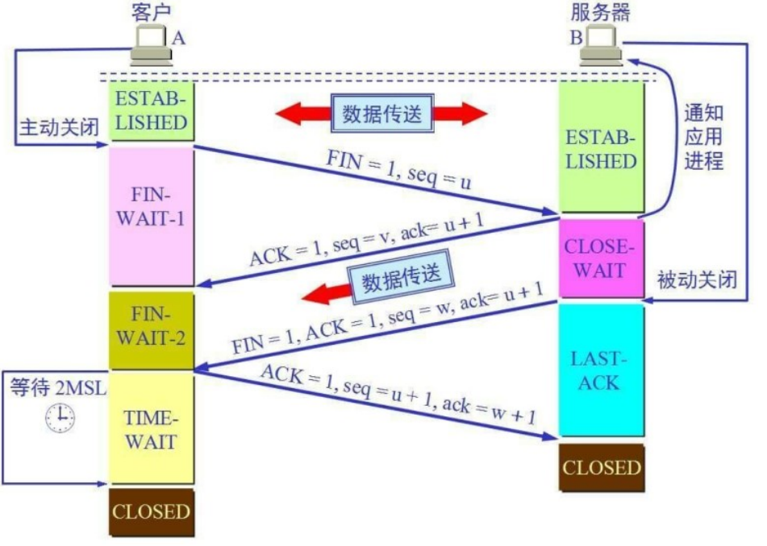
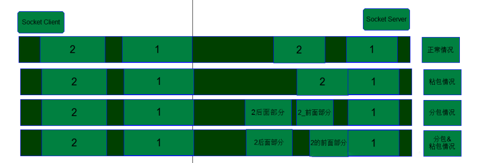
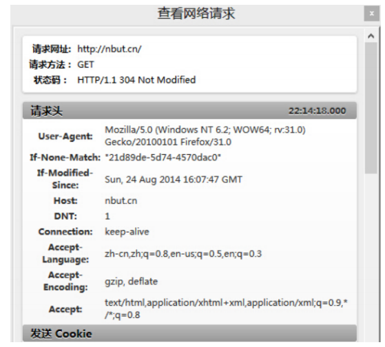
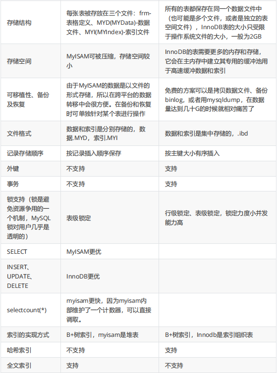
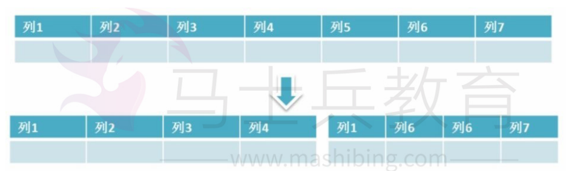
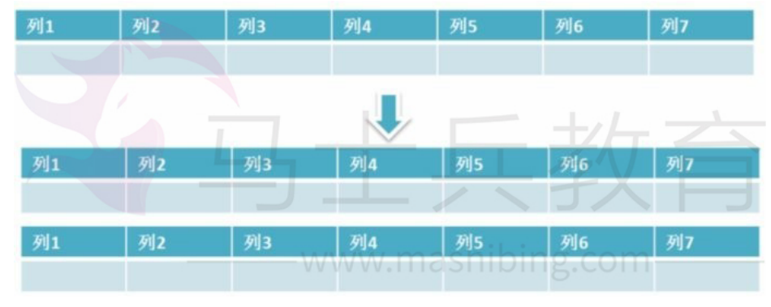

## RPC

#### 1.什么是RPC

比较正式的定义是：`一种通过网络从远程计算机程序上请求服务，而不需要了解底层网络技术的思想`。

没看懂？说的通俗一点就是：`客户端在不知道调用细节的情况下，调用存在于远程计算机上的某个对象，就像调用本地应用程序中的对象一样`。

比如说有两台服务器：A 和 B，一个应用部署在 A 服务器上，想要调用 B 服务器上某个应用提供的函数/方法，

由于跨应用跨服务器，不能直接调用，需要通过网络来表达调用的语义和传达调用的数据，这种调用的方式就是 RPC，如下图所示。


如果在一个应用内直接调用， 这就是本地调用了，如下图所示。


#### 2.为什么需要RPC

上面简单介绍了一下 RPC 是什么，那大家有没有想过为什么需要 RPC？一项新技术出来总是为了解决某些实际的业务或架构问题。

下面以电商业务为例介绍一下技术架构的演变。

##### 单体架构

通俗地讲，「单体应用」就是将应用程序的所有功能都打成一个部署包。


从上面的架构图总结一下单体架构的特点：

- 所有的功能集成在一个项目工程中；
- 通过分层架构，上层调用下层接口，所有的调用都在应用内完成；
- 所有的功能打一个 war 包部署到服务器；
- 应用与数据库分开部署；

当网站流量很小时，只需一个应用，将所有功能都部署在一起，以减少部署节点和成本。当流量稍微大一点可以通过部署应用集群和数据库集群来提高系统的性能。

随着业务逐渐复杂，应用的外部流量压力增加，团队成员越来越多，单体应用架构的缺点也就慢慢暴露了。

**缺点一：持续交付周期拉长**

单体应用变大后构建和部署时间也相应地延长，不利于频繁部署，阻碍持续交付。即使在仅仅更改了一行代码的情况下，软件开发人员需要花费几十分钟甚至超过一个小时的时间对所有代码进行编译，并接下来花费大量的时间重新部署刚刚生成的产品，以验证自己的更改是否正确。

**缺点二：高耦合**

某个模块出现了死循环，导致内存溢出，整个应用都会挂掉。

**缺点三：伸缩性差**

系统的扩容只能针对应用进行扩容，不能做到对某个功能模块进行扩容，扩容后必然带来资源浪费的问题。

**缺点四：技术栈受限**

单应用内一般只会选择同一种技术栈，比如说很少在一个应用内同时才用 Java 和 Go 语言。

为了解决这些问题，微服务架构就应运而生了。

##### 微服务架构

目前我们所说的微服务架构是经过了多年的迭代发展而形成，像以前用的 SOAP、ESB 等技术这里就不再赘述了。

单体架构发展到一定阶段必然会遇到瓶颈，怎么解决呢？首先想到的办法就是把单体架构进行拆分，大的问题难以解决就把它拆分成小的问题逐个解决，这就是分而治之的思想。

我们试着把前面的单体架构根据业务模块拆分为多个微服务：商品服务、购物车服务、订单服务、用户服务等等。


这些微服务在之前的单体应用架构中可能是一个业务模块，业务模块之前的调用直接使用本地调用即可。

服务拆分后，这些微服务可能部署在不同的机器节点上，那服务间如何调用呢？

这个时候就该我们的女主角 RPC 闪亮登场了，RPC 就是为了解决远程服务间调用问题。关于RPC 如何实现调用以及内部原理，后面的文章会详细讲解，这里只是简单引入一下，大家有个大致的概念即可。

服务间调用的问题解决了，我们会发现微服务架构有很多优点：

**优点一：团队独立**

团队根据微服务划分职责，微服务可独立编译、测试、部署，依赖关系清晰明了。

**优点二：技术栈独立**

各服务可根据业务特点自行选择技术栈，对外暴露的接口与具体实现无关。

**优点三：易伸缩**

业务团队可根据实际的负载情况动态决定部署规模，避免资源浪费。

#### 3.RPC 框架典型的架构

典型的 RPC 架构大致可以分为三个部分：

（1）服务提供者（RPC Server）：运行在服务器端，提供服务接口定义与服务实现类。

（2）注册中心（Registry）：运行在服务器端，负责将本地服务发布成远程服务，管理远程服务，提供给服务消费者使用。

（3）服务消费者（RPC Client）：运行在客户端，通过远程代理对象调用远程服务。


通过上面的图可以看出，一次简单的 RPC 调用可以分为以下几个步骤：

（1）服务提供者启动后主动向服务注册中心注册机器ip、端口以及提供的服务列表；

（2）服务消费者启动时向服务注册中心获取服务提供方地址列表，在本地缓存一份；

（3）服务消费者通过本地调用的方式调用服务，调用模块收到请求后通过负载均衡策略选取合适的远程服务地址；

（4）协议模块负责将方法、入参等信息序列化(编码)成能够进行网络传输的消息体，并将消息通过网络发送给服务端；

（5）服务端收到消息后进行解码(反序列化操作)。

（6）根据解码结果调用本地的服务进行相关处理；

（7）服务端将处理返回的结果进行序列化（编码），并将结果通过网络发送至服务消费者；

（8）服务消费者收到消息后进行解码最终得到结果；

#### 4.RPC 核心功能

一个完整的商用 RPC 框架有很多功能，最最核心的基本就是三个：**服务寻址**、**数据编解码**、**网络传输**。

##### 服务寻址

如果是本地调用，被调用的方法在同一个进程内，操作系统或虚拟机可以地址空间找到；但是在远程调用中，这是行不通的，因为两个进程的地址空间是完全不一样的，并且也无法知道远端的进程在何处。

要想实现远程调用，我们需要对服务消费者和服务提供者进行约束：

- 在远程过程调用中所有的函数都必须有一个ID，这个 ID 在整套系统中是唯一确定的。
- 服务消费者在做远程过程调用时，发送的消息体中必须携带这个 ID。
- 服务消费者和服务提供者分别维护一个函数和 ID 的对应表。

当服务消费者需要进行远程调用时，它就查一下这个表，找出对应的 ID，然后把它传给服务端，服务端也通过查表，来确定客户端需要调用的函数，然后执行相应函数的代码。

上面说的可能比较抽象，通俗一点就是**服务消费者如何寻找服务提供者**，这就是服务寻址。


服务寻址的实现方式有很多种，比较常见的是：**服务注册中心**。要调用服务，首先你需要一个服务注册中心去查询对方服务都有哪些实例，然后根据负载均衡策略择优选一。

像 Dubbo 框架的服务注册中心是可以配置的，官方推荐使用 Zookeeper。

##### 数据编解码（序列化和反序列化）

对计算机网络稍微有一点了解的同学都知道，数据在网络中传输是二进制的：01010101010101010，类似这种，只有二进制数据才能在网络中传输。

那一个客户端调用远程服务的一个方法，像方法入参这些必然需要转换成二进制才能进行传输，这种将对象转换成二进制流的过程就叫做**序列化编码**。

服务端接收到二进制流不能识别，势必要将二进制流转换成对象，这个逆过程就叫做**反序列化解码**。

一般场景下是可以将序列化编码简称为序列化。

> 敲黑板：
>
> 如果非要较真，严格来说序列化和编码是两个不同的概念，我画一张图大家都明白了。


序列化和编码的对比

> 序列化+编码的逆过程就是：解码+反序列化。

##### 网络传输

提起网络传输大家脑海里肯定马上就能想到 TCP/IP四层模型、OSI 七层模型，那通常 RPC 会选择那一层作为传输协议呢？

在回答这个问题前我们先看下 RPC 需要网络传输实现什么功能。

客户端的数据经过序列化+编码后，就需要通过网络传输到服务端。网络传输层需要把前面说的函数 ID 和序列化后的参数字节流传给服务端，服务端处理完然后再把序列化后的调用结果传回客户端。

原则上只要能实现上面这个功能的都可以作为传输层来使用，具体协议没有限制。

我们先来看下 TCP 协议，TCP 连接可以是按需连接，需要调用的时候就先建立连接，调用结束后就立马断掉，也可以是长连接，客户端和服务器建立起连接之后保持长期持有，不管此时有无数据包的发送，可以配合心跳检测机制定期检测建立的连接是否存活有效。

由此可见 TCP 的性能确实很好，因此市面上大部分 RPC 框架都使用 TCP 协议，但也有少部分框架使用其他协议，比如 gRPC 就基于 HTTP2 来实现的。

> 敲黑板：
>
> 数据编解码和网络传输可以有多种组合方式，比如常见的有：HTTP+JSON, Dubbo 协议+TCP 等。

#### 5.常见的 RPC 框架

说了这么多 RPC 相关的技术，我们盘点一下市面上常用的 RPC 框架。

- RMI（Sun/Oracle）
- Thrift（Facebook/Apache）
- gRPC（Google）
- Finagle（Twitter）
- Dubbo（阿里巴巴/Apache）
- Motan（新浪微博）
- brpc（百度/Apache）
- ……欢迎大家补充其他的。

#### 6.服务注册发现机制

##### 6.1 引入服务注册与发现组件的原因

先来看一个问题，假如现在我们要做一个商城项目，作为架构师的你应该怎样设计系统的架构？你心里肯定在想：这还不容易直接照搬淘宝的架构不就行了。但在现实的创业环境中一个项目可能是九死一生，如果一开始投入巨大的人力和财力，一旦项目失败损失就很大。

作为一位有经验的架构师需要结合公司财力、人力投入预算等现状选择最适合眼下的架构才是王道。大型网站都是从小型网站发展而来，架构也是一样。

任何一个大型网站的架构都不是从一开始就一层不变的，而是随着用户量和数据量的不断增加不断迭代演进的结果。

在架构不断迭代演进的过程中我们会遇到很多问题，**技术发展的本质就是不断发现问题再解决问题，解决问题又发现问题**。

##### 6.2 单体架构

在系统建立之初可能不会有特别多的用户，将所有的业务打成一个应用包放在tomcat容器中运行，与数据库共用一台服务器，这种架构一般称之为单体架构。


在初期这种架构的效率非常高，根据用户的反馈可以快速迭代上线。但是随着用户量增加，一台服务的内存和CPU吃紧，很容易造成瓶颈，新的问题来了怎么解决呢？

##### 6.3 应用于数据分离

单实例很容易造成单点问题，比如遇到服务器故障或者服务能力瓶颈，那怎么办？聪明的你肯定想到了，用集群呀。


集群部署是指将应用部署在多个服务器或者虚机上，用户通过服务均衡随机访问其中的一个实例，从而使多个实例的流量均衡，如果一个实例出现故障可以将其下线，其他实例不受影响仍然可以对外提供服务。

随着用户数量快速增加，老板决定增加投入扩大团队规模。开发团队壮大后效率并没有得到显著的提高，以前小团队可以一周迭代上线一次，现在至少需要两到三周时间。

业务逻辑越来越复杂，代码间耦合很严重，修改一行代码可能引入几个线上问题。架构师意识到需要进行架构重构。

##### 6.4 微服务架构

当单体架构演进到一定阶段后开发测试的复杂性都会成本增加，团队规模的扩大也会使得各自工作耦合性更严重，牵一发而动全身就是这种场景。

单体架构遇到瓶颈了，微服务架构就横空出世了。微服务就是将之前的单体服务按照业务维度进行拆分，拆分粒度可大可小，拆分时机可以分节奏进行。最佳实践是先将一些独立的功能从单体中剥离出来抽成一个或多个微服务，这样可以保障业务的连续性和稳定性。


如上图将一个商用应用拆分为六个独立微服务。六个微服务可以使用Docker容器化进行多实例部署。

架构演化到这里遇到了一个难题，如果要查询用户所有的订单，用户服务可能会依赖订单服务，用户服务如何与订单服务交互呢？订单服务有多个实例该访问哪一个？

**（1）服务地址硬编码**

服务的地址写死在数据库或者配置文件，通过访问DNS域名进行寻址路由。


服务B的地址硬编码在数据库或者配置文件中，服务A首先需要拿到服务B的地址，然后通过DNS服务器解析获取其中一实例的真实地址，最后可以向服务B发起请求。

如果遇到大促活动需要对服务实例扩容，大促完需要对服务实例进行下线，运维人员要做大量的手工操作，非常容易误操作。

**（2）服务动态注册与发现**

服务地址硬编码还有一个非常致命的问题，如果一台实例挂了，运维人员可能不能及时感知到，导致一部分用户的请求会异常。

引入服务注册与发现组件可以很好解决上面遇到的问题，避免过多的人工操作。

#### 7.服务注册与发现基本原理

服务注册与发现是分为注册和发现两个关键的步骤。

**服务注册**：服务进程在注册中心注册自己的元数据信息。通常包括主机和端口号，有时还有身份验证信息，协议，版本号，以及运行环境的信息。

**服务发现**：客户端服务进程向注册中心发起查询，来获取服务的信息。服务发现的一个重要作用就是提供给客户端一个可用的服务列表。

##### 7.1 服务注册

服务注册有两种形式：客户端注册和代理注册。

**客户端注册**

客户端注册是服务自己要负责注册与注销的工作。当服务启动后注册线程向注册中心注册，当服务下线时注销自己。

这种方式的缺点是注册注销逻辑与服务的业务逻辑耦合在一起，如果服务使用不同语言开发，那需要适配多套服务注册逻辑。

**代理注册**

代理注册由一个单独的代理服务负责注册与注销。当服务提供者启动后以某种方式通知代理服务，然后代理服务负责向注册中心发起注册工作。


这种方式的缺点是多引用了一个代理服务，并且代理服务要保持高可用状态。

##### 7.2 服务发现

务发现也分为客户端发现和代理发现。

**客户端发现**

客户端发现是指客户端负责向注册中心查询可用服务地址，获取到所有的可用实例地址列表后客户端根据负载均衡算法选择一个实例发起请求调用。


这种方式非常直接，客户端可以控制负载均衡算法。但是缺点也很明显，获取实例地址、负载均衡等逻辑与服务的业务逻辑耦合在一起，如果服务发现或者负载平衡有变化，那么所有的服务都要修改重新上线。

**代理发现**

代理发现是指新增一个路由服务负责服务发现获取可用的实例列表，服务消费者如果需要调用服务A的一个实例可以直接将请求发往路由服务，路由服务根据配置好的负载均衡算法从可用的实例列表中选择一个实例将请求转发过去即可，如果发现实例不可用，路由服务还可以自行重试，服务消费者完全不用感知。

#### 8.心跳机制

如果服务有多个实例，其中一个实例出现宕机，注册中心是可以实时感知到，并且将该实例信息从列表中移出，也称为摘机。

如何实现摘机？业界比较常用的方式是通过心跳检测的方式实现，心跳检测有**主动**和**被动**两种方式。

**被动检测**是指服务主动向注册中心发送心跳消息，时间间隔可自定义，比如配置5秒发送一次，注册中心如果在三个周期内比如说15秒内没有收到实例的心跳消息，就会将该实例从列表中移除。


上图中服务A的实例2已经宕机不能主动给注册中心发送心跳消息，15秒之后注册就会将实例2移除掉。

**主动检测**是注册中心主动发起，每隔几秒中会给所有列表中的服务实例发送心跳检测消息，如果多个周期内未发送成功或未收到回复就会主动移除该实例。


## 代理

#### 1.静态代理

（1）为工程里每个类都写一个代理类，让它与目标类实现同一个接口。图中标红色的就是代理类。


（2）在代理类里面维护一个目标实现类，调用代理类的方法时还是会去调用目标类的方法，只不过在前后加了一些其他逻辑代码。也就是说后面客户端不需要直接调用目标实现类，只需要调用代理类即可，这样就间接调用了对应方法。

用一个公式总结一下：**代理类 = 增强代码 + 目标实现类** 。

下面这个图中，计算耗时的逻辑就是增强代码。


（3）在所有 new 目标类的地方都替换为 new 代理类，并将目标类作为构造方法参数传入；所有使用目标类调用的地方全部都替换为代理类调用。


如果你看懂了上面的实现方法，那么恭喜你已经掌握了静态代理的核心思想。

#### 2.静态代理的缺点

静态代理的思路非常简单，就是给每一个目标实现类写一个对应的代理实现类，但是如果一个项目有几千甚至有几万个类，这个工作量可想而知。

前面我们还隐藏了一个假设：每个类都会实现一个接口。那如果一个类没有实现任何接口，代理类如何实现呢？

好了，我们来总结一下静态代理的缺点：

- 静态代理需要针对每个目标实现类写一个对应的代理类，如果目标类的方法有变动，代理类也要跟着动，维护成本非常高。
- 静态代理必须依赖接口。

既然知道了静态代理的缺点，那有没有办法实现少些或者不写代理类来实现代理功能呢？答案是有，动态代理。

#### 3.对象的创建流程

在正式介绍动态代理前，我们先复习一下 java 中对象是如何创建的。


我们在项目中使用一行代码就可以简单创建一个对象，实际上经过的流程还是很复杂的。

```
// 创建对象
A a = new A();
```

- （1）java 源文件经过编译生成字节码文件（.class结尾）；
- （2）类加载器将 class 文件加载到 JVM 内存中，就是常说的方法区，生成 Class 对象；
- （3）执行 new，申请一块内存区域，紧接着创建一个对象放在 JVM 对象，准确地说是**新生代**；

上面的流程中提到了 Class 对象，有两个概念初学者很容易混淆：**Class 对象** 和 **实例对象**。


Class 对象简单来说就是 Class 类的实例，Class 类描述了所有的类；实例对象是通过 Class 对象创建出来的。

从上面的分析可以看出来，要想创建一个实例，最最关键的是获得 **Class 对象**。

有些同学可能有疑问了，我写代码的时候创建对象没有用到 Class 对象呀，那是因为 Java 语言底层帮你封装了细节。Java 语言给我们提供了new 这个关键字，new 实在太好用了，一行代码就可以创建一个对象。

我们再回到前面讲的静态代理，静态代理最重要的是提前写一个代理类，有了代理类就可以 new 一个代理对象。但是每次都去写一个代理类是不是太麻烦了？！

再稍微扩展一下思路，有没有办法不写代理类还能生成一个代理对象呢？可以，上面讲的通过代理类 Class 对象就可以生成代理对象，那如何获取代理类 Class 对象呢？我们接着往下看。

#### 4.动态代理

Class对象包含了一个类的所有信息，如：构造方法、成员方法、成员属性等。

如果我们不写代理类，似乎无法获得代理类 Class 对象，但稍稍动一动脑：代理类和目标类实现的是同一组接口，是不是可以通过接口间接获得代理类 Class 对象。

代理类和目标类实现了同一组接口，这就说明他们大体结构都是一致的，这样我们对代理对象的操作都可以转移到目标对象身上，代理对象只需要专注于增强代码的实现。

**上面说了这么多其实是在引入动态代理的概念，动态代理相对于静态代理最大的区别就是不需要事先写好代理类，一般在程序的运行过程中动态产生代理类对象。**

##### 4.1.jdk动态代理

JDK 原生提供了动态代理的实现，主要是通过`java.lang.reflect.Proxy`和`java.lang.reflect.InvocationHandler`这两个类配合使用。

Proxy类有个静态方法，传入类加载器和一组接口就可以返回代理 Class 对象。

```
public static Class<?> getProxyClass(ClassLoader loader, Class<?>... interfaces)
```

这个方法的作用简单来说就是，会将你传入一组接口类的结构信息"拷贝"到一个新的 Class 对象中，新的 Class对象带有构造器是可以创建对象的。

一句话总结：`Proxy.getProxyClass()` 这个静态方法的本质是**以 Class 造 Class**。

拿到了 Class 对象，就可以使用反射创建实例对象了：

```
// Proxy.getProxyClass 默认会生成一个带参数的构造方法，这里指定参数获取构造方法
Constructor<A> constructor = aClazz.getConstructor(InvocationHandler.class);
// 使用反射创建代理对象
A a1 = constructor.newInstance(new InvocationHandler() {});
```

眼尖的同学已经看到了，创建实例的时候需要传入一个 InvocationHandler 对象，说明代理对象中必然有一个成员变量去接收。在调用代理对象的方法时实际上会去执行 InvocationHandler 对象的 invoke方法，画个图理解一下：


invoke 方法里可以写增强代码，然后调用目标对象 work 方法。

总结一下流程：

（1）通过 Proxy.getProxyClass() 方法获取代理类 Class 对象；

（2）通过反射 aClazz.getConstructor() 获取构造器对象；

（3）定义InvocationHandler类并实例化，当然也可以直接使用匿名内部类；

（4）通过反射 constructor.newInstance() 创建代理类对象；

（5）调用代理方法；

看了上面的流程，是不是觉得比静态代理还要繁琐，有没有更加优雅的方法？当然有！

为了尽量简化操作，JDK Proxy 类直接提供了一个静态方法：

```
public static Object newProxyInstance(ClassLoader loader, Class<?>[] interfaces, InvocationHandler h)
```

这个方法传入类加载器、一组接口和 InvocationHandler 对象直接就可以返回代理对象了，有了代理对象就可以调用代理方法了，是不是 so easy？！

newProxyInstance方法本质上帮我们省略了**获取代理类对象**和**通过代理类对象创建代理类**的过程，这些细节全部隐藏了。

所以真正在项目中直接使用newProxyInstance这个方法就好了，上面讲的那些流程是为了方便大家理解整个过程。

看到这里我相信大家应该能看懂JDK 原生动态代理了。

##### 4.2 cglib动态代理

JDK 动态代理，一旦目标类有了明确的接口，完全可以通过接口生成一个代理 Class 对象，通过代理 Class 对象就可以创建代理对象。

这里可以看出 JDK 动态代理有个限制必须要求目标类实现了接口，那加入一个目标类没有实现接口，那岂不是不能使用动态代理了？

cglib 就是为了实现这个目标而出现的，利用asm开源包对代理对象类的class文件加载进来，通过修改其字节码生成子类来处理。

#### 5.jdk和cglib区别

我们通过几个问题简单对比一下 JDK 和 cglib 动态代理的区别。

**问题 1：cglib 和 JDK 动态代理的区别？**

> - JDK 动态代理：利用 InvocationHandler 加上反射机制生成一个代理接口的匿名类，在调用具体方法前调用InvokeHandler来处理
> - cglib 动态代理：利用ASM框架，将目标对象类生成的class文件加载进来，通过修改其字节码生成代理子类

**问题 2：cglib 比 JDK快？**

> - cglib底层是ASM字节码生成框架，在 JDK 1.6 前字节码生成要比反射的效率高
> - 在 JDK 1.6 之后 JDK 逐步对动态代理进行了优化，在 1.8 的时候 JDK 的效率已经高于 cglib

**问题 3：Spring框架什么时候用 cglib 什么时候用 JDK 动态代理？**

> - 目标对象生成了接口默认用 JDK 动态代理
> - 如果目标对象没有实现接口，必须采用cglib
> - 当然如果目标对象使用了接口也可以强制使用cglib

## 序列化

#### 1.什么是序列化

前面引入游戏的例子是为了让大家生动地理解什么是序列化和反序列化。简单总结一下就是：

- **序列化**是指将对象实例的状态存到存储媒体的过程
- **反序列化**是指将存储在存储媒体中的对象状态装换成对象的过程

用更为抽象的概念来讲：

**序列化：**把对象转化为可传输的字节序列过程


**反序列化：把字节序列还原为对象的过程**


#### 序列化的机制

序列化最终的目的是为了对象可以**跨平台存储**和**进行网络传输**，而我们进行跨平台存储和网络传输的方式就是 **IO**，而 IO 支持的数据格式就是**字节数组**。

那现在的问题就是如何把对象转换成字节数组？这个很好办，一般的编程语言都有这个能力，可以很容易将对象转成字节数组。

仔细一想，我们单方面的把对象转成字节数组还不行，因为没有规则的字节数组我们是没办法把对象的本来面目还原回来的，简单说就是将对象转成字节数组容易但是将字节数组还原成对象就难了，所以我们必须在把对象转成字节数组的时候就制定一种规则（序列化）**，那么我们从 IO 流里面读出数据的时候再以这种规则把对象还原回来**（反序列化）。

还是拿上面游戏那个例子，我们将正在玩的游戏存档到硬盘，**序列化**就是将一个个角色对象和装备对象存储到硬盘，然后留下一张原来对象的结构图纸，**反序列化**就是将硬盘里一个个对象读出来照着图纸逐个还原恢复。

#### 常见序列化的方式

序列化只是定义了拆解对象的具体规则，那这种规则肯定也是多种多样的，比如现在常见的序列化方式有：JDK 原生、JSON、ProtoBuf、Hessian、Kryo等。

**（1）JDK 原生**

作为一个成熟的编程语言，JDK自带了序列化方法。只需要类实现了`Serializable`接口，就可以通过`ObjectOutputStream`类将对象变成byte[]字节数组。

JDK 序列化会把对象类的描述信息和所有的属性以及继承的元数据都序列化为字节流，所以会导致生成的字节流相对比较大。

另外，这种序列化方式是 JDK 自带的，因此不支持跨语言。

简单总结一下：JDK 原生的序列化方式生成的字节流比较大，也不支持跨语言，因此在实际项目和框架中用的都比较少。

**（2）ProtoBuf**

谷歌推出的，是一种语言无关、平台无关、可扩展的序列化结构数据的方法，它可用于通信协议、数据存储等。序列化后体积小，一般用于对传输性能有较高要求的系统。

**（4）Hessian**

Hessian 是一个轻量级的二进制 web service 协议，主要用于传输二进制数据。

在传输数据前 Hessian 支持将对象序列化成二进制流，相对于 JDK 原生序列化，Hessian序列化之后体积更小，性能更优。

**（5）Kryo**

Kryo 是一个 Java 序列化框架，号称 Java 最快的序列化框架。Kryo 在序列化速度上很有优势，底层依赖于字节码生成机制。

由于只能限定在 JVM 语言上，所以 Kryo 不支持跨语言使用。

**（6）JSON**

上面讲的几种序列化方式都是直接将对象变成二进制，也就是byte[]字节数组，这些方式都可以叫二进制方式。

JSON 序列化方式生成的是一串有规则的字符串，在可读性上要优于上面几种方式，但是在体积上就没什么优势了。

另外 JSON 是有规则的字符串，不跟任何编程语言绑定，天然上就具备了跨平台。

**总结一下：JSON 可读性强，支持跨平台，体积稍微逊色。**

JSON 序列化常见的框架有：

`fastJSON`、`Jackson`、`Gson` 等。

#### 序列化技术的选型

上面列举的这些序列化技术各有优缺点，不能简单地说哪一种就是最好的，不然也不会有这么多序列化技术共存了。

既然有这么多序列化技术可供选择，那在实际项目中如何选型呢？

我认为需要结合具体的项目来看，比较技术是服务于业务的。你可以从下面这几个因素来考虑：

**（1）协议是否支持跨平台**

如果一个大的系统有好多种语言进行混合开发，那么就肯定不适合用有语言局限性的序列化协议，比如 JDK 原生、Kryo 这些只能用在 Java 语言范围下，你用 JDK 原生方式进行序列化，用其他语言是无法反序列化的。

**（2）序列化的速度**

如果序列化的频率非常高，那么选择序列化速度快的协议会为你的系统性能提升不少。

**（3）序列化生成的体积**

如果频繁的在网络中传输的数据那就需要数据越小越好，小的数据传输快，也不占带宽，也能整体提升系统的性能，因此序列化生成的体积就很关键了。

## 计算机网络

#### 1.由下往上说出 OSI 七层模型、TCP/IP 五层模型以及各层的代表协议

##### OSI：

**OSI 七层模型** 是国际标准化组织提出一个网络分层模型，其大体结构以及每一层提供的功能如下图所示：


每一层都专注做一件事情，并且每一层都需要使用下一层提供的功能比如传输层需要使用网络层提供的路有和寻址功能，这样传输层才知道把数据传输到哪里去。

**OSI 的七层体系结构概念清楚，理论也很完整，但是它比较复杂而且不实用，而且有些功能在多个层中重复出现。**

上面这种图可能比较抽象，再来一个比较生动的图片。下面这个图片是我在国外的一个网站上看到的，非常赞！


**既然 OSI 七层模型这么厉害，为什么干不过 TCP/IP 四 层模型呢？**

的确，OSI 七层模型当时一直被一些大公司甚至一些国家政府支持。这样的背景下，为什么会失败呢？我觉得主要有下面几方面原因：

1. OSI 的专家缺乏实际经验，他们在完成 OSI 标准时缺乏商业驱动力
2. OSI 的协议实现起来过分复杂，而且运行效率很低
3. OSI 制定标准的周期太长，因而使得按 OSI 标准生产的设备无法及时进入市场（20 世纪 90 年代初期，虽然整套的 OSI 国际标准都已经制定出来，但基于 TCP/IP 的互联网已经抢先在全球相当大的范围成功运行了）
4. OSI 的层次划分不太合理，有些功能在多个层次中重复出现。

OSI 七层模型虽然失败了，但是却提供了很多不错的理论基础。为了更好地去了解网络分层，OSI 七层模型还是非常有必要学习的。

最后再分享一个关于 OSI 七层模型非常不错的总结图片！


##### TCP/IP：

**TCP/IP 四层模型** 是目前被广泛采用的一种模型,我们可以将 TCP / IP 模型看作是 OSI 七层模型的精简版本，由以下 4 层组成：

1. 应用层
2. 传输层
3. 网络层
4. 网络接口层

需要注意的是，我们并不能将 TCP/IP 四层模型 和 OSI 七层模型完全精确地匹配起来，不过可以简单将两者对应起来，如下图所示：


###### 应用层（Application layer）

**应用层位于传输层之上，主要提供两个终端设备上的应用程序之间信息交换的服务，它定义了信息交换的格式，消息会交给下一层传输层来传输。** 我们把应用层交互的数据单元称为报文。


应用层协议定义了网络通信规则，对于不同的网络应用需要不同的应用层协议。在互联网中应用层协议很多，如支持 Web 应用的 HTTP 协议，支持电子邮件的 SMTP 协议等等。


###### 传输层（Transport layer）

**传输层的主要任务就是负责向两台终端设备进程之间的通信提供通用的数据传输服务。** 应用进程利用该服务传送应用层报文。“通用的”是指并不针对某一个特定的网络应用，而是多种应用可以使用同一个运输层服务。

**运输层主要使用以下两种协议：**

1. **传输控制协议 TCP**（Transmisson Control Protocol）--提供**面向连接**的，**可靠的**数据传输服务。
2. **用户数据协议 UDP**（User Datagram Protocol）--提供**无连接**的，尽最大努力的数据传输服务（**不保证数据传输的可靠性**）。


###### 网络层（Network layer）

**网络层负责为分组交换网上的不同主机提供通信服务。** 在发送数据时，网络层把运输层产生的报文段或用户数据报封装成分组和包进行传送。在 TCP/IP 体系结构中，由于网络层使用 IP 协议，因此分组也叫 IP 数据报，简称数据报。

注意 ⚠️：**不要把运输层的“用户数据报 UDP”和网络层的“IP 数据报”弄混**。

**网络层的还有一个任务就是选择合适的路由，使源主机运输层所传下来的分株，能通过网络层中的路由器找到目的主机。**

这里强调指出，网络层中的“网络”二字已经不是我们通常谈到的具体网络，而是指计算机网络体系结构模型中第三层的名称。

互联网是由大量的异构（heterogeneous）网络通过路由器（router）相互连接起来的。互联网使用的网络层协议是无连接的网际协议（Intert Prococol）和许多路由选择协议，因此互联网的网络层也叫做**网际层**或**IP 层**。


###### 网络接口层（Network interface layer）

我们可以把网络接口层看作是数据链路层和物理层的合体。

1. 数据链路层(data link layer)通常简称为链路层（ 两台主机之间的数据传输，总是在一段一段的链路上传送的）。**数据链路层的作用是将网络层交下来的 IP 数据报组装成帧，在两个相邻节点间的链路上传送帧。每一帧包括数据和必要的控制信息（如同步信息，地址信息，差错控制等）。**
2. **物理层的作用是实现相邻计算机节点之间比特流的透明传送，尽可能屏蔽掉具体传输介质和物理设备的差异**


#### 1（2）.（小牛肉博客版）由下往上说出 OSI 七层模型、TCP/IP 五层模型以及各层的代表协议

###### **1. 五层协议参考模型**

**所谓通信协议就是通信双方都必须要遵守的通信规则**。如果没有网络通信协议，计算机的数据将无法发送到网络上，更无法到达对方计算机，即使能够到达，对方也未必能读懂。**有了通信协议，网络通信才能够发生**。

一般我们用**五层协议参考模型**来进行计算机网络的学习：

- 应用层
- 运输层
- 网络层
- 数据链路层
- 物理层

上述各层的作用会在下文详细讲解，我们首先要明白**为什么要分层**：

协议的实现是很复杂的。因为协议要把人读得懂的数据，如网页、电子邮件等加工转化成可以在网络上传输的信号，需要进行的处理工作非常多。

两个系统中实体间的通信是一个十分复杂的过程。为了减少协议设计和调试过程的复杂性，网络协议通常都按**结构化**的层次方式来进行组织，每一层完成一定功能，每一层又都建立在它的下层之上。不同的网络协议，其层的数量、各层的名字、和功能不尽相同。

👍 也就是说，**每一层都是在下一层的基础上，通过层间接口向上一层提供一定的服务**，而把 “这种服务是如何实现的” **细节对上层加以屏蔽**。

❓ 那么，我们将一个大型网络体系分成了若干个层，**各个层之间是如何进行通信的呢**？

- 1）**对等层之间通信**（不同开放系统中的相同层次之间的通信，对等层实体之间的信息交换）：OSI 标准为每一层的通信都严格定义了 **协议数据单元 PDU**的格式。 **对等层之间的通信是目的**，对等层实体的协作保证该层功能和服务的实现
- 2）**相邻层之间通信**（相邻的上下层之间的通信，属于局部问题）：**相邻层之间的通信是手段**，保证对等层实体之间的通信得以实施

⭐ 假设网络协议分为若干层，那么 **A、B 两节点通信，实际是节点 A 的第 n 层与节点 B 的第 n 层进行通信**，故协议总是指某一层的协议，例如物理层协议、传输层协议、应用层协议。每一相邻层协议间有一接口，下层通过该接口向上一层提供服务。


###### **2. 物理层**

两台计算机之间要进行通信，必然需要**传输介质/物理媒介**来连接两台计算机，这样，我们才能把数据传输过去。传输介质分为：

- 导向型传输介质

  ：

  - 双绞线：适用于近距离
  - 同轴电缆（抗干扰性强）：适用于远距离
  - 光纤：带宽远远大于其他传输媒体

- 非导向型传输介质

  ：

  - 无线电波
  - 微波
  - 红外线、激光

⭐ 也就是说，**物理层的作用就是实现计算机之间的数据传送**，这个数据其实是**比特流**，物理层需要尽可能屏蔽掉具体传输介质和物理设备的差异， 使其上面的数据链路层不必考虑网络的具体传输介质是什么，即实现**比特流的透明传输**。

###### **3. 数据链路层**

物理层只是简单的把计算机连接起来并在上面传输比特流，它还是存在着很多问题的：

- 1）物理连接是有差错和不可靠的
- 2）物理设备之间可能存在传输速度不匹配问题

也就是说**仅仅靠物理层是无法保证数据传输的正确性的**。

⭐ 这样，数据链路层的主要作用就是**加强物理层传输原始比特流的功能，将物理层提供的可能出错的物理连接改造成为逻辑上无差错的数据链路，使之对网络层表现为一条无差错的链路**。在物理层提供服务的基础上，数据链路层还肩负着**为网络层提供服务**的责任，其最基本的服务是将来自网络层的 IP 数据报**封装成帧**，可靠的传输到相邻结点的目标网络层。

###### **① 封装成帧**

首先了解一下**为什么需要封装成帧**：前面说了，物理层它只是简单的把计算机连接起来并在上面传输比特流（0、1 序列），如果这些 0，1 组合的传送毫无规则的话，计算机是解读不了的。因此，我们需要制定一套规则来进行 0、1 的传送，让计算能够读懂这些序列。

⭐ 封装成帧就是：发送端的数据链路层接收到上层网络层传过来的 IP 数据报后，在其前后部分**添加**首部、尾部，这样就构成了一个**帧**。接收端在收到物理层上交的比特流后，就能根据首部和尾部的标记，从收到的比特流中识别帧的开始和结束。


把一台计算的的数据通过物理层和链路层发送给另一台计算机，究竟是谁发给谁的，计算机与计算机之间如何区分，你总得给他们一个唯一的标识吧？

于是，MAC 地址出现了 👇

###### **② MAC 地址**

MAC 地址就是链路层地址，长度为 6 字节（48 位），**用于唯一标识网络适配器（网卡）。**计算机之间的数据传送，就是通过 MAC 地址来唯一寻找、传送的。

**一台主机拥有多少个网络适配器就有多少个 MAC 地址**。例如笔记本电脑普遍存在无线网络适配器和有线网络适配器，因此就有两个 MAC 地址。

❓ 那么，一台计算机它是如何知道另一台计算机的 MAC 地址的呢？这是网络层的 ARP 地址解析协议做的事情，详见下文 👇

###### **4. 网络层**

在 计算机网络中进行通信的两个计算机之间可能会经过很多个数据链路，也可能还要经过很多通信子网。

**网络层的任务就是选择合适的网间路由和交换结点， 确保数据及时传送**。 在发送数据时，网络层把运输层产生的报文段或用户数据报封装成分组和包进行传送。

在 TCP/IP 体系结构中，由于网络层使用 IP 协议，因此分组也叫 IP 数据报 ，简称数据报。

###### **① IP 协议**

IP 协议用于**屏蔽下层物理网络的差异，为上层提供统一的 IP 数据报**。


IP 协议定义的地址，我们称之为 **IP 地址**。**IP 数据报中含有发/收方的 IP 地址**。

IP 协议提供无连接的、不可靠的、尽力的数据报投递服务

- 1）**无连接**的投递服务

  发送端可于任何时候自由发送数据，而接收端永远不知道自己会在何时从哪里接收到数据。每个数据报独立处理和传输， **一台主机发出的数据报序列，可能取不同的路径**， 甚至其中的一部分数据报会在传输过程中丢失；

- 2）**不可靠**的投递服务

  IP 协议本身不保证数据报投递的结果。 在传输的过程中，数据报可能会丢失、重复、延迟和乱序等， IP协议不对内容作任何检测，也不将这些结果通知收发双方； **I 数据报的丢失，通过路由器发 `ICMP报文` 告知**； 必要时，由高层实体（如TCP）负责差错恢复动作。

- 3）**尽力**投递服务

  执行数据报的分段和封装，以适应具体的传输网络， 由最终结点的IP模块进行合段处理

  不同物理网络对传输的帧 /分组的体积有不同的规定； 当数据报长度 > **MTU（最大传输单元 MTU**—Maximun Transfer Unit ）时，需对数据报分段 。

###### **② ARP 地址解析协议**

OK，有了上面 IP 协议的知识，我们来讲解一台计算机它是如何知道另一台计算机的 MAC 地址的，这就是网络层的 ARP 地址解析协议做的事情。

网络层实现主机之间的通信，而链路层实现具体每段链路之间的通信。因此**在通信过程中，IP 数据报的源地址和目的地址始终不变，而 MAC 地址随着链路的改变而改变**。

⭐ **ARP（Address Resolution Protocol ）协议就可以实现由 IP 地址得到 MAC 地址。**


每个主机都有一个 **ARP 高速缓存**，里面有本局域网上的各主机和路由器的 **IP 地址到 MAC 地址的映射表**。

如果主机 A 知道主机 B 的 IP 地址，但是 ARP 高速缓存中没有该 IP 地址到 MAC 地址的映射，此时主机 A 通过**广播**的方式发送 **ARP 请求分组**（该分组携带自己的 IP 地址 和 MAC 地址 以及 目标主机的 IP 地址），主机 B 收到该请求后会发送 **ARP 响应分组** 给主机 A 告知其 MAC 地址，随后主机 A 向其高速缓存中写入主机 B 的 IP 地址到 MAC 地址的映射。


> 💡 对应的，RARP 协议可以实现由 MAC地址转化为 IP 地址

❓ 那么，我们如何知道对方计算机的 IP 地址呢，这是 **DNS 协议**做的事情，在应用层我们会详细讲解。

###### **5. 传输层**

通过物理层、数据链路层以及网络层的互相作用，我们已经把数据成功从计算机 A 传送到计算机 B 了，可是，计算机 B 里面有各种各样的应用程序，**计算机 B 该如何知道这些数据是给哪个应用程序的呢**？

所以，我们在从计算机 A 传数据给计算表 B 的时候，还得指定一个**端口（Port）**，以供特定的应用程序来接受处理。即 **IP 地址 + 端口号就可以唯一确定某个主机上的某个应用进程**

⭐ 也就是说，**网络层的功能是建立主机到主机的通信，而传输层的功能就是建立端口到端口的通信（也可以说是进程到进程之间的通信）**

传输层最常见的两大协议是 TCP 协议和 UDP 协议，其中 TCP 协议与 UDP 最大的不同就是 TCP 提供可靠的传输，而 UDP 提供的是不可靠传输。

- 1）**用户数据报协议 UDP（User Datagram Protocol）**

  **UDP 在传送数据之前不需要先建立连接**，远程主机在收到 UDP 报文后，不需要给出任何确认。虽然

  UDP **不提供可靠交付**，但在某些情况下 UDP 确是一种最有效的工作方式（**一般用于即时通信），比**

  如： QQ 语音、 QQ 视频 、直播等等

- 2）**传输控制协议 TCP（Transmission Control Protocol）**

  TCP 提供**面向连接**的服务。在传送数据之前必须先建立连接，数据传送结束后要释放连接。

  TCP 不提供广播或多播服务。由于 TCP 要提供**可靠**的，面向连接的传输服务（TCP 的可靠体现在 TCP 在传递数据之前，会有三次握手来建立连接，而且在数据传递时，有确认、窗口、重传、流量控制、拥塞控制机制，在数据传完后，还会断开连接用来节约系统资源。这不仅使协议数据单元的首部增大很多，还要占用许多处理机资源。TCP **一般用于文件传输、发送和接收邮件、远程登录等场景**。

###### **6. 应用层**

应用层最接近于用于，它的任务就是通过**应用进程间的交互**来完成特定网络应用。

应用层协议定义的是应用进程间的通信和交互的规则。由于传输层传来的数据五花八门，有 html 格式的，有 mp4 格式等等，所以**对于不同的网络应用需要不同的应用层协议**。在互联网中应用层协议很多，如域名系统 DNS，支持万维网应用的 HTTP 协议，支持电子邮件的 SMTP 协议等等。我们把应用层交互的数据单元称为**报文**。

由于本文的关键就是讲解计算机之间的通信，所以其他协议我们就不讲了，只讲解一下 **DNS 协议是如何将域名转化为 IP 地址的**。

###### **DNS 域名解析协议**

域名系统 Domain Name System 缩写 DNS，是因特网的一项核心服务，它作为可以**将域名和 IP 地址相互映射的一个分布式数据库** (这里的分布式数据库是指，每个站点只保留它自己的那部分数据)，**能够使人更方便的访问互联网，而不用去记住能够被机器直接读取的 IP 地址**。

域名具有层次结构，从上到下依次为：根域名、顶级域名、二级域名。


DNS 可以使用 UDP 或者 TCP 进行传输，使用的端口号都为 53。

**大多数情况下 DNS 使用 UDP 进行传输**，这就要求域名解析器和域名服务器都必须自己处理超时和重传从而保证可靠性。

域名解析方式：

- **递归查询**
- **迭代查询**


**基本原理**：

1）浏览器搜索**自己的 DNS 缓存**，缓存中维护一张域名与 IP 地址的对应表；

2）若没有，则搜索**操作系统的 DNS 缓存**；

3）若没有，则操作系统将域名发送至**本地域名服务器**（递归查询方式），本地域名服务器查询自己的 DNS 缓存，查找成功则返回结果，否则，通过以下方式迭代查找：

- 本地域名服务器向根域名服务器发起请求，根域名服务器返回 com 域的顶级域名服务器的地址；
- 本地域名服务器向 com 域的顶级域名服务器发起请求，返回权限域名服务器地址
- 本地域名服务器向权限域名服务器发起请求，得到 IP 地址

4）本地域名服务器将得到的 IP 地址返回给操作系统，同时自己将 IP 地址缓存起来

5）操作系统将 IP 地址返回给浏览器，同时自己也将 IP 地址缓存起来

至此，浏览器已经得到了域名对应的 IP 地址。

#### 2.为什么网络要分层

在这篇文章的最后，我想聊聊：“为什么网络要分层？”。

说到分层，我们先从我们平时使用框架开发一个后台程序来说，我们往往会按照每一层做不同的事情的原则将系统分为三层（复杂的系统分层会更多）:

1. Repository（数据库操作）
2. Service（业务操作）
3. Controller（前后端数据交互）

**复杂的系统需要分层，因为每一层都需要专注于一类事情。网络分层的原因也是一样，每一层只专注于做一类事情。**

好了，再来说回：“为什么网络要分层？”。我觉得主要有 3 方面的原因：

1. **各层之间相互独立**：各层之间相互独立，各层之间不需要关心其他层是如何实现的，只需要知道自己如何调用下层提供好的功能就可以了（可以简单理解为接口调用）**。这个和我们对开发时系统进行分层是一个道理。**
2. **提高了整体灵活性** ：每一层都可以使用最适合的技术来实现，你只需要保证你提供的功能以及暴露的接口的规则没有改变就行了。**这个和我们平时开发系统的时候要求的高内聚、低耦合的原则也是可以对应上的。**
3. **大问题化小** ： 分层可以将复杂的网络间题分解为许多比较小的、界线比较清晰简单的小问题来处理和解决。这样使得复杂的计算机网络系统变得易于设计，实现和标准化。 **这个和我们平时开发的时候，一般会将系统功能分解，然后将复杂的问题分解为容易理解的更小的问题是相对应的，这些较小的问题具有更好的边界（目标和接口）定义。**

我想到了计算机世界非常非常有名的一句话，这里分享一下：

> 计算机科学领域的任何问题都可以通过增加一个间接的中间层来解决，计算机整个体系从上到下都是按照严格的层次结构设计的。

#### 3.TCP 三次握手和四次挥手的过程

为了准确无误地把数据送达目标处，TCP 协议采用了三次握手策略。

如下图所示，下面的两个机器人通过 3 次握手确定了对方能正确接收和发送消息(图片来源：《图解 HTTP》)。


**简单示意图：**


- 客户端–发送带有 SYN 标志的数据包–一次握手–服务端
- 服务端–发送带有 SYN/ACK 标志的数据包–二次握手–客户端
- 客户端–发送带有带有 ACK 标志的数据包–三次握手–服务端

**详细示意图（图片来源不详）**


第一次握手：客户端要向服务端发起连接请求，首先客户端随机生成一个起始序列号ISN(比如是100)，那客户端向服务端发送的报文段包含SYN标志位(也就是SYN=1)，序列号seq=100。

第二次握手：服务端收到客户端发过来的报文后，发现SYN=1，知道这是一个连接请求，于是将客户端的起始序列号100存起来，并且随机生成一个服务端的起始序列号(比如是300)。然后给客户端回复一段报文，回复报文包含SYN和ACK标志(也就是SYN=1,ACK=1)、序列号seq=300、确认号ack=101(客户端发过来的序列号+1)。

第三次握手：客户端收到服务端的回复后发现ACK=1并且ack=101,于是知道服务端已经收到了序列号为100的那段报文；同时发现SYN=1，知道了服务端同意了这次连接，于是就将服务端的序列号300给存下来。然后客户端再回复一段报文给服务端，报文包含ACK标志位(ACK=1)、ack=301(服务端序列号+1)、seq=101(第一次握手时发送报文是占据一个序列号的，所以这次seq就从101开始，需要注意的是不携带数据的ACK报文是不占据序列号的，所以后面第一次正式发送数据时seq还是101)。当服务端收到报文后发现ACK=1并且ack=301，就知道客户端收到序列号为300的报文了，就这样客户端和服务端通过TCP建立了连接。

#### 4.为什么需要三次握手

**三次握手的目的是建立可靠的通信信道，说到通讯，简单来说就是数据的发送与接收，而三次握手最主要的目的就是双方确认自己与对方的发送与接收是正常的。**

第一次握手：Client 什么都不能确认；Server 确认了对方发送正常，自己接收正常

第二次握手：Client 确认了：自己发送、接收正常，对方发送、接收正常；Server 确认了：对方发送正常，自己接收正常

第三次握手：Client 确认了：自己发送、接收正常，对方发送、接收正常；Server 确认了：自己发送、接收正常，对方发送、接收正常

所以三次握手就能确认双方收发功能都正常，缺一不可。

#### 5.第 2 次握手传回了 ACK，为什么还要传回 SYN？

接收端传回发送端所发送的 ACK 是为了告诉客户端，我接收到的信息确实就是你所发送的信号了，这表明从客户端到服务端的通信是正常的。而回传 SYN 则是为了建立并确认从服务端到客户端的通信。”

> SYN 同步序列编号(Synchronize Sequence Numbers) 是 TCP/IP  建立连接时使用的握手信号。在客户机和服务器之间建立正常的 TCP 网络连接时，客户机首先发出一个 SYN 消息，服务器使用 SYN-ACK  应答表示接收到了这个消息，最后客户机再以 ACK(Acknowledgement）消息响应。这样在客户机和服务器之间才能建立起可靠的 TCP  连接，数据才可以在客户机和服务器之间传递。

#### 6.TCP为什么是四次挥手？



比如客户端初始化的序列号ISA=100，服务端初始化的序列号ISA=300。TCP连接成功后客户端总共发送了1000个字节的数据，服务端在客户端发FIN报文前总共回复了2000个字节的数据。

第一次挥手：当客户端的数据都传输完成后，客户端向服务端发出连接释放报文(当然数据没发完时也可以发送连接释放报文并停止发送数据)，释放连接报文包含FIN标志位(FIN=1)、序列号seq=1101(100+1+1000，其中的1是建立连接时占的一个序列号)。需要注意的是客户端发出FIN报文段后只是不能发数据了，但是还可以正常收数据；另外FIN报文段即使不携带数据也要占据一个序列号。

第二次挥手：服务端收到客户端发的FIN报文后给客户端回复确认报文，确认报文包含ACK标志位(ACK=1)、确认号ack=1102(客户端FIN报文序列号1101+1)、序列号seq=2300(300+2000)。此时服务端处于关闭等待状态，而不是立马给客户端发FIN报文，这个状态还要持续一段时间，因为服务端可能还有数据没发完。

第三次挥手：服务端将最后数据(比如50个字节)发送完毕后就向客户端发出连接释放报文，报文包含FIN和ACK标志位(FIN=1,ACK=1)、确认号和第二次挥手一样ack=1102、序列号seq=2350(2300+50)。

第四次挥手：客户端收到服务端发的FIN报文后，向服务端发出确认报文，确认报文包含ACK标志位(ACK=1)、确认号ack=2351、序列号seq=1102。注意客户端发出确认报文后不是立马释放TCP连接，而是要经过2MSL(最长报文段寿命的2倍时长)后才释放TCP连接。而服务端一旦收到客户端发出的确认报文就会立马释放TCP连接，所以服务端结束TCP连接的时间要比客户端早一些。


断开一个 TCP 连接则需要“四次挥手”：

- 客户端-发送一个 FIN，用来关闭客户端到服务器的数据传送
- 服务器-收到这个 FIN，它发回一 个 ACK，确认序号为收到的序号加 1 。和 SYN 一样，一个 FIN 将占用一个序号
- 服务器-关闭与客户端的连接，发送一个 FIN 给客户端
- 客户端-发回 ACK 报文确认，并将确认序号设置为收到序号加 1

任何一方都可以在数据传送结束后发出连接释放的通知，待对方确认后进入半关闭状态。当另一方也没有数据再发送的时候，则发出连接释放通知，对方确认后就完全关闭了 TCP 连接。

举个例子：A 和 B 打电话，通话即将结束后，A 说“我没啥要说的了”，B 回答“我知道了”，但是 B 可能还会有要说的话，A 不能要求 B  跟着自己的节奏结束通话，于是 B 可能又巴拉巴拉说了一通，最后 B 说“我说完了”，A 回答“知道了”，这样通话才算结束。

#### 7.TCP 初始序列号为什么是随机值

考虑场景，B是服务器，A是一个合法的客户端，C假冒A（比如模拟IP等）和B进行通信。

**由于ISN是随机的，最终C无法传递数据到B。**

 


C假冒A，B接受后把ACK会直接发给A

由于A没有发送过seq=ISN _C的请求，当A收到ISN_C的ack后直接发送reset 给B，最终关闭了链接。

**加入初始序列号不是随机的，而是可以推测的，那么C就可以拿到ISN_B，然后模拟一个ACK过去，B最终会建立链接，**

C开始传递数据，这就会产生非常严重的安全问题，所以ISN随机是必须的。


#### 8.TCP 超时重传时间设置

TCP 使用超时重传来实现可靠传输：如果一个已经发送的报文段在超时时间内没有收到确认，那么就重传这个报文段。

一个报文段从发送再到接收到确认所经过的时间称为往返时间 RTT，加权平均往返时间 RTTs 计算如下：

[](https://camo.githubusercontent.com/4b31b44c078c2a6fe1354e38006e624c3ae5af66ad3f982d3d73e220a120ab98/68747470733a2f2f6c617465782e636f6465636f67732e636f6d2f6769662e6c617465783f525454733d28312d61292a2852545473292b612a525454)


 其中，0 ≤ a ＜ 1，RTTs 随着 a 的增加更容易受到 RTT 的影响。

超时时间 RTO 应该略大于 RTTs，TCP 使用的超时时间计算如下：

[](https://camo.githubusercontent.com/ae415414727a193c7c23b73199e5ca6c1caa84df9822bf02f8483f8a359605e0/68747470733a2f2f6c617465782e636f6465636f67732e636f6d2f6769662e6c617465783f52544f3d525454732b342a5254545f64)


 其中 RTTd 为偏差的加权平均值。

TCP设有一个保活计时器，客户端如果出现故障，服务器不能一直等下去，白白浪费资源。服务器每收到一次客户端的请求后都会重新复位这个计时器，时间通常是设置为2小时，若两小时还没有收到客户端的任何数据，服务器就会发送一个探测报文段，以后每隔75秒钟发送一次。若一连发送10个探测报文仍然没反应，服务器就认为客户端出了故障，接着就关闭连接。

#### 9.TCP 怎么保证可靠传输（校验和、序列号和确认应答机制、重传机制、滑动窗口机制、流量控制、拥塞控制）

1. 一句话：通过`校验和`、`序列号`、`确认应答`、`超时重传`、`连接管理`、`流量控制`、`拥塞控制`等机制来保证可靠性。

   **（1）校验和**

   在数据传输过程中，将发送的数据段都当做一个16位的整数，将这些整数加起来，并且前面的进位不能丢弃，补在最后，然后取反，得到校验和。

   发送方：在发送数据之前计算校验和，并进行校验和的填充。接收方：收到数据后，对数据以同样的方式进行计算，求出校验和，与发送方进行比较。

   **（2）序列号**

   TCP 传输时将每个字节的数据都进行了编号，这就是序列号。序列号的作用不仅仅是应答作用，有了序列号能够将接收到的数据根据序列号进行排序，并且去掉重复的数据。

   **（3）确认应答**

   TCP 传输过程中，每次接收方接收到数据后，都会对传输方进行确认应答，也就是发送 ACK 报文，这个 ACK 报文中带有对应的确认序列号，告诉发送方，接收了哪些数据，下一次数据从哪里传。

   **（4）超时重传**

   在进行 TCP 传输时，由于存在确认应答与序列号机制，也就是说发送方发送一部分数据后，都会等待接收方发送的 ACK 报文，并解析 ACK 报文，判断数据是否传输成功。如果发送方发送完数据后，迟迟都没有接收到接收方传来的 ACK 报文，那么就对刚刚发送的数据进行重发。

   **（5）连接管理**

   就是指三次握手、四次挥手的过程。

   **（6）流量控制**

   如果发送方的发送速度太快，会导致接收方的接收缓冲区填充满了，这时候继续传输数据，就会造成大量丢包，进而引起丢包重传等等一系列问题。TCP 支持根据接收端的处理能力来决定发送端的发送速度，这就是流量控制机制。

   具体实现方式：接收端将自己的接收缓冲区大小放入 TCP 首部的『窗口大小』字段中，通过 ACK 通知发送端。

   **（7）拥塞控制**

   TCP 传输过程中一开始就发送大量数据，如果当时网络非常拥堵，可能会造成拥堵加剧。所以 TCP 引入了`慢启动机制`，在开始发送数据的时候，先发少量的数据探探路。

#### 10.TCP 中有哪些定时器

(1)超时重传定时器
tcp的靠谱特性，通过确认机制，保证每一个包都被对方收到，那么什么时候需要重传呢？就是靠这个超时重传定时器，每次发送报文前都启动这个定时器，如果定时器超时之前收到了应答则关闭定时器，如果没收到就重发该报文，并重置定时器。

(2)建连定时器
和重传定时器类似，发送syn时，为了防止被丢弃，一段时间不回复ack也会重传。

(3)TIME_WAIT(2MSL)定时器

主动发送fin的一端，在接收到对端的ack报文后会进入TIME_WAIT等待自状态，一方面是防止自己回复对方fin的ack被丢掉了，对方无法释放资源，给对方一次重新发送fin的机会（对方等1MSL发现没回+又发送fin（最多耗时1MSL收到）），另一方面是防止刚释放的端口被新建立的连接用上，刚好又有老连接的报文迟到被新连接误用。tcp是一群讲究公平的生物，他们总是期望两边的资源尽量对等，一端释放的时候尽量确保对方也释放，但有时候对端死活没响应，那也不能死等。通常的做法是，我想释放资源了，那么我告诉你一声，等收到你回复了，我就知道你已经释放了，那么我也释放资源。但是有时候，等了一段时间还没收到回复，那就认为是中间传话的系统出问题了，那我再通知一次，再过一段时间，还不回复，那就认为你自己偷偷释放资源了，所以我也不等了，释放资源。TIME_WAIT为了确定对方能释放资源，多等一会儿自己再释放。

(4)坚持定时器

如果发送方数据发送的比较快，接收方处理的比较慢，那么接收方的缓存队列可能会满，这时没法接收新数据了，会将窗口值为0通知给发送方，而发送方将不再发送数据。过一段时间接收方处理完了，队列有了空闲，又把窗口调大，通知给发送方，但这个报文可能被不可靠的链路丢掉，而这个是不会确认和重传的，这样发送方就一直认为接收方的窗口为0，一直等待下去了。为此有了坚持定时器，发送方接收到0窗口就会启动该定时器，定期的询问窗口值变为多少了。

(5)保活定时器
不懂为什么起名叫保活定时器，其实是起的探测作用，定时发送探测报文，探测对端是否还活着，防止资源被白白占用。如客户端和服务器建立连接，客户端直接断电，那么如果没有这个探测，那么服务器会认为这个客户端还在，对应连接的资源就不会释放。有了这个探测，如果客户端已经重启了，会直接回复复位报文给服务器，服务器就会释放原来的资源，新建立连接，如果客户端关机不重启，服务器探测几次之后也知道对方挂了，会释放资源。

(6)延迟确认定时器
为了提高利用率，接收到报文，不立即回复ack，而是延时一段时间，将ack捎带在其他报文里。

#### 11.TCP 窗口糊涂综合症

对于服务器来讲，如果处理的速度过于缓慢，他会将通告窗口的值设置的越来越小，甚至是小于报文头，这种情况下，通信的效率极其低下，这种情况称作糊涂窗口综合症。

#### 12.如何解决窗口糊涂综合征

###### 发送端产生的症状

如果发送端为产生数据很慢的应用程序服务，例如，一次产生一个字节。这个应用程序一次将一个字节的数据写入发送端的TCP的缓存。如果发送端的TCP没有特定的指令，它就产生只包括一个字节数据的报文段。结果有很多41字节的IP数据报就在互连网中传来传去。

解决的方法是防止发送端的TCP逐个字节地发送数据。必须强迫发送端的TCP收集数据，然后用一个更大的数据块来发送。发送端的TCP要等待多长时间呢？如果它等待过长，它就会使整个的过程产生较长的时延。如果它的等待时间不够长，它就可能发送较小的报文段。Nagle找到了一个很好的解决方法。

###### Nagle算法

Nagle算法非常简单，但它能解决问题。这个算法是为发送端的TCP用的：

1. 发送端的TCP将它从发送应用程序收到的第一块数据发送出去，哪怕只有一个字节。
2. 在发送第一个报文段（即报文段1）以后，发送端的TCP就在输出缓存中积累数据，并等待：或者接收端的TCP发送出一个确认，或者数据已积累到可以装成一个最大的报文段。在这个时候，发送端的TCP就可以发送这个报文段。
3. 对剩下的传输，重复步骤2。这就是：如果收到了对报文段x的确认，或者数据已积累到可以装成一个最大的报文段，那么就发送下一个报文段(x + 1)。

###### 接收端产生的症状

接收端的TCP可能产生糊涂窗口综合症，如果它为消耗数据很慢的应用程序服务，例如，一次消耗一个字节。假定发送应用程序产生了1000字节的数据块，但接收应用程序每次只吸收1字节的数据。再假定接收端的TCP的输入缓存为4000字节。发送端先发送第一个4000字节的数据。接收端将它存储在其缓存中。现在缓存满了。它通知窗口大小为零，这表示发送端必须停止发送数据。接收应用程序从接收端的TCP的输入缓存中读取第一个字节的数据。在入缓存中现在有了1字节的空间。接收端的TCP宣布其窗口大小为1字节，这表示正渴望等待发送数据的发送端的TCP会把这个宣布当作一个好消息，并发送只包括一个字节数据的报文段。这样的过程一直继续下去。一个字节的数据被消耗掉，然后发送只包含一个字节数据的报文段。这又是一个效率问题和糊涂窗口综合症.

对于这种糊涂窗口综合症，即应用程序消耗数据比到达的慢，有两种建议的解决方法。

###### Clark解决方法

Clark解决方法是只要有数据到达就发送确认，但宣布的窗口大小为零，直到或者缓存空间已能放入具有最大长度的报文段，或者缓存空间的一半已经空了。

###### 延迟的确认

第二个解决方法是延迟一段时间后再发送确认。这表示当一个报文段到达时并不立即发送确认。接收端在确认收到的报文段之前一直等待，直到入缓存有足够的空间为止。延迟的确认防止了发送端的TCP滑动其窗口。当发送端的TCP发送完其数据后，它就停下来了。这样就防止了这种症状。

迟延的确认还有另一个优点：它减少了通信量。接收端不需要确认每一个报文段。但它也有一个缺点，就是迟延的确认有可能迫使发送端重传其未被确认的报文段。

#### 13.TCP 粘包问题 怎么解决 都有什么好处和坏处 如果设置长度而当前没收到这么多怎么办

通过图解法来描述一下分包和粘包，这样客户更清晰直观的了解：



下面对上面的图进行解释：

1.正常情况：如果Socket Client 发送的数据包，在Socket Server端也是一个一个完整接收的，那个就不会出现粘包和分包情况，数据正常读取。

2.粘包情况：Socket Client发送的数据包，在客户端发送和服务器接收的情况下都有可能发送，因为客户端发送的数据都是发送的一个缓冲buffer，然后由缓冲buffer最后刷到数据链路层的，那么就有可能把数据包2的一部分数据结合数据包1的全部被一起发送出去了，这样在服务器端就有可能出现这样的情况，导致读取的数据包包含了数据包2的一部分数据，这就产生粘包，当然也有可能把数据包1和数据包2全部读取出来。

3.分包情况：意思就是把数据包2或者数据包1都有可能被分开一部分发送出去，接着发另外的部分，在服务器端有可能一次读取操作只读到一个完整数据包的一部分。

4.在数据包发送的情况下，有可能后面的数据包分开成2个或者多个，但是最前面的部分包，黏住在前面的一个完整或者部分包的后面，也就是粘包和分包同时产生了。

二：产生上情况的内部原因有下面几点：

1.数据发送端发送数据给缓冲buffer太大，导致发送一个完整的数据包被分几次发送给缓存buffer，然而缓冲buffer等到数据满了以后会自动把数据发送的数据链路层去，这样就导致分包了。

2.TCP协议定义有一个选项叫做最大报文段长度（MSS，Maximum Segment Size），该选项用于在TCP连接建立时，收发双方协商通信时每一个报文段所能承载的最大数据长度。在一定程度上MSS应该能尽可能多地承载用户数据，用于在传输通路上又可能避免分片，但是在复杂的网络环境下确定这个长度值非常困难，那么在这样的情况下在传输过程中产生分包，粘包就很常见了

3.以太网，IP,TCP,UDP数据包分析

4.数据帧的有效载荷(payload)比以太网的最大传输单元（MTU）大的时候，进行了IP分片。

三：解决数据分包和粘包的基本策略如下

1.固定包长的数据包
顾名思义，即每个协议包的长度都是固定的。举个例子,例如我们可以规定每个协议包的大是64个字节，每次收满64个字节，就取出来解析(如果不够,就先存起来)。

这种通信协议的格式简单但灵活性差。如果包内容不足指定的字节数,剩余的空间需要填充特殊的信息,如\0 (如果不充特殊内容,如何区分包里面的正常内容与琉信息呢? ) ;如果包内容超过指定字节数，又得分包分片，需要增加额外处理逻辑一在发送端进行分包分片 ，在接收端重新组装包片(分包和分片内容在接下来会详细介绍)。

2.以指定字符(串)为包的结束标志这种协议包比较常见，即字节流中遇到特殊的符号值时就认为到一个包的末尾了。例如，我们熟悉的FTP协议，发邮件的SMTP协议,一个命令或者-段数据后面加 上"\r\n" (即所谓的**CRLF**)表示一个包的结束。对端收到后，每遇到一个" \r\n”就把之 前的数据当做一个数据包。
这种协议一般用于包含各种命令控制的应用中，不足之处就是如果协议数据包内容部分要使用包结束标志字符，就需要对这些字符做转码或者转义 操作,以免被接收方错误地当成包结束标志而误解析。

3.读取缓存的数据是不定长的，所以我们把读取到的数据添加到我们自己的一个byte[]数组中，然后根据我们的业务逻辑来找到指定的特殊协议头部，协议长度，协议尾部，然后从我们的byte[]中获取一个完整的数据包，然后再对数据包进行业务解析就可以得到正确结果。
这种格式的包一般分为两部分，即包头和包体，包头是固定大小的，且包头中必须含有一个字段来说明接下来的包体有多大。

设置长度没有收到怎么办：缓存区会根据设置长度进行截取

#### 14.怎么快速回收 TCP 资源

Linux实现了一个TIME_WAIT状态快速回收的机制，即无需等待两倍的MSL这么久的时间，而是等待一个Retrans时间即释放，也就是等待一个重传时间(一般超级短，以至于你都来不及能在netstat -ant中看到TIME_WAIT状态)随即释放。

#### 15.TCP 和 UDP 的区别

先上一张对比图：


**总结**

- TCP 向上层提供面向连接的可靠服务 ，UDP 向上层提供无连接不可靠服务。
- UDP 没有 TCP 传输可靠，但是可以在实时性要求搞的地方有所作为。
- 对数据准确性要求高，速度可以相对较慢的，可以选用TCP。

#### 16、说说 TCP 协议如何提高传输效率？

一句话：TCP 协议提高效率的方式有`滑动窗口`、`快重传`、`延迟应答`、`捎带应答`等。

**（1）滑动窗口**

如果每一个发送的数据段，都要收到 ACK 应答之后再发送下一个数据段，这样的话我们效率很低，大部分时间都用在了等待 ACK 应答上了。

为了提高效率我们可以一次发送多条数据，这样就能使等待时间大大减少，从而提高性能。窗口大小指的是无需等待确认应答而可以继续发送数据的最大值。

**（2）快重传**

`快重传`也叫`高速重发控制`。

那么如果出现了丢包，需要进行重传。一般分为两种情况：

情况一：数据包已经抵达，ACK被丢了。这种情况下，部分ACK丢了并不影响，因为可以通过后续的ACK进行确认；

情况二：数据包直接丢了。发送端会连续收到多个相同的 ACK 确认，发送端立即将对应丢失的数据重传。

**（3）延迟应答**

如果接收数据的主机立刻返回ACK应答，这时候返回的窗口大小可能比较小。

- 假设接收端缓冲区为1M，一次收到了512K的数据；如果立刻应答，返回的窗口就是512K；
- 但实际上可能处理端处理速度很快，10ms之内就把512K的数据从缓存区消费掉了；
- 在这种情况下，接收端处理还远没有达到自己的极限，即使窗口再放大一些，也能处理过来；
- 如果接收端稍微等一会在应答，比如等待200ms再应答，那么这个时候返回的窗口大小就是1M；

窗口越大，网络吞吐量就越大，传输效率就越高；我们的目标是在保证网络不拥塞的情况下尽量提高传输效率。

**（4）捎带应答**

在延迟应答的基础上，很多情况下，客户端服务器在应用层也是一发一收的。这时候常常采用捎带应答的方式来提高效率，而ACK响应常常伴随着数据报文共同传输。如：三次握手。

#### 17.你知道 TCP 如何处理拥塞吗？

在某段时间，若对网络中某一资源的需求超过了该资源所能提供的可用部分，网络的性能就要变坏。这种情况就叫拥塞。拥塞控制就是为了防止过多的数据注入到网络中，这样就可以使网络中的路由器或链路不致过载。拥塞控制所要做的都有一个前提，就是网络能够承受现有的网络负荷。拥塞控制是一个全局性的过程，涉及到所有的主机，所有的路由器，以及与降低网络传输性能有关的所有因素。相反，流量控制往往是点对点通信量的控制，是个端到端的问题。流量控制所要做到的就是抑制发送端发送数据的速率，以便使接收端来得及接收。

为了进行拥塞控制，TCP 发送方要维持一个 **拥塞窗口(cwnd)** 的状态变量。拥塞控制窗口的大小取决于网络的拥塞程度，并且动态变化。发送方让自己的发送窗口取为拥塞窗口和接收方的接受窗口中较小的一个。

TCP 的拥塞控制采用了四种算法，即 **慢开始** 、 **拥塞避免** 、**快重传** 和 **快恢复**。在网络层也可以使路由器采用适当的分组丢弃策略（如主动队列管理 AQM），以减少网络拥塞的发生。

- **慢开始：**  慢开始算法的思路是当主机开始发送数据时，如果立即把大量数据字节注入到网络，那么可能会引起网络阻塞，因为现在还不知道网络的符合情况。经验表明，较好的方法是先探测一下，即由小到大逐渐增大发送窗口，也就是由小到大逐渐增大拥塞窗口数值。cwnd 初始值为 1，每经过一个传播轮次，cwnd 加倍。
- **拥塞避免：** 拥塞避免算法的思路是让拥塞窗口 cwnd 缓慢增大，即每经过一个往返时间 RTT 就把发送放的 cwnd 加 1.
- **快重传与快恢复：** 在 TCP/IP 中，快速重传和恢复（fast retransmit and  recovery，FRR）是一种拥塞控制算法，它能快速恢复丢失的数据包。没有 FRR，如果数据包丢失了，TCP  将会使用定时器来要求传输暂停。在暂停的这段时间内，没有新的或复制的数据包被发送。有了  FRR，如果接收机接收到一个不按顺序的数据段，它会立即给发送机发送一个重复确认。如果发送机接收到三个重复确认，它会假定确认件指出的数据段丢失了，并立即重传这些丢失的数据段。有了 FRR，就不会因为重传时要求的暂停被耽误。  当有单独的数据包丢失时，快速重传和恢复（FRR）能最有效地工作。当有多个数据信息包在某一段很短的时间内丢失时，它则不能很有效地工作。

#### 18.滑动窗口和流量控制

**TCP 利用滑动窗口实现流量控制。流量控制是为了控制发送方发送速率，保证接收方来得及接收。** 接收方发送的确认报文中的窗口字段可以用来控制发送方窗口大小，从而影响发送方的发送速率。将窗口字段设置为 0，则发送方不能发送数据。

#### 19. ARQ 协议

**自动重传请求**（Automatic Repeat-reQuest，ARQ）是 OSI  模型中数据链路层和传输层的错误纠正协议之一。它通过使用确认和超时这两个机制，在不可靠服务的基础上实现可靠的信息传输。如果发送方在发送后一段时间之内没有收到确认帧，它通常会重新发送。ARQ 包括停止等待 ARQ 协议和连续 ARQ 协议。

###### 停止等待 ARQ 协议

停止等待协议是为了实现可靠传输的，它的基本原理就是每发完一个分组就停止发送，等待对方确认（回复 ACK）。如果过了一段时间（超时时间后），还是没有收到 ACK 确认，说明没有发送成功，需要重新发送，直到收到确认后再发下一个分组。

在停止等待协议中，若接收方收到重复分组，就丢弃该分组，但同时还要发送确认。

**优缺点：**

- **优点：** 简单
- **缺点：** 信道利用率低，等待时间长

**1) 无差错情况:**

发送方发送分组, 接收方在规定时间内收到, 并且回复确认. 发送方再次发送。

**2) 出现差错情况（超时重传）:**

停止等待协议中超时重传是指只要超过一段时间仍然没有收到确认，就重传前面发送过的分组（认为刚才发送过的分组丢失了）。因此每发送完一个分组需要设置一个超时计时器，其重传时间应比数据在分组传输的平均往返时间更长一些。这种自动重传方式常称为 **自动重传请求 ARQ** 。另外在停止等待协议中若收到重复分组，就丢弃该分组，但同时还要发送确认。**连续 ARQ 协议** 可提高信道利用率。发送维持一个发送窗口，凡位于发送窗口内的分组可连续发送出去，而不需要等待对方确认。接收方一般采用累积确认，对按序到达的最后一个分组发送确认，表明到这个分组位置的所有分组都已经正确收到了。

**3) 确认丢失和确认迟到**

- **确认丢失** ：确认消息在传输过程丢失。当 A 发送 M1 消息，B 收到后，B 向 A 发送了一个 M1 确认消息，但却在传输过程中丢失。而 A  并不知道，在超时计时过后，A 重传 M1 消息，B 再次收到该消息后采取以下两点措施：1. 丢弃这个重复的 M1 消息，不向上层交付。 2. 向 A 发送确认消息。（不会认为已经发送过了，就不再发送。A 能重传，就证明 B 的确认消息丢失）。
- **确认迟到** ：确认消息在传输过程中迟到。A 发送 M1 消息，B 收到并发送确认。在超时时间内没有收到确认消息，A 重传 M1 消息，B  仍然收到并继续发送确认消息（B 收到了 2 份 M1）。此时 A 收到了 B 第二次发送的确认消息。接着发送其他数据。过了一会，A 收到了 B  第一次发送的对 M1 的确认消息（A 也收到了 2 份确认消息）。处理如下：1. A 收到重复的确认后，直接丢弃。2. B 收到重复的 M1  后，也直接丢弃重复的 M1。

######  连续 ARQ 协议

连续 ARQ 协议可提高信道利用率。发送方维持一个发送窗口，凡位于发送窗口内的分组可以连续发送出去，而不需要等待对方确认。接收方一般采用累积确认，对按序到达的最后一个分组发送确认，表明到这个分组为止的所有分组都已经正确收到了。

**优缺点：**

- **优点：** 信道利用率高，容易实现，即使确认丢失，也不必重传。
- **缺点：** 不能向发送方反映出接收方已经正确收到的所有分组的信息。 比如：发送方发送了 5 条 消息，中间第三条丢失（3  号），这时接收方只能对前两个发送确认。发送方无法知道后三个分组的下落，而只好把后三个全部重传一次。这也叫 Go-Back-N（回退  N），表示需要退回来重传已经发送过的 N 个消息。

#### 20.为什么需要 DNS 协议？(DNS 原理、DNS 协议有啥用)

😎 **小牛肉**：由于 IP 地址具有不方便记忆并且不能显示地址组织的名称和性质等缺点，人们设计出了域名，并通过域名解析协议（DNS，Domain Name System）来将域名和 IP 地址相互映射，使我们可以更方便地访问互联网，而不用去记住能够被机器直接读取的 IP 地址数串。

DNS 工作过程是这样的：

1）首先搜索浏览器的 DNS 缓存，缓存中维护一张域名与 IP 地址的对应表；

2）若没有命中，则继续搜索操作系统的 DNS 缓存；

3）若仍然没有命中，则操作系统将域名发送至本地域名服务器，本地域名服务器查询自己的 DNS 缓存，查找成功则返回结果（主机和本地域名服务器之间的查询方式是递归查询）；

4）若本地域名服务器的 DNS 缓存没有命中，则本地域名服务器向上级域名服务器进行查询，通过以下方式进行迭代查询（本地域名服务器和其他域名服务器之间的查询方式是迭代查询，防止根域名服务器压力过大）：

- 首先本地域名服务器向根域名服务器发起请求，根域名服务器是最高层次的，它并不会直接指明这个域名对应的 IP 地址，而是返回顶级域名服务器的地址，也就是说给本地域名服务器指明一条道路，让他去这里寻找答案
- 本地域名服务器拿到这个顶级域名服务器的地址后，就向其发起请求，获取权限域名服务器的地址
- 本地域名服务器根据权限域名服务器的地址向其发起请求，最终得到该域名对应的 IP 地址

4）本地域名服务器将得到的 IP 地址返回给操作系统，同时自己将 IP 地址缓存起来

5）操作系统将 IP 地址返回给浏览器，同时自己也将 IP 地址缓存起来

6）至此，浏览器就得到了域名对应的 IP 地址，并将 IP 地址缓存起来

#### 21.DNS 协议基于 TCP 还是 UDP？

###### DNS区域传输的时候使用TCP协议：

1.辅域名服务器会定时（一般3小时）向主域名服务器进行查询以便了解数据是否有变动。如有变动，会执行一次区域传送，进行数据同步。区域传送使用TCP而不是UDP，因为数据同步传送的数据量比一个请求应答的数据量要多得多。

2.TCP是一种可靠连接，保证了数据的准确性。

###### 域名解析时使用UDP协议：

客户端向DNS服务器查询域名，一般返回的内容都不超过512字节，用UDP传输即可。不用经过三次握手，这样DNS服务器负载更低，响应更快。理论上说，客户端也可以指定向DNS服务器查询时用TCP，但事实上，很多DNS服务器进行配置的时候，仅支持UDP查询包。

DNS在进行区域传输的时候使用TCP协议，其它时候则使用UDP协议；
DNS的规范规定了2种类型的DNS服务器，一个叫主DNS服务器，一个叫辅助DNS服务器。在一个区中主DNS服务器从自己本机的数据文件中读取该区的DNS数据信息，而辅助DNS服务器则从区的主DNS服务器中读取该区的DNS数据信息。当一个辅助DNS服务器启动时，它需要与主DNS服务器通信，并加载数据信息，这就叫做区传送（zone transfer）。

###### **为什么既使用TCP又使用UDP？**

 首先了解一下TCP与UDP传送字节的长度限制：
 UDP报文的最大长度为512字节，而TCP则允许报文长度超过512字节。当DNS查询超过512字节时，协议的TC标志出现删除标志，这时则使用TCP发送。通常传统的UDP报文一般不会大于512字节。

#### 22.假设你连续访问两次百度官网，会进行几次 DNS 解析？

😎 **小牛肉**：如果每次上网的时候都去访问域名服务器获取 IP 地址显然是不实际的，解决方法就是使用缓存保存域名和 IP 地址的映射。

计算机中 DNS 记录在本地有两种缓存方式：浏览器缓存和操作系统缓存。

在浏览器中进行访问的时候，会优先查询浏览器缓存，如果未命中则继续查询操作系统缓存，最后再查询本地域名服务器，然后本地域名服务器会递归的查找域名记录，最后返回结果。

#### 23.DNS 解析一个地址时候会返回多个 IP 吗？

一个域名可以解析到多个IP地址，这样做可以实现DNS的负载均衡以及线路的智能选择。比如，网站遭受攻击导致某个服务器宕机时，DNS就可以将域名指向备用的IP地址，确保站点的连续可用性。或者，当某个服务器因为流量过大导致线路拥堵时，DNS就可以根据权重将流量分摊至不同的IP地址，确保每条线路的畅通。域名解析到多个IP地址的方法也很简单，您可以在设置域名解析时，选择需要解析的域名增加多条 A 记录，不同的主机记录对应不同的 IP 地址。如果是来自不同线路的 IP 地址，只需在解析线路选择对应线路即可。

（CDN）

#### 24.HTTP 状态码（HTTP 访问一个下载地址时怎么知道是要下载文件？）

😎 **小牛肉**：状态码由 3 位数字组成，第一个数字定义了响应的类别：

🔶 **2xx**：请求正常处理完毕

- `200 OK`：客户端请求成功

  

- `204 No Content`：无内容。服务器成功处理，但未返回内容。一般用在只是客户端向服务器发送信息，而服务器不用向客户端返回什么信息的情况。不会刷新页面。

  

- `206 Partial Content`：服务器已经完成了部分 GET 请求（客户端进行了范围请求）。响应报文中包含 Content-Range 指定范围的实体内容

  

🔶 **3xx**：需要进行附加操作以完成请求（重定向）

- `301 Moved Permanently`：永久重定向，表示请求的资源已经永久的搬到了其他位置。
- `302 Found`：临时重定向，表示请求的资源临时搬到了其他位置
- `303 See Other`：临时重定向，应使用GET定向获取请求资源。303功能与302一样，区别只是303明确客户端应该使用GET访问
- `304 Not Modified`：表示客户端发送附带条件的请求（GET方法请求报文中的IF…）时，条件不满足。返回304时，不包含任何响应主体。虽然304被划分在3XX，但和重定向一毛钱关系都没有
- `307 Temporary Redirect`：临时重定向，和302有着相同含义。POST不会变成GET

🔶 **4xx**：客户端错误

- `400 Bad Request`：客户端请求有语法错误，服务器无法理解。
- `401 Unauthorized`：请求未经授权，这个状态代码必须和 WWW-Authenticate 报头域一起使用。
- `403 Forbidden`：服务器收到请求，但是拒绝提供服务
- `404 Not Found`：请求资源不存在。比如，输入了错误的 URL
- `415 Unsupported media type`：不支持的媒体类型

🔶 **5xx**：服务器端错误，服务器未能实现合法的请求。

- `500 Internal Server Error`：服务器发生不可预期的错误。
- `503 Server Unavailable`：服务器当前处于超负载或正在停机维护，暂时不能处理客户端的请求，一段时间后可能恢复正常

#### 25.什么是HTTP

HTTP 传输的内容就是**超文本**：

- 我们先来理解「文本」：在互联网早期的时候只是简单的字符文字，但随着技术的发展，现在「文本」的涵义已经可以扩展为图片、视频、压缩包等，在 HTTP 眼里这些都算做「文本」。

- 再来理解「超文本」：它就是超越了普通文本的文本，它是文字、图片、视频等的混合体。最关键有**超链接**，能从一个超文本跳转到另外一个超文本。

  HTML 就是最常见的超文本了，它本身只是纯文字文件，但内部用很多标签定义了图片、视频等的链接，在经过浏览器的解析，呈现给我们的就是一个文字、有画面的网页了。

OK，下面我们正式介绍什么是 HTTP？

**HTTP：超文本传输协议**（HyperText Transfer Protocol）是当今互联网上应用最为广泛的一种网络协议。所有的 WWW（万维网） 文件都必须遵守这个标准。HTTP 和 TCP/IP 协议簇中的众多协议一样，用于客户端和服务器端之间的通信。


#### 26.区分 URL 和 URI

与 URI（**统一资源标识符**） 相比，大家应该更熟悉 URL（Uniform Resource Location，**统一资源定位符**），URL 就是我们使用 Web 浏览器访问 Web 页面时需要输入的网页地址。比如 `http://baidu.com`。

URI 是 Uniform Resource Identifier 的缩写，RFC 2386 分别对这三个单词进行如下定义：

- Uniform：统一规定的格式可方便处理多种不同类型的资源
- Resource：资源的定义是可标识的任何东西。不仅可以是单一的，也可以是一个集合
- Identifier：标识可标识的对象。也称为标识符

综上，URI 就是由某个协议方法表示的资源的定位标识符。比如说，采用 HTTP 协议时，协议方案就是 `http`，除此之外，还有 `ftp`、`telnet` 等，标准的 URI 协议方法有 30 种左右。

URI 有两种格式，相对 URI 和绝对 URI。

- **相对 URI**：指从浏览器中基本 URI 处指定的 URL，形如 `/user/logo.png`

- **绝对 URI**：使用涵盖全部必要信息

  

总结来说：**URI 用字符串标识某一处互联网资源，而 URL 标识资源的地点（互联网上所处的位置），可见 URL 是 URI 的子集**。

#### 27.HTTP 请求报文

HTTP 请求报文由 3 大部分组成：

1）请求行（必须在 HTTP 请求报文的第一行）

2）请求头（从第二行开始，到第一个空行结束。请求头和请求体之间存在一个空行）

3）请求体（通常以键值对 `{key:value}`方式传递数据）

举个请求报文的例子：


请求行开头的 `POST` 表示请求访问服务器的类型，称为方法（method）。随后的字符串 `/form/login` 指明了请求访问的资源对象，也叫做请求 URI（request-URI）。最后的 `HTTP/1.1` 即 HTTP 的版本号，用来提示客户端使用的 HTTP  协议功能。

综上来看，这段请求的意思就是：请求访问某台 HTTP 服务器上的 `/form/login` 页面资源，并附带参数 name = veal、age = 37。

> 注意，无论是 HTTP 请求报文还是 HTTP 响应报文，请求头/响应头和请求体/响应体之间都会有一个空行，且请求体/响应体并不是必须的。

#### 28.HTTP 请求方法

请求行中的方法的作用在于可以指定请求的资源按照期望产生某种行为，即**使用方法给服务器下命令**。

包括（HTTP 1.1）：`GET`、`POST`、`PUT`、`HEAD`、`DELETE`、`OPTIONS`、`CONNECT`、`TRACE`。当然，我们在开发中最常见也最常使用的就只有前面三个。

###### 1）**GET 获取资源**

GET 方法用来请求访问已被 URI 识别的资源。指定的资源经服务器端解析后返回响应内容


使用 GET 方法请求-响应的例子：


###### 2）**POST 传输实体主体**

POST 主要用来传输数据，而 GET 主要用来获取资源。


使用 POST 方法请求-响应的例子：


###### 3）**PUT 传输文件**

PUT 方法用来传输文件，由于自身**不带验证机制，任何人都可以上传文件**，因此存在安全性问题，一般不使用该方法。


使用 PUT 方法请求-响应的例子：


###### 4）**HEAD 获取报文首部**

和 GET 方法类似，但是不返回报文实体主体部分。主要用于确认 URI 的有效性以及资源更新的日期时间等。


使用 HEAD 方法请求-响应的例子：


###### 5）**DELETE 删除文件**

与 PUT 功能相反，用来删除文件，并且同样不带验证机制，按照请求 URI 删除指定的资源。


使用 DEELTE 方法请求-响应的例子：


###### 6）**OPTIONS 查询支持的方法**

用于**获取当前 URI 所支持的方法**。若请求成功，会在 HTTP 响应头中包含一个名为 “`Allow`” 的字段，值是所支持的方法，如 “GET, POST”。


使用 OPTIONS 方法请求-响应的例子：


#### 29.HTTP请求头

请求头用于补充请求的附加信息、客户端信息、对响应内容相关的优先级等内容。以下列出常见请求头：

1）**Referer**：表示这个请求是从哪个 URI 跳过来的。比如说通过百度来搜索淘宝网，那么在进入淘宝网的请求报文中，Referer 的值就是：[www.baidu.com](notion://www.notion.so/flying-veal/www.baidu.com)。如果是直接访问就不会有这个头。这个字段通常用于防盗链。


2）**Accept**：告诉服务端，该请求所能支持的响应数据类型。（对应的，HTTP 响应报文中也有这样一个类似的字段 `Content-Type`，用于表示服务端发送的数据类型，如果 `Accept` 指定的类型和服务端返回的类型不一致，就会报错）


上图中的 `text/plain;q = 0.3` 表示对于 `text/plain` 媒体类型的数据优先级/权重为 0.3（q 的范围 0 ~ 1）。不指定权重的，默认为 1.0。

数据格式类型如下图：


3）**Host**：告知服务器请求的资源所处的互联网主机名和端口号。该字段是 HTTP/1.1 规范中唯一一个必须被	包含在请求头中的字段。

4）**Cookie**：客户端的 Cookie 就是通过这个报文头属性传给服务端的！

```
 Cookie: JSESSIONID=15982C27F7507C7FDAF0F97161F634B5
```

5）**Connection**：表示客户端与服务连接类型；Keep-Alive 表示持久连接，close 已关闭

6）**Content-Length**：请求体的长度

7）**Accept-Language**：浏览器通知服务器，浏览器支持的语言

8）**Range**：对于只需获取部分资源的范围请求，包含首部字段 Range 即可告知服务器资源的指定范围

#### 30.HTTP响应报文

HTTP的响应报文也由三部分组成：

- 响应行（必须在 HTTP 响应报文的第一行）
- 响应头（从第二行开始，到第一个空行结束。响应头和响应体之间存在一个空行）
- 响应体


在响应行开头的 HTTP 1.1 表示服务器对应的 HTTP 版本。紧随的 200 OK 表示请求的处理结果的**状态码**和**原因短语**。

#### 31.HTTP响应头

响应头也是用键值对 k：v，用于补充响应的附加信息、服务器信息，以及对客户端的附加要求等。


这里着重说明一下 `Location` 这个字段，可以将响应接收方引导至与某个 URI 位置不同的资源。通常来说，该字段会配合 `3xx:Redirection` 的响应，提供重定向的 URI。


#### 32.HTTP链接管理

###### **① 短连接（非持久连接）**

在 HTTP 协议的初始版本（**HTTP/1.0**）中，**客户端和服务器每进行一次 HTTP 会话，就建立一次连接，任务结束就中断连接**。当客户端浏览器访问的某个 HTML 或其他类型的 Web 页中包含有其他的 Web 资源（如JavaScript 文件、图像文件、CSS文件等），每遇到这样一个 Web 资源，浏览器就会重新建立一个 HTTP 会话。这种方式称为**短连接**（也称**非持久连接**）。

也就是说每次 HTTP 请求都要重新建立一次连接。由于 HTTP 是基于 TCP/IP 协议的，所以连接的每一次建立或者断开都需要 TCP 三次握手或者 TCP 四次挥手的开销。


显然，这种方式存在巨大的弊端。比如访问一个包含多张图片的 HTML 页面，每请求一张图片资源就会造成无谓的 TCP 连接的建立和断开，大大增加了通信量的开销


###### **② 长连接（持久连接）**

从 **HTTP/1.1** 起，默认使用**长连接**也称**持久连接 keep-alive**。使用长连接的 HTTP 协议，会在响应头加入这行代码：`Connection:keep-alive`

在使用长连接的情况下，当一个网页打开完成后，客户端和服务器之间用于传输 HTTP 数据的 TCP 连接不会关闭，客户端再次访问这个服务器时，会继续使用这一条已经建立的连接。**Keep-Alive 不会永久保持连接，它有一个保持时间，可以在不同的服务器软件（如 Apache）中设定这个时间**。实现长连接需要客户端和服务端都支持长连接。


> HTTP 协议的长连接和短连接，实质上是 TCP 协议的长连接和短连接。

###### **③ 流水线（管线化）**

默认情况下，HTTP 请求是按顺序发出的，下一个请求只有在当前请求收到响应之后才会被发出。由于受到网络延迟和带宽的限制，在下一个请求被发送到服务器之前，可能需要等待很长时间。

持久连接使得多数请求以**流水线**（管线化 pipeline）方式发送成为可能，即在**同一条持久连接上连续发出请求，而不用等待响应返回后再发送**，这样就可以做到同时**并行**发送多个请求，而不需要一个接一个地等待响应了。


#### **33. HTTP 断点续传**

所谓断点续传指的是下载传输文件可以中断，之后重新下载时可以接着中断的地方开始下载，而不必从头开始下载。断点续传需要客户端和服务端都支持。

这是一个非常常见的功能，原理很简单，其实就是 HTTP 请求头中的字段 `Range` 和响应头中的字段 `Content-Range` 的简单使用。客户端一块一块的请求数据，最后将下载回来的数据块拼接成完整的数据。

#### 34.说一说 HTTP 请求的过程（从输入域名到浏览器看见页面经历了什么过程）

首先是查找浏览器缓存，浏览器会保存一段时间你之前访问过的一些网址的DNS信息，不同浏览器保存的时常不等。

如果没有找到对应的记录，这个时候浏览器会尝试调用系统缓存来继续查找这个网址的对应DNS信息。

如果还是没找到对应的IP，那么接着会发送一个请求到路由器上，然后路由器在自己的路由器缓存上查找记录，路由器一般也存有DNS信息。

如果还是没有，这个请求就会被发送到ISP（注：Internet Service Provider，互联网服务提供商，就是那些拉网线到你家里的运营商，中国电信中国移动什么的），ISP也会有相应的ISP DNS服务器，一听中国电信就知道这个DNS服务器的规模肯定不会小，所以基本上都能在这里找得到。

如果还是没有的话， 你的ISP的DNS服务器会将请求发向根域名服务器进行搜索。根域名服务器就是面向全球的顶级DNS服务器，共有13台逻辑上的服务器，从A到M命名，真正的实体服务器则有几百台，分布于全球各大洲。所以这些服务器有真正完整的DNS数据库。如果到了这里还是找不到域名的对应信息，那只能说明一个问题：这个域名本来就不存在，它没有在网上正式注册过。或者卖域名的把它回收掉了（通常是因为欠费）。

这也就是为什么打开一个新页面会有点慢，因为本地没什么缓存，要这样递归地查询下去。

多说一句，例如"mp3.baidu.com"，域名先是解析出这是个.com的域名，然后跑到管理.com域名的服务器上进行进一步查询，然后是.baidu，最后是mp3，所以域名结构为：三级域名.二级域名.一级域名。

浏览器终于得到了IP以后，浏览器接着给这个IP的服务器发送了一个http请求，方式为get，例如访问nbut.cn



这个get请求包含了主机（host）、用户代理(User-Agent)，用户代理就是自己的浏览器，它是你的"代理人"，Connection（连接属性）中的keep-alive表示浏览器告诉对方服务器在传输完现在请求的内容后不要断开连接，不断开的话下次继续连接速度就很快了。其他的顾名思义就行了。还有一个重点是Cookies，Cookies保存了用户的登陆信息，在每次向服务器发送请求的时候会重复发送给服务器。Corome上的F12与Firefox上的firebug(快捷键shift+F5)均可查看这些信息。

发送完请求接下来就是等待回应了

当然了，服务器收到浏览器的请求以后（其实是WEB服务器接收到了这个请求，WEB服务器有iis、apache等），它会解析这个请求（读请求头），然后生成一个响应头和具体响应内容。接着服务器会传回来一个响应头和一个响应，响应头告诉了浏览器一些必要的信息，例如重要的Status Code，2开头如200表示一切正常，3开头表示重定向，4开头，如404，浏览器先读了关于这个响应的说明书（响应头），然后开始解析这个响应并在页面上显示出来。在下一次CF的时候，由于经常难以承受几千人的同时访问，所以CF页面经常会出现崩溃页面，到时候可以点开火狐的firebug或是Chrome的F12看看状态，不过这时候一般都急着看题和提交代码，似乎根本就没心情理会这个状态吧-.-。

如果是个静态页面，那么基本上到这一步就没了，但是如今的网站几乎没有静态的了吧，基本全是动态的。所以这时候事情还没完，根据我们的经验，浏览器打开一个网址的时候会慢慢加载这个页面，一部分一部分的显示，直到完全显示，最后标签栏上的圈圈就不转了。


这是因为，主页（index）页面框架传送过来以后，浏览器还要继续向服务器发送请求，请求的内容是主页里面包含的一些资源，如图片，视频，css样式等等。这些"非静态"的东西要一点点地请求过来，所以标签栏转啊转，内容刷啊刷，最后全部请求并加载好了就终于好了。

需要说明的是，对于静态的页面内容，浏览器通常会进行缓存，而对于动态的内容，浏览器通常不会进行缓存。缓存的内容通常也不会保存很久，因为难保网站不会被改动。

#### 35.HTTP 的缓存机制

缓存技术通过避免用户与源服务器的频繁交互，节约了大量的网络带宽，降低了用户接收信息的延迟。

###### HTTP/1.0

HTTP/1.0提供的缓存机制非常简单。服务器端使用`Expires`标签来标志（时间）一个响应体，在`Expires`标志时间内的请求，都会获得该响应体缓存。服务器端在初次返回给客户端的响应体中，有一个`Last-Modified`标签，该标签标记了被请求资源在服务器端的最后一次修改。在请求头中，使用`If-Modified-Since`标签，该标签标志一个时间，意为客户端向服务器进行问询：“该时间之前，我要请求的资源是否有被修改过？”通常情况下，请求头中的`If-Modified-Since`的值即为上一次获得该资源时，响应体中的`Last-Modified`的值。

如果服务器接收到了请求头，并判断`If-Modified-Since`时间后，资源确实没有修改过，则返回给客户端一个`304 not modified`响应头，表示”缓冲可用，你从浏览器里拿吧！”。

如果服务器判断`If-Modified-Since`时间后，资源被修改过，则返回给客户端一个`200 OK`的响应体，并附带全新的资源内容，表示”你要的我已经改过的，给你一份新的”。


###### HTTP/1.1

HTTP/1.1的缓存机制在HTTP/1.0的基础上，大大增加了灵活性和扩展性。基本工作原理和HTTP/1.0保持不变，而是增加了更多细致的特性。其中，请求头中最常见的特性就是`Cache-Control`，详见MDN Web文档 [Cache-Control](https://developer.mozilla.org/zh-CN/docs/Web/HTTP/Headers/Cache-Control)

#### 36.get和post区别

（1）GET 一般用来从服务器上获取资源，POST 一般用来创建资源；

（2）GET 是幂等的，即读取同一个资源，总是得到相同的数据，而 POST 不是幂等的。GET 不会改变服务器上的资源，而 POST 会对服务器资源进行改变；

（3）从请求参数形式上看，GET 请求的数据会附在`URL之后`；而 POST 请求会把提交的数据则放置在是HTTP请求报文的`请求体`中。

（4）POST 的安全性要比 GET 的安全性高，因为 GET 请求提交的数据将明文出现在 URL 上，而 POST 请求参数则被包装到请求体中，相对更安全。

（5）GET 请求的长度受限于浏览器或服务器对URL长度的限制，允许发送的数据量比较小，而POST请求则是没有大小限制的。

#### 37.我们知道post和get主要区别有一个幂等性嘛对吧，那我们现在如果不小心提交了两次重复的数据，要怎么解决（如何保证幂等性？）

为需要保证幂等性的每一次请求创建一个唯一标识`token`, 先获取`token`, 并将此`token`存入redis

请求接口时, 将此`token`放到header或者作为请求参数请求接口, 后端接口判断redis中是否存在此`token`:

- 如果存在, 正常处理业务逻辑, 并从redis中删除此`token`, 那么, 如果是重复请求, 由于`token`已被删除, 则不能通过校验, 返回`请勿重复操作`提示
- 如果不存在, 说明参数不合法或者是重复请求, 返回提示即可

#### 38.session 和 cookie，token

HTTP协议本身是无状态的。什么是无状态呢，即服务器无法判断用户身份。

###### 什么是cookie

cookie是由Web服务器保存在用户浏览器上的小文件（key-value格式），包含用户相关的信息。客户端向服务器发起请求，如果服务器需要记录该用户状态，就使用response向客户端浏览器颁发一个Cookie。客户端浏览器会把Cookie保存起来。当浏览器再请求该网站时，浏览器把请求的网址连同该Cookie一同提交给服务器。服务器检查该Cookie，以此来辨认用户身份。

###### 什么是session

session是依赖Cookie实现的。session是服务器端对象

session 是浏览器和服务器会话过程中，服务器分配的一块储存空间。服务器默认为浏览器在cookie中设置 sessionid，浏览器在向服务器请求过程中传输cookie 包含 sessionid ，服务器根据 sessionid 获取出会话中存储的信息，然后确定会话的身份信息。

###### cookie与session区别

存储位置与安全性：cookie数据存放在客户端上，安全性较差，session数据放在服务器上，安全性相对更高；sessionId 当然可以被劫持，因为是存在 cookie 中的， 劫持了 sessionId，可以伪造身份，但是恶意程序无法获取到sessionId 对应的 value，更不可能篡改。所以 session 是相对安全的。cookie 是存在浏览器本地的，恶意程序可以访问甚至篡改 value，所以 cookie 不是那么安全。sessionId 是存在 cookie 中的，如果 cookie 设置了有效期，暂时不会失效的。

存储空间：单个cookie保存的数据不能超过4K，很多浏览器都限制一个站点多保存20个cookie，session无此限制

占用服务器资源：session一定时间内保存在服务器上，当访问增多，占用服务器性能，考虑到服务器性能方面，应当使用cookie。

###### 什么是Token

Token的引入：Token是在客户端频繁向服务端请求数据，服务端频繁的去数据库查询用户名和密码并进行对比，判断用户名和密码正确与否，并作出相应提示，在这样的背景下，Token便应运而生。

Token的定义：Token是服务端生成的一串字符串，以作客户端进行请求的一个令牌，当第一次登录后，服务器生成一个Token便将此Token返回给客户端，以后客户端只需带上这个Token前来请求数据即可，无需再次带上用户名和密码。使用Token的目的：Token的目的是为了减轻服务器的压力，减少频繁的查询数据库，使服务器更加健壮。

Token 是在服务端产生的。如果前端使用用户名/密码向服务端请求认证，服务端认证成功，那么在服务端会返回 Token 给前端。前端可以在每次请求的时候带上 Token 证明自己的合法地位 

###### session与token区别

1.session机制存在服务器压力增大，CSRF跨站伪造请求攻击，扩展性不强等问题；

2.session存储在服务器端，token存储在客户端

3.token提供认证和授权功能，作为身份认证，token安全性比session好；

4.session这种会话存储方式方式只适用于客户端代码和服务端代码运行在同一台服务器上，token适用于项目级的前后端分离（前后端代码运行在不同的服务器下）

#### 39.使用JSON Web Token的好处?

1.性能问题。
JWT方式将用户状态分散到了客户端中，相比于session，可以明显减轻服务端的内存压力。
Session方式存储用户id的最大弊病在于Session是存储在服务器端的，所以需要占用大量服务器内存，
对于较大型应用而言可能还要保存许多的状态，一般还需借助nosql和缓存机制来实现session的存储，如果是分布式应用还需session共享。
2.单点登录。
JWT能轻松的实现单点登录，因为用户的状态已经被传送到了客户端。
token可保存自定义信息，如用户基本信息，web服务器用key去解析token，就获取到请求用户的信息了。
我们也可以配置它以便包含用户拥有的任何权限。这意味着每个服务不需要与授权服务交互才能授权用户。
3.前后端分离。
以前的传统模式下，后台对应的客户端就是浏览器，就可以使用session+cookies的方式实现登录，
但是在前后分离的情况下，后端只负责通过暴露的RestApi提供数据，而页面的渲染、路由都由前端完成。因为rest是无状态的，因此也就不会有session记
录到服务器端。
4.兼容性。
支持移动设备，支持跨程序调用，Cookie 是不允许垮域访问的，而Token 则不存在这个问题。
5.可拓展性。
jwt是无状态的，特别适用于分布式站点的单点登录(SSO) 场景。
比如有3台机器(A、 B、C)组成服务器集群，若session存 在机器A上，session只 能保存在其中- -台服务器，此时你便不能访问机器B、C，因为B、C_上没有存放该Session,而使用token就能够验证用户请求合法性，并且我再加几台机器也没事，所以可拓展性好。
6.安全性。因为有签名，所以JWT可以防止被篡改。

#### 40.什么是XSS攻击

XSS 即（Cross Site Scripting）中文名称为：跨站脚本攻击。XSS的重点不在于跨站点，而在于脚本的执行。

XSS的原理是：

恶意攻击者在web页面中会插入一些恶意的script代码。当用户浏览该页面的时候，那么嵌入到web页面中script代码会执行，因此会达到恶意攻击用户的目的。

XSS攻击最主要有如下分类：`反射型`、`存储型`、及 `DOM-based型`。反射性和DOM-baseed型可以归类为`非持久性XSS攻击`。存储型可以归类为`持久性XSS攻击`。

#### 41.什么是跨站攻击CSRF？

CSRF（Cross Site Request Forgery，跨站域请求伪造）是一种网络的攻击方式，它在 2007 年曾被列为互联网 20 大安全隐患之一，也被称为『One Click Attack』或者 『Session Riding』，通常缩写为`CSRF`或者`XSRF`，是一种对网站的恶意利用。

听起来像跨站脚本（XSS），但它与XSS非常不同，并且攻击方式几乎相左。

XSS利用站点内的信任用户，而CSRF则通过伪装来自受信任用户的请求来利用受信任的网站。与XSS攻击相比，CSRF攻击往往不大流行（因此对其进行防范的资源也相当稀少）和难以防范，所以被认为比XSS更具危险性。

#### 42.HTPP1.0/HTTP1.1/HTTP2.0 区别

###### http1.0与http1.1之间的区别:

1. **缓存策略:** 

http1.0的缓存策略主要是依赖header中的If-Modiified-Since,Expire(到期)

http1.1的缓存策略要比http1.0略多,例如 Entity tag(实体标签), If-Unmodified-Since, If-Match, If-None-Match等.

**2. 宽带和网络连接优化:** 

http1.0中会存在一些性能浪费,比如我们的只需要对象中的一部分,但是每次请求返回的却是整个对象,这无疑造成了性能的损害

http1.1则不然,它可以通过在请求头处设置range头域,就可以返回请求资源的某一部分,也就是返回码为206(Partial Content)的时候,这对于性能优化很有必要.

> 这里所谓的请求资源的一部分,也就是大家常说的断点续传

关于断点续传的应用场景,例如用户需要下载一个大文件,最佳的方式是将这个大文件分割成几部分,然后由多个进程同时进行.

这个时候,我们可以在请求头中设置range字段,来规定分割的byte数范围.

而服务端会给客户端返回一个包含着content-range的响应头,来对应相应的分割byte数范围

请求头中:

> Range: bytes=0-801 // 一般请求下载整个文件是bytes=0- 或不用这个头

响应头中:

> Content-Range: bytes 0-800/801 //801:文件总大小

**3. 新增部分错误通知:**

http1.1版本新增了24个错误状态响应码,比如

> 409(Conflict)表示: 请求的资源与当前的状态发生冲突
> 410(Gone)表示服务器上某个资源被永久性的删除了

**4.Host头处理:** 

http1.0中默认每台服务器都绑定唯一的一个IP地址,所以请求消息中url并没有传递主机名,也就是hostname.

http1.1中请求消息和响应消息都支持Host头域,而且,如果我们不传这个字段还会报一个400(bad request)的状态码

这里也介绍下头域的内容:

**通用头域:**

> **Cache-Control: 缓存头域 => 常见值为no-cache(不允许缓存), no-store(无论请求还是响应均不允许缓存), max-age(规定可以客户端可以接受多长生命期的数据)**
> **Keep-Alive: 使得服务端和客户端的链接长时间有效**
> **Date: 信息发送的时间**
> **Host: 请求资源的主机IP和端口号**
> **Range: 请求资源的某一部分**
> **User-Agent: 发出请求的用户的信息(鉴权)**

**5. 长连接:**

http1.1支持长连接和请求的流水线(pipelining),在一个TCP链接上可以传送多个http请求和响应.这样就不用多次建立和关闭TCP连接了.

###### http2.0和http1.x的区别:

1. http1的解析是基于文本协议的各式解析,而http2.0的协议解析是二进制格式,更加的强大
2. **多路复用(Mutiplexing) :** 一个连接上可以有多个request,且可以随机的混在一起,每个不同的request都有对应的id,服务端可以通过request_id来辨别,大大加快了传输速率
3. header压缩:   http1.x中的header需要携带大量信息.而且每次都要重复发送.http2.0使用encode来减少传输的header大小.而且客户端和服务端可以各自缓存(cache)一份header filed表,避免了header的重复传输,还可以减少传输的大小.
4. 服务端推送(server push): 可以通过解析html中的依赖,只能的返回所需的其他文件(css或者js等),而不用再发起一次请求.

#### 43.http2 的头部压缩原理

#### 44.http https 什么区别？

1）HTTPS 协议需要到 CA 申请证书，一般免费证书较少，因而需要一定费用。

2）HTTP 是超文本传输协议，信息是明文传输，HTTPS 则是具有安全性的 SSL 加密传输协议。

3）HTTP 和 HTTPS 使用的是完全不同的连接方式，用的端口也不一样，前者是80，后者是443。

4）HTTP 的连接很简单，是无状态的；HTTPS 协议是由 SSL+HTTP 协议构建的可进行加密传输、身份认证的网络协议，比 HTTP 协议安全。

#### 45.HTTPS 从客户端到服务器端全流程，包括 ca 验证体系

客户端在使用HTTPS方式与Web服务器通信时有以下几个步骤

1) 客户端请求建立SSL连接，并将自己支持的一套加密规则发送给网站。

2) 网站从中选出一组加密算法与HASH算法，并将自己的身份信息以证书的形式发回给浏览器。证书里面包含了网站地址，加密公钥，以及证书的颁发机构等信息

3) 获得网站证书之后浏览器要做以下工作：

Ø 验证证书的合法性

Ø 如果证书受信任，浏览器会生成一串随机数的密码，并用证书中提供的公钥加密。

Ø 使用约定好的HASH*****计算握手消息*****，

Ø 使用生成的随机数**对消息进行加密**，最后将之前生成的所有信息发送给网站。

4) 网站接收浏览器发来的数据之后要做以下的操作：

Ø 使用自己的私钥将信息解密**取出密码**

Ø 使用密码**解密**浏览器发来的握手消息，并验证HASH是否与浏览器发来的一致。

Ø *****使用密码加密*****一段握手消息，发送给浏览器

5) 浏览器解密并计算握手消息的***HASH\***，如果与服务端发来的HASH一致，此时握手结束。

6) 使用**随机密码**和**对称加密算法**对传输的数据加密，传输。

#### 46.https 中的 TLS 怎么工作的

###### 非对称加密

SSL/TLS 的核心要素是**非对称加密**。非对称加密采用两个密钥——一个公钥，一个私钥。在通信时，私钥仅由解密者保存，公钥由任何一个想与解密者通信的发送者（加密者）所知。可以设想一个场景，

> 在某个自助邮局，每个通信信道都是一个邮箱，每一个邮箱所有者都在旁边立了一个牌子，上面挂着一把钥匙：这是我的公钥，发送者请将信件放入我的邮箱，并用公钥锁好。
>
> 但是公钥只能加锁，并不能解锁。解锁只能由邮箱的所有者——因为只有他保存着私钥。
>
> 这样，通信信息就不会被其他人截获了，这依赖于私钥的保密性。


非对称加密的公钥和私钥需要采用一种复杂的数学机制生成（密码学认为，为了较高的安全性，尽量不要自己创造加密方案）。公私钥对的生成算法依赖于单向陷门函数。

> 单向函数：已知单向函数 f，给定任意一个输入 x，易计算输出 y=f(x)；而给定一个输出 y，假设存在 f(x)=y，很难根据 f 来计算出 x。
>
> 单向陷门函数：一个较弱的单向函数。已知单向陷门函数 f，陷门 h，给定任意一个输入 x，易计算出输出 y=f(x;h)；而给定一个输出 y，假设存在 f(x;h)=y，很难根据 f 来计算出 x，但可以根据 f 和 h 来推导出 x。


上图就是一个单向函数（不是单项陷门函数），假设有一个绝世秘籍，任何知道了这个秘籍的人都可以把苹果汁榨成苹果，那么这个秘籍就是“陷门”了吧。

在这里，函数 f 的计算方法相当于公钥，陷门 h 相当于私钥。公钥 f 是公开的，任何人对已有输入，都可以用 f 加密，而要想根据加密信息还原出原信息，必须要有私钥才行。

###### 对称加密

使用 SSL/TLS 进行通信的双方需要使用非对称加密方案来通信，但是非对称加密设计了较为复杂的数学算法，在实际通信过程中，计算的代价较高，效率太低，因此，SSL/TLS 实际对消息的加密使用的是对称加密。

> 对称加密：通信双方共享唯一密钥 k，加解密算法已知，加密方利用密钥 k 加密，解密方利用密钥 k 解密，保密性依赖于密钥 k 的保密性。


对称加密的密钥生成代价比公私钥对的生成代价低得多，那么有的人会问了，为什么 SSL/TLS  还需要使用非对称加密呢？因为对称加密的保密性完全依赖于密钥的保密性。在双方通信之前，需要商量一个用于对称加密的密钥。我们知道网络通信的信道是不安全的，传输报文对任何人是可见的，密钥的交换肯定不能直接在网络信道中传输。因此，使用非对称加密，对对称加密的密钥进行加密，保护该密钥不在网络信道中被窃听。这样，通信双方只需要一次非对称加密，交换对称加密的密钥，在之后的信息通信中，使用绝对安全的密钥，对信息进行对称加密，即可保证传输消息的保密性。

###### 公钥传输的信赖性

SSL/TLS 介绍到这里，了解信息安全的朋友又会想到一个安全隐患，设想一个下面的场景：

> 客户端 C 和服务器 S 想要使用 SSL/TLS 通信，由上述 SSL/TLS 通信原理，C 需要先知道 S 的公钥，而 S 公钥的唯一获取途径，就是把 S 公钥在网络信道中传输。要注意网络信道通信中有几个前提：
>
> 1. 任何人都可以捕获通信包
> 2. 通信包的保密性由发送者设计
> 3. 保密算法设计方案默认为公开，而（解密）密钥默认是安全的
>
> 因此，假设 S 公钥不做加密，在信道中传输，那么很有可能存在一个攻击者 A，发送给 C 一个诈包，假装是 S 公钥，其实是诱饵服务器 AS 的公钥。当 C 收获了 AS 的公钥（却以为是 S 的公钥），C 后续就会使用 AS 公钥对数据进行加密，并在公开信道传输，那么 A 将捕获这些加密包，用  AS 的私钥解密，就截获了 C 本要给 S 发送的内容，而 C 和 S 二人全然不知。
>
> 同样的，S 公钥即使做加密，也难以避免这种信任性问题，C 被 AS 拐跑了！


为了公钥传输的信赖性问题，第三方机构应运而生——证书颁发机构（CA，Certificate Authority）。CA 默认是受信任的第三方。CA 会给各个服务器颁发证书，证书存储在服务器上，并附有 CA 的**电子签名**（见下节）。

当客户端（浏览器）向服务器发送 HTTPS  请求时，一定要先获取目标服务器的证书，并根据证书上的信息，检验证书的合法性。一旦客户端检测到证书非法，就会发生错误。客户端获取了服务器的证书后，由于证书的信任性是由第三方信赖机构认证的，而证书上又包含着服务器的公钥信息，客户端就可以放心的信任证书上的公钥就是目标服务器的公钥。

###### 数字签名

好，到这一小节，已经是 SSL/TLS 的尾声了。上一小节提到了数字签名，数字签名要解决的问题，是防止证书被伪造。第三方信赖机构 CA 之所以能被信赖，就是靠数字签名技术。

数字签名，是 CA 在给服务器颁发证书时，使用散列+加密的组合技术，在证书上盖个章，以此来提供验伪的功能。具体行为如下：

> CA 知道服务器的公钥，对该公钥采用散列技术生成一个摘要。CA 使用 CA 私钥对该摘要进行加密，并附在证书下方，发送给服务器。
>
> 现在服务器将该证书发送给客户端，客户端需要验证该证书的身份。客户端找到第三方机构 CA，获知 CA 的公钥，并用 CA 公钥对证书的签名进行解密，获得了 CA 生成的摘要。
>
> 客户端对证书数据（也就是服务器的公钥）做相同的散列处理，得到摘要，并将该摘要与之前从签名中解码出的摘要做对比，如果相同，则身份验证成功；否则验证失败。


注意，验证身份的证书一定是由 CA 的公钥进行签名，而不能由发送者自己来签名。这是为了抵抗以下的攻击场景：

> 攻击者使用某种手段，欺骗了客户端，将服务器的公钥替换为攻击者的诱饵公钥。
>
> 假使证书的签名使用的是服务器的私钥，那么客户端在解码的时候，将会使用假的服务器公钥（实则为诱饵公钥）。那么，如果该证书实则由攻击者（使用自己的私钥签名）发出，那么客户端就会成功验证（攻击者的）身份为真，从而信赖了证书中的公钥。
>
> 如果使用 CA 的私钥和公钥来对签名处理，则不会出现上述问题。

总结来说，带有证书的公钥传输机制如下：

1. 设有服务器 S，客户端 C，和第三方信赖机构 CA。
2. S 信任 CA，CA 是知道 S 公钥的，CA 向 S 颁发证书。并附上 CA 私钥对消息摘要的加密签名。
3. S 获得 CA 颁发的证书，将该证书传递给 C。
4. C 获得 S 的证书，信任 CA 并知晓 CA 公钥，使用 CA 公钥对 S 证书山的签名解密，同时对消息进行散列处理，得到摘要。比较摘要，验证 S 证书的真实性。
5. 如果 C 验证 S 证书是真实的，则信任 S 的公钥（在 S 证书中）。


#### 47.知道哪些非对称密钥算法

1) 非对称加密算法：RSA，DSA/DSS，用于在握手过程中加密生成的密码。

2) 对称加密算法：AES，RC4，3DES，用于对真正传输的数据进行加密。

3) HASH算法：MD5，SHA1，SHA256，验证数据的完整性。

#### 48.常用的端口及其对应功能

## MySQL

#### 1.手写 SQL：一张表，删除重复的数据

```mysql
select distinct * into [NewTable] from [OldTable]
drop table [OldTable]
exec sp_renamedb 'NewTable','OldTable'
drop table [NewTable]
```

#### 2.手写 SQL：查询前七天数据

```MySQL
SELECT * FROM table where DATE_SUB(CURDATE(), INTERVAL 7 DAY) <= date(updated_date)
```

#### 3.手写 SQL：学生表和成绩表选出没考试的学生、选出参加 2 次考试的学生

###### 学生表(t_student)：

| id   | stu_name | stu_no |
| ---- | -------- | ------ |
| 1    | zhangsan | 1001   |

###### 成绩表(t_score):

| id   | stu_no | score |
| ---- | ------ | ----- |
| 1    | 1001   | 90    |

```mysql
选出没考试的学生:
select * from t_student where stu_no not in (select stu_no from t_score) ;
选出参加 2 次考试的学生:
select * from t_student where stu_no in (select stu_no from t_score group by stu_no having count(*) = 2) ;
```

#### 4.关系型数据库和非关系型数据库区别

##### 1.关系型数据库

顾名思义，关系型数据库就是一种建立在关系模型的基础上的数据库。关系模型表明了数据库中所存储的数据之间的联系（一对一、一对多、多对多）。

关系型数据库中，我们的数据都被存放在了各种表中（比如用户表），表中的每一行就存放着一条数据（比如一个用户的信息）。


大部分关系型数据库都使用 SQL 来操作数据库中的数据。并且，大部分关系型数据库都支持事务的四大特性(ACID)。

###### **有哪些常见的关系型数据库呢？**

MySQL、PostgreSQL、Oracle、SQL Server、SQLite（微信本地的聊天记录的存储就是用的 SQLite） ......。

##### 2.非关系型数据库

非关系型数据库提出另一种理念，例如，以键值对存储，且结构不固定，每一个元组可以有不一样的字段，每个元组可以根据需要增加一些自己的键值对，这  样就不会局限于固定的结构，可以减少一些时间和空间的开销。使用这种方式，用户可以根据需要去添加自己需要的字段，这样，为了获取用户的不同信息，不需要  像关系型数据库中，要对多表进行关联查询。仅需要根据id取出相应的value就可以完成查询。但非关系型数据库由于很少的约束，他也不能够提供像SQL  所提供的where这种对于字段属性值情况的查询。并且难以体现设计的完整性。他只适合存储一些较为简单的数据，对于需要进行较复杂查询的数据，SQL数 据库显的更为合适。

###### 非关系型数据库分类

由于非关系型数据库本身天然的多样性，以及出现的时间较短，因此，不像关系型数据库，有几种数据库能够一统江山，非关系型数据库非常多，并且大部分都是开源的。

这些数据库中，其实实现大部分都比较简单，除了一些共性外，很大一部分都是针对某些特定的应用需求出现的，因此，对于该类应用，具有极高的性能。依据结构化方法以及应用场合的不同，主要分为以下几类：

- 面向高性能并发读写的key-value数据库：

key-value数据库的主要特点即使具有极高的并发读写性能，Redis,Tokyo Cabinet,Flare就是这类的代表

- 面向海量数据访问的面向文档数据库：

这类数据库的特点是，可以在海量的数据中快速的查询数据，典型代表为MongoDB以及CouchDB

- 面向可扩展性的分布式数据库：

这类数据库想解决的问题就是传统数据库存在可扩展性上的缺陷，这类数据库可以适应数据量的增加以及数据结构的变化

##### 3.区别

1. 数据存储结构：
     首先关系型数据库一般都有固定的表结构，并且需要通过DDL语句来修改表结构，不是很容易进行扩展，而非关系型数据库的存储机制就有很多了，比如基于文档的，K-V键值对的，还有基于图的等，对于数据的格式十分灵活没有固定的表结构，方便扩展，因此如果业务的数据结构并不是固定的或者经常变动比较大的，那么非关系型数据库是个好的选择

2. 可扩展性
     传统的关系型数据库给人一种横向扩展难，不好对数据进行分片等，而一些非关系型数据库则原生就支持数据的水平扩展(比如mongodb的sharding机制)，并且这可能也是很多NoSQL的一大卖点，其实象Mysql这种关系型数据库的水平扩展也并不是难，即使NoSQL水平扩展容易但对于向跨分片进行joins这种场景都没有什么太好的解决办法，不管是关系型还是非关系型数据库，解决水平扩展或者跨分片Joins这种场景，在应用层和数据库层中间加一层中间件来做数据处理也许是个好的办法

3. 数据一致性
     非关系型数据库一般强调的是数据最终一致性，而不没有像ACID一样强调数据的强一致性，从非关系型数据库中读到的有可能还是处于一个中间态的数据，因此如果你的业务对于数据的一致性要求很高，那么非关系型数据库并不一个很好的选择，非关系型数据库可能更多的偏向于OLAP场景，而关系型数据库更多偏向于OLTP场景

#### 5.数据库三范式

**1NF(第一范式)**

属性（对应于表中的字段）不能再被分割，也就是这个字段只能是一个值，不能再分为多个其他的字段了。**1NF 是所有关系型数据库的最基本要求** ，也就是说关系型数据库中创建的表一定满足第一范式。

**2NF(第二范式)**

2NF 在 1NF 的基础之上，消除了非主属性对于码的部分函数依赖。如下图所示，展示了第一范式到第二范式的过渡。第二范式在第一范式的基础上增加了一个列，这个列称为主键，非主属性都依赖于主键。


一些重要的概念：

- **函数依赖（functional dependency）** ：若在一张表中，在属性（或属性组）X 的值确定的情况下，必定能确定属性 Y 的值，那么就可以说 Y 函数依赖于 X，写作 X → Y。
- **部分函数依赖（partial functional dependency）** ：如果 X→Y，并且存在 X 的一个真子集 X0，使得 X0→Y，则称 Y 对 X 部分函数依赖。比如学生基本信息表 R  中（学号，身份证号，姓名）当然学号属性取值是唯一的，在 R  关系中，（学号，身份证号）->（姓名），（学号）->（姓名），（身份证号）->（姓名）；所以姓名部分函数依赖与（学号，身份证号）；
- **完全函数依赖(Full functional dependency)** ：在一个关系中，若某个非主属性数据项依赖于全部关键字称之为完全函数依赖。比如学生基本信息表  R（学号，班级，姓名）假设不同的班级学号有相同的，班级内学号不能相同，在 R  关系中，（学号，班级）->（姓名），但是（学号）->(姓名)不成立，（班级）->(姓名)不成立，所以姓名完全函数依赖与（学号，班级）；
- **传递函数依赖** ： 在关系模式 R(U)中，设 X，Y，Z 是 U 的不同的属性子集，如果 X 确定 Y、Y 确定 Z，且有 X 不包含 Y，Y 不确定  X，（X∪Y）∩Z=空集合，则称 Z 传递函数依赖(transitive functional dependency) 于  X。传递函数依赖会导致数据冗余和异常。传递函数依赖的 Y 和 Z 子集往往同属于某一个事物，因此可将其合并放到一个表中。比如在关系 R(学号 , 姓名, 系名，系主任)中，学号 → 系名，系名 → 系主任，所以存在非主属性系主任对于学号的传递函数依赖。。

**3NF(第三范式)**

3NF 在 2NF 的基础之上，消除了非主属性对于码的传递函数依赖 。符合 3NF 要求的数据库设计，**基本**上解决了数据冗余过大，插入异常，修改异常，删除异常的问题。比如在关系 R(学号 , 姓名, 系名，系主任)中，学号 → 系名，系名 → 系主任，所以存在非主属性系主任对于学号的传递函数依赖，所以该表的设计，不符合 3NF 的要求。

**总结**

- 1NF：属性不可再分。
- 2NF：1NF 的基础之上，消除了非主属性对于码的部分函数依赖。
- 3NF：3NF 在 2NF 的基础之上，消除了非主属性对于码的传递函数依赖 。

#### 6.MySQL 组成部分

MySQL 主要分为 Server 层和存储引擎层：

- **Server 层**：主要包括连接器、查询缓存、分析器、优化器、执行器等，所有跨存储引擎的功能都在这一层实现，比如存储过程、触发器、视图，函数等，还有一个通用的日志模块 binlog 日志模块。
- **存储引擎**： 主要负责数据的存储和读取，采用可以替换的插件式架构，支持 InnoDB、MyISAM、Memory 等多个存储引擎，其中 InnoDB 引擎有自有的日志模块 redolog 模块。**现在最常用的存储引擎是 InnoDB，它从 MySQL 5.5.5 版本开始就被当做默认存储引擎了。**

##### Server层

###### 1.连接器

连接器主要和身份认证和权限相关的功能相关，就好比一个级别很高的门卫一样。

主要负责用户登录数据库，进行用户的身份认证，包括校验账户密码，权限等操作，如果用户账户密码已通过，连接器会到权限表中查询该用户的所有权限，之后在这个连接里的权限逻辑判断都是会依赖此时读取到的权限数据，也就是说，后续只要这个连接不断开，即使管理员修改了该用户的权限，该用户也是不受影响的。

###### 2.查询缓存(MySQL 8.0 版本后移除)

查询缓存主要用来缓存我们所执行的 SELECT 语句以及该语句的结果集。

连接建立后，执行查询语句的时候，会先查询缓存，MySQL 会先校验这个 sql 是否执行过，以 Key-Value 的形式缓存在内存中，Key 是查询预计，Value 是结果集。如果缓存 key  被命中，就会直接返回给客户端，如果没有命中，就会执行后续的操作，完成后也会把结果缓存起来，方便下一次调用。当然在真正执行缓存查询的时候还是会校验用户的权限，是否有该表的查询条件。

MySQL 查询不建议使用缓存，因为查询缓存失效在实际业务场景中可能会非常频繁，假如你对一个表更新的话，这个表上的所有的查询缓存都会被清空。对于不经常更新的数据来说，使用缓存还是可以的。

所以，一般在大多数情况下我们都是不推荐去使用查询缓存的。

MySQL 8.0 版本后删除了缓存的功能，官方也是认为该功能在实际的应用场景比较少，所以干脆直接删掉了。

###### 3.分析器

MySQL 没有命中缓存，那么就会进入分析器，分析器主要是用来分析 SQL 语句是来干嘛的，分析器也会分为几步：

**第一步，词法分析**，一条 SQL 语句有多个字符串组成，首先要提取关键字，比如 select，提出查询的表，提出字段名，提出查询条件等等。做完这些操作后，就会进入第二步。

**第二步，语法分析**，主要就是判断你输入的 sql 是否正确，是否符合 MySQL 的语法。

完成这 2 步之后，MySQL 就准备开始执行了，但是如何执行，怎么执行是最好的结果呢？这个时候就需要优化器上场了。

###### 4.优化器

优化器的作用就是它认为的最优的执行方案去执行（有时候可能也不是最优，这篇文章涉及对这部分知识的深入讲解），比如多个索引的时候该如何选择索引，多表查询的时候如何选择关联顺序等。

可以说，经过了优化器之后可以说这个语句具体该如何执行就已经定下来。

###### 5.执行器

当选择了执行方案后，MySQL 就准备开始执行了，首先执行前会校验该用户有没有权限，如果没有权限，就会返回错误信息，如果有权限，就会去调用引擎的接口，返回接口执行的结果。

#### 7.一条SQL是怎么执行的

##### 查询语句

一条 sql 语句是如何执行的呢？其实我们的 sql 可以分为两种，一种是查询，一种是更新（增加，更新，删除）。我们先分析下查询语句，语句如下：

```sql
select * from tb_student  A where A.age='18' and A.name=' 张三 ';
```

结合上面的说明，我们分析下这个语句的执行流程：

- 先检查该语句是否有权限，如果没有权限，直接返回错误信息，如果有权限，在 MySQL8.0 版本以前，会先查询缓存，以这条 sql 语句为 key 在内存中查询是否有结果，如果有直接缓存，如果没有，执行下一步。

- 通过分析器进行词法分析，提取 sql 语句的关键元素，比如提取上面这个语句是查询 select，提取需要查询的表名为  tb_student，需要查询所有的列，查询条件是这个表的 id='1'。然后判断这个 sql  语句是否有语法错误，比如关键词是否正确等等，如果检查没问题就执行下一步。

- 接下来就是优化器进行确定执行方案，上面的 sql 语句，可以有两种执行方案：

  ```
    a.先查询学生表中姓名为“张三”的学生，然后判断是否年龄是 18。
    b.先找出学生中年龄 18 岁的学生，然后再查询姓名为“张三”的学生。
  ```

  那么优化器根据自己的优化算法进行选择执行效率最好的一个方案（优化器认为，有时候不一定最好）。那么确认了执行计划后就准备开始执行了。

- 进行权限校验，如果没有权限就会返回错误信息，如果有权限就会调用数据库引擎接口，返回引擎的执行结果。

#####  更新语句

以上就是一条查询 sql 的执行流程，那么接下来我们看看一条更新语句如何执行的呢？sql 语句如下：

```mysql
update tb_student A set A.age='19' where A.name=' 张三 ';
```

我们来给张三修改下年龄，在实际数据库肯定不会设置年龄这个字段的，不然要被技术负责人打的。其实这条语句也基本上会沿着上一个查询的流程走，只不过执行更新的时候肯定要记录日志啦，这就会引入日志模块了，MySQL 自带的日志模块是 **binlog（归档日志）** ，所有的存储引擎都可以使用，我们常用的 InnoDB 引擎还自带了一个日志模块 **redo log（重做日志）**，我们就以 InnoDB 模式下来探讨这个语句的执行流程。流程如下：

- 先查询到张三这一条数据，如果有缓存，也是会用到缓存。
- 然后拿到查询的语句，把 age 改为 19，然后调用引擎 API 接口，写入这一行数据，InnoDB 引擎把数据保存在内存中，同时记录 redo log，此时 redo log 进入 prepare 状态，然后告诉执行器，执行完成了，随时可以提交。
- 执行器收到通知后记录 binlog，然后调用引擎接口，提交 redo log 为提交状态。
- 更新完成。

**这里肯定有同学会问，为什么要用两个日志模块，用一个日志模块不行吗?**

这是因为最开始 MySQL 并没有 InnoDB 引擎（InnoDB 引擎是其他公司以插件形式插入 MySQL 的），MySQL 自带的引擎是  MyISAM，但是我们知道 redo log 是 InnoDB 引擎特有的，其他存储引擎都没有，这就导致会没有 crash-safe  的能力(crash-safe 的能力即使数据库发生异常重启，之前提交的记录都不会丢失)，binlog 日志只能用来归档。

并不是说只用一个日志模块不可以，只是 InnoDB 引擎就是通过 redo log 来支持事务的。那么，又会有同学问，我用两个日志模块，但是不要这么复杂行不行，为什么 redo  log 要引入 prepare 预提交状态？这里我们用反证法来说明下为什么要这么做？

- **先写 redo log 直接提交，然后写 binlog**，假设写完 redo log 后，机器挂了，binlog 日志没有被写入，那么机器重启后，这台机器会通过 redo log 恢复数据，但是这个时候 binlog 并没有记录该数据，后续进行机器备份的时候，就会丢失这一条数据，同时主从同步也会丢失这一条数据。
- **先写 binlog，然后写 redo log**，假设写完了 binlog，机器异常重启了，由于没有 redo log，本机是无法恢复这一条记录的，但是 binlog 又有记录，那么和上面同样的道理，就会产生数据不一致的情况。

如果采用 redo log 两阶段提交的方式就不一样了，写完 binlog 后，然后再提交 redo log  就会防止出现上述的问题，从而保证了数据的一致性。那么问题来了，有没有一个极端的情况呢？假设 redo log 处于预提交状态，binlog  也已经写完了，这个时候发生了异常重启会怎么样呢？ 这个就要依赖于 MySQL 的处理机制了，MySQL 的处理过程如下：

- 判断 redo log 是否完整，如果判断是完整的，就立即提交。
- 如果 redo log 只是预提交但不是 commit 状态，这个时候就会去判断 binlog 是否完整，如果完整就提交 redo log, 不完整就回滚事务。

这样就解决了数据一致性的问题。

#### 8.还知道有什么引擎么(MyISAM)，两个搜索引擎的区别

##### 区别：

​                                                                                          **MyISAM**                                 **InnoDB**



**1.是否支持行级锁**

MyISAM 只有表级锁(table-level locking)，而 InnoDB 支持行级锁(row-level locking)和表级锁,默认为行级锁。

也就说，MyISAM 一锁就是锁住了整张表！这也是为什么 InnoDB 在并发写的时候，性能更高了！

**2.是否支持事务**

MyISAM 不提供事务支持。

InnoDB 提供事务支持，具有提交(commit)和回滚(rollback)事务的能力。

**3.是否支持外键**

MyISAM 不支持，而 InnoDB 支持。

🌈 拓展一下：

一般我们也是不建议在数据库层面使用外键的，应用层面可以解决。不过，这样会对数据的一致性造成威胁。具体要不要使用外键还是要根据你的项目来决定。

**4.是否支持数据库异常崩溃后的安全恢复**

MyISAM 不支持，而 InnoDB 支持。

使用 InnoDB 的数据库在异常崩溃后，数据库重新启动的时候会保证数据库恢复到崩溃前的状态。这个恢复的过程依赖于 `redo log` 。

🌈 拓展一下：

- MySQL InnoDB 引擎使用 **redo log(重做日志)** 保证事务的**持久性**，使用 **undo log(回滚日志)** 来保证事务的**原子性**。
- MySQL InnoDB 引擎通过 **锁机制**、**MVCC** 等手段来保证事务的隔离性（ 默认支持的隔离级别是 **`REPEATABLE-READ`** ）。
- 保证了事务的持久性、原子性、隔离性之后，一致性才能得到保障。

**5.是否支持 MVCC**

MyISAM 不支持，而 InnoDB 支持。

讲真，这个对比有点废话，毕竟 MyISAM 连行级锁都不支持。

MVCC 可以看作是行级锁的一个升级，可以有效减少加锁操作，提高性能。

##### 关于 MyISAM 和 InnoDB 的选择问题

大多数时候我们使用的都是 InnoDB 存储引擎，在某些读密集的情况下，使用 MyISAM 也是合适的。不过，前提是你的项目不介意 MyISAM 不支持事务、崩溃恢复等缺点（可是~我们一般都会介意啊！）。

《MySQL 高性能》上面有一句话这样写到:

> 不要轻易相信“MyISAM 比 InnoDB 快”之类的经验之谈，这个结论往往不是绝对的。在很多我们已知场景中，InnoDB 的速度都可以让 MyISAM 望尘莫及，尤其是用到了聚簇索引，或者需要访问的数据都可以放入内存的应用。

一般情况下我们选择 InnoDB 都是没有问题的，但是某些情况下你并不在乎可扩展能力和并发能力，也不需要事务支持，也不在乎崩溃后的安全恢复问题的话，选择 MyISAM 也是一个不错的选择。但是一般情况下，我们都是需要考虑到这些问题的。

因此，对于咱们日常开发的业务系统来说，你几乎找不到什么理由再使用 MyISAM 作为自己的 MySQL 数据库的存储引擎。

#### 9.InnoDB 存储引擎的数据组织形式

#### 10.什么是索引？作用？

**索引是一种用于快速查询和检索数据的数据结构。常见的索引结构有: B 树， B+树和 Hash。**

索引的作用就相当于目录的作用。打个比方: 我们在查字典的时候，如果没有目录，那我们就只能一页一页的去找我们需要查的那个字，速度很慢。如果有目录了，我们只需要先去目录里查找字的位置，然后直接翻到那一页就行了。

#### 11.索引的优缺点

**优点** ：

- 使用索引可以大大加快 数据的检索速度（大大减少检索的数据量）, 这也是创建索引的最主要的原因。
- 通过创建唯一性索引，可以保证数据库表中每一行数据的唯一性。

**缺点** ：

- 创建索引和维护索引需要耗费许多时间。当对表中的数据进行增删改的时候，如果数据有索引，那么索引也需要动态的修改，会降低 SQL 执行效率。
- 索引需要使用物理文件存储，也会耗费一定空间。

但是，**使用索引一定能提高查询性能吗?**

大多数情况下，索引查询都是比全表扫描要快的。但是如果数据库的数据量不大，那么使用索引也不一定能够带来很大提升。

#### 12.索引的底层数据结构

##### Hash表 & B+树

哈希表是键值对的集合，通过键(key)即可快速取出对应的值(value)，因此哈希表可以快速检索数据（接近 O（1））。

**为何能够通过 key 快速取出 value呢？** 原因在于 **哈希算法**（也叫散列算法）。通过哈希算法，我们可以快速找到 key 对应的 index，找到了 index 也就找到了对应的 value。

```java
hash = hashfunc(key)
index = hash % array_size
```


但是！哈希算法有个 **Hash 冲突** 问题，也就是说多个不同的 key 最后得到的 index 相同。通常情况下，我们常用的解决办法是 **链地址法**。链地址法就是将哈希冲突数据存放在链表中。就比如 JDK1.8 之前 `HashMap` 就是通过链地址法来解决哈希冲突的。不过，JDK1.8 以后`HashMap`为了减少链表过长的时候搜索时间过长引入了红黑树。


为了减少 Hash 冲突的发生，一个好的哈希函数应该“均匀地”将数据分布在整个可能的哈希值集合中。

既然哈希表这么快，**为什么MySQL 没有使用其作为索引的数据结构呢？**

**1.Hash 冲突问题** ：我们上面也提到过Hash 冲突了，不过对于数据库来说这还不算最大的缺点。

**2.Hash 索引不支持顺序和范围查询(Hash 索引不支持顺序和范围查询是它最大的缺点：** 假如我们要对表中的数据进行排序或者进行范围查询，那 Hash 索引可就不行了。

试想一种情况:

```java
SELECT * FROM tb1 WHERE id < 500;
```

在这种范围查询中，优势非常大，直接遍历比 500 小的叶子节点就够了。而 Hash 索引是根据 hash 算法来定位的，难不成还要把 1 - 499 的数据，每个都进行一次 hash 计算来定位吗?这就是 Hash 最大的缺点了。

##### B 树& B+树

B 树也称 B-树,全称为 **多路平衡查找树** ，B+ 树是 B 树的一种变体。B 树和 B+树中的 B 是 `Balanced` （平衡）的意思。

目前大部分数据库系统及文件系统都采用 B-Tree 或其变种 B+Tree 作为索引结构。

- B 树的所有节点既存放键(key) 也存放 数据(data)，而 B+树只有叶子节点存放 key 和 data，其他内节点只存放 key。
- B 树的叶子节点都是独立的;B+树的叶子节点有一条引用链指向与它相邻的叶子节点。
- B 树的检索的过程相当于对范围内的每个节点的关键字做二分查找，可能还没有到达叶子节点，检索就结束了。而 B+树的检索效率就很稳定了，任何查找都是从根节点到叶子节点的过程，叶子节点的顺序检索很明显。


在 MySQL 中，MyISAM 引擎和 InnoDB 引擎都是使用 B+Tree 作为索引结构，但是，两者的实现方式不太一样。

MyISAM 引擎中，B+Tree 叶节点的 data 域存放的是数据记录的地址。在索引检索的时候，首先按照 B+Tree 搜索算法搜索索引，如果指定的  Key 存在，则取出其 data 域的值，然后以 data 域的值为地址读取相应的数据记录。这被称为“非聚簇索引”。

InnoDB  引擎中，其数据文件本身就是索引文件。相比 MyISAM，索引文件和数据文件是分离的，其表数据文件本身就是按 B+Tree  组织的一个索引结构，树的叶节点 data 域保存了完整的数据记录。这个索引的 key 是数据表的主键，因此 InnoDB  表数据文件本身就是主索引。这被称为“聚簇索引（或聚集索引）”，而其余的索引都作为辅助索引，辅助索引的 data  域存储相应记录主键的值而不是地址，这也是和 MyISAM 不同的地方。在根据主索引搜索时，直接找到 key  所在的节点即可取出数据；在根据辅助索引查找时，则需要先取出主键的值，再走一遍主索引。  因此，在设计表的时候，不建议使用过长的字段作为主键，也不建议使用非单调的字段作为主键，这样会造成主索引频繁分裂。

#### 13.索引的基本原理

索引用来快速地寻找那些具有特定值的记录。如果没有索引，一般来说执行查询时遍历整张表。

索引的原理很简单，就是把无序的数据变成有序的查询

1. 把创建了索引的列的内容进行排序

2. 对排序结果生成倒排表

3. 在倒排表内容上拼上数据地址链

4. 在查询的时候，先拿到倒排表内容，再取出数据地址链，从而拿到具体数据

#### 14.为什么要用B+树

可以从几个维度去看这个问题，查询是否够快，效率是否稳定，存储数据多少，以及查找磁盘次数，为什么不是普通二叉树，为什么不是平衡二叉树，为什么不是B树，而偏偏是 B+ 树呢？

（1）为什么不是普通二叉树？

如果二叉树特殊化为一个链表，相当于全表扫描。平衡二叉树相比于二叉查找树来说，查找效率更稳定，总体的查找速度也更快。

（2）为什么不是平衡二叉树呢？

我们知道，在内存比在磁盘的数据，查询效率快得多。如果树这种数据结构作为索引，那我们每查找一次数据就需要从磁盘中读取一个节点，也就是我们说的一个磁盘块，但是平衡二叉树可是每个节点只存储一个键值和数据的，如果是B树，可以存储更多的节点数据，树的高度也会降低，因此读取磁盘的次数就降下来啦，查询效率就快啦。

（3）为什么不用红黑树？

B+树只有叶节点存放数据，其余节点用来索引，而B-树是每个索引节点都会有Data域。所以从Mysql（Inoodb）的角度来看，B+树是用来充当索引的，一般来说索引非常大，尤其是关系型数据库这种数据量大的索引能达到亿级别，所以为了减少内存的占用，索引也会被存储在磁盘上。

那么Mysql如何衡量查询效率呢？– 磁盘IO次数。 B-树/B+树  的特点就是每层节点数目非常多，层数很少，目的就是为了减少磁盘IO次数，但是B-树的每个节点都有data域（指针），这无疑增大了节点大小，说白了增加了磁盘IO次数（磁盘IO一次读出的数据量大小是固定的，单个数据变大，每次读出的就少，IO次数增多，一次IO多耗时），而B+树除了叶子节点其它节点并不存储数据，节点小，磁盘IO次数就少。这是优点之一。另一个优点是： B+树所有的Data域在叶子节点，一般来说都会进行一个优化，就是将所有的叶子节点用指针串起来。这样遍历叶子节点就能获得全部数据，这样就能进行区间访问啦。在数据库中基于范围的查询是非常de频繁的，而B树不支持这样的遍历操作

红黑树基本都是存储在内存中才会使用的数据结构。在大规模数据存储的时候，红黑树往往出现由于树的深度过大而造成磁盘IO读写过于频繁，进而导致效率低下的情况。磁盘IO代价主要花费在查找所需的柱面上，树的深度过大会造成磁盘IO频繁读写。根据磁盘查找存取的次数往往由树的高度所决定，所以，只要我们通过某种较好的树结构减少树的结构尽量减少树的高度，B树可以有多个子女，从几十到上千，可以降低树的高度。

（4）为什么不是 B 树而是 B+ 树呢？

B+ 树非叶子节点上是不存储数据的，仅存储键值，而B树节点中不仅存储键值，也会存储数据。innodb中页的默认大小是16KB，如果不存储数据，那么就会存储更多的键值，相应的树的阶数（节点的子节点树）就会更大，树就会更矮更胖，如此一来我们查找数据进行磁盘的IO次数有会再次减少，数据查询的效率也会更快。

B+ 树索引的所有数据均存储在叶子节点，而且数据是按照顺序排列的，链表连着的。那么 B+ 树使得范围查找，排序查找，分组查找以及去重查找变得异常简单。

（5）为什么不用跳表

1.跳跃表的level太高,数据存储不紧凑,产生大量的空间浪费
2.插入的数据不会如b+树那么紧凑,数据的压缩,dump也会存在问题
2.查询会产生大量跨页IO
3.查询时候磁盘磁头无法对链表进行预读,会产生大量的随机IO,对磁盘的缓存不友好

#### 15.B+ 树一般有多少层（小牛肉博客）

一般是 2 ~ 3 层，可以存放约 两千万行 的数据。

前文说过，页是 InnoDB 磁盘管理的最小单位，在 InnoDB 存储引擎中，默认每个页的大小为 16KB。而页里面存放的东西就是一行一行的记录。


假设一行数据的大小是 1k，那么一页就可以存放 16 行这样的数据。

众所周知，B+ 树的叶子节点存储真正的记录，而非叶子节点的存在是为了更快速的找到对应记录所在的叶子节点，所以**可以简单理解为非叶子节点存放的是键值 + 指针**。这里用指针来描其实述不是太准确，准确来说是**页的偏移量**，不过指针更好理解~

通过索引组织表的方式，数据行被存放在不同的页中。如下图所示：


假设我们要从上图这棵 B+ 树种找到主键是 20 这行数据

```
select * from table where id = 20;
```

首先找到 B+ 树的根节点，即存储的非叶子节点的页 page_number = 10，在该页上通过二分查找法以及指针定位到 id = 20 这行数据存在于 page_number = 12 这页上，然后同样的在这页上用二分查找即可快速定位 id = 20 这行记录。

说这些和文题不是很相关的话题，其实就是想要大家知道：**页作为 InnoDB 磁盘管理的最小单位，不仅可以用来存放具体的行数据，还可以存放键值和指针**。

回到文题，我们先从简单的入手，假设 B+ 树只有两层，即一个根节点和若干个叶子节点，如下图：


**那么对于这棵 B+ 树能够存放多少行数据，其实问的就是这棵 B+ 树的非叶子节点中存放的数据量**，可以通过下面这个简单的公式来计算：

- **根节点指针数 \* 每个叶子节点存放的行记录数**

每个叶子节点存放的行记录数就是每页存放的记录数，由于各个数据表中的字段数量都不一样，这里我们就不深究叶子节点的存储结构了，简单按照一行记录的数据大小为 1k 来算的话（实际上现在很多互联网业务数据记录大小通常就是 1K 左右），一页或者说一个叶子节点可以存放 16 行这样的数据。

**那么 B+ 数的根节点（非叶子节点）能够存储多少数据呢？**

非叶子节点里面存的是主键值 + 指针，我们假设主键的类型是 BigInt，长度为 8 字节，而指针大小在 InnoDB 中设置为 6 字节，这样一共 14 字节。

为了方便行文，这里我们把一个主键值 + 一个指针称为一个单元，这样的话，一页或者说一个非叶子节点能够存放 16384 / 14=1170 个这样的单元。

也就是说一个非叶子节点中能够存放 1170 个指针，即对应 1170 个叶子节点，所以对于这样一棵高度为 2 的 B+ 树，能存放 1170（一个非叶子节点中的指针数） * 16（一个叶子节点中的行数）= 18720 行数据。

当然，这样分析其实不是很严谨，按照 《MySQL 技术内幕：InnoDB 存储引擎》中的定义，InnoDB 数据页结构包含如下几个部分：


想要深究的小伙伴可以去看书中的 4.4 章节，这里我就不再多分析了。

OK，分析完高度为 2 的 B+ 树，同样的道理，我们来看高度为 3 的：


根页（page10）可以存放 1170 个指针，然后第二层的每个页（page:11,12,13）也都分别可以存放1170个指针。这样一共可以存放 `1170 * 1170` 个指针，即对应的有 `1170 * 1170` 个非叶子节点，所以一共可以存放 `1170 * 1170 * 16 = 21902400` 行记录。

#### 16.数据库中（不限于MySQL）还有哪些结构的索引

##### 主键索引(Primary Key)

数据表的主键列使用的就是主键索引。

一张数据表有只能有一个主键，并且主键不能为 null，不能重复。

在 MySQL 的 InnoDB 的表中，当没有显示的指定表的主键时，InnoDB 会自动先检查表中是否有唯一索引且不允许存在null值的字段，如果有，则选择该字段为默认的主键，否则 InnoDB 将会自动创建一个 6Byte 的自增主键。

##### 二级索引(辅助索引)

**二级索引又称为辅助索引，是因为二级索引的叶子节点存储的数据是主键。也就是说，通过二级索引，可以定位主键的位置。**

唯一索引，普通索引，前缀索引等索引属于二级索引。

**PS:不懂的同学可以暂存疑，慢慢往下看，后面会有答案的，也可以自行搜索。**

1. **唯一索引(Unique Key)** ：唯一索引也是一种约束。**唯一索引的属性列不能出现重复的数据，但是允许数据为 NULL，一张表允许创建多个唯一索引。** 建立唯一索引的目的大部分时候都是为了该属性列的数据的唯一性，而不是为了查询效率。
2. **普通索引(Index)** ：**普通索引的唯一作用就是为了快速查询数据，一张表允许创建多个普通索引，并允许数据重复和 NULL。**
3. **前缀索引(Prefix)** ：前缀索引只适用于字符串类型的数据。前缀索引是对文本的前几个字符创建索引，相比普通索引建立的数据更小， 因为只取前几个字符。
4. **全文索引(Full Text)** ：全文索引主要是为了检索大文本数据中的关键字的信息，是目前搜索引擎数据库使用的一种技术。Mysql5.6 之前只有 MYISAM 引擎支持全文索引，5.6 之后 InnoDB 也支持了全文索引。

二级索引:


在Oracle中的索引可以分为：B树索引、位图索引、反向键索引、基于函数的索引、簇索引、全局索引、局部索引等

#### 17.聚集索引和非聚集索引

##### 聚集索引

**聚集索引即索引结构和数据一起存放的索引。主键索引属于聚集索引。**

在 Mysql 中，InnoDB 引擎的表的 `.ibd`文件就包含了该表的索引和数据，对于 InnoDB 引擎表来说，该表的索引(B+树)的每个非叶子节点存储索引，叶子节点存储索引和索引对应的数据。

###### 聚集索引的优点

聚集索引的查询速度非常的快，因为整个 B+树本身就是一颗多叉平衡树，叶子节点也都是有序的，定位到索引的节点，就相当于定位到了数据。

###### 聚集索引的缺点

1. **依赖于有序的数据** ：因为 B+树是多路平衡树，如果索引的数据不是有序的，那么就需要在插入时排序，如果数据是整型还好，否则类似于字符串或 UUID 这种又长又难比较的数据，插入或查找的速度肯定比较慢。
2. **更新代价大** ： 如果对索引列的数据被修改时，那么对应的索引也将会被修改，而且聚集索引的叶子节点还存放着数据，修改代价肯定是较大的，所以对于主键索引来说，主键一般都是不可被修改的。

##### 非聚集索引

**非聚集索引即索引结构和数据分开存放的索引。**

**二级索引属于非聚集索引。**

> MYISAM 引擎的表的.MYI 文件包含了表的索引， 该表的索引(B+树)的每个叶子非叶子节点存储索引， 叶子节点存储索引和索引对应数据的指针，指向.MYD 文件的数据。
>
> **非聚集索引的叶子节点并不一定存放数据的指针， 因为二级索引的叶子节点就存放的是主键，根据主键再回表查数据。**

###### 非聚集索引的优点

**更新代价比聚集索引要小** 。非聚集索引的更新代价就没有聚集索引那么大了，非聚集索引的叶子节点是不存放数据的

###### 非聚集索引的缺点

1. 跟聚集索引一样，非聚集索引也依赖于有序的数据
2. **可能会二次查询(回表)** :这应该是非聚集索引最大的缺点了。 当查到索引对应的指针或主键后，可能还需要根据指针或主键再到数据文件或表中查询。

这是 MySQL 的表的文件截图:


聚集索引和非聚集索引:


#### 18.非聚集索引一定回表查询吗(覆盖索引)?

**非聚集索引不一定回表查询。**

> 试想一种情况，用户准备使用 SQL 查询用户名，而用户名字段正好建立了索引。

```text
 SELECT name FROM table WHERE name='guang19';
```

> 那么这个索引的 key 本身就是 name，查到对应的 name 直接返回就行了，无需回表查询。

**即使是 MYISAM 也是这样，虽然 MYISAM 的主键索引确实需要回表， 因为它的主键索引的叶子节点存放的是指针。但是如果 SQL 查的就是主键呢?**

```text
SELECT id FROM table WHERE id=1;
```

主键索引本身的 key 就是主键，查到返回就行了。这种情况就称之为覆盖索引了

##### 覆盖索引

如果一个索引包含（或者说覆盖）所有需要查询的字段的值，我们就称之为“覆盖索引”。我们知道在 InnoDB  存储引擎中，如果不是主键索引，叶子节点存储的是主键+列值。最终还是要“回表”，也就是要通过主键再查找一次。这样就会比较慢覆盖索引就是把要查询出的列和索引是对应的，不做回表操作！

**覆盖索引即需要查询的字段正好是索引的字段，那么直接根据该索引，就可以查到数据了， 而无需回表查询。**

> 如主键索引，如果一条 SQL 需要查询主键，那么正好根据主键索引就可以查到主键。
>
> 再如普通索引，如果一条 SQL 需要查询 name，name 字段正好有索引， 那么直接根据这个索引就可以查到数据，也无需回表。

 

#### 19.什么字段适合建索引

- **不为 NULL 的字段** ：索引字段的数据应该尽量不为 NULL，因为对于数据为 NULL 的字段，数据库较难优化。如果字段频繁被查询，但又避免不了为 NULL，建议使用 0,1,true,false 这样语义较为清晰的短值或短字符作为替代。
- **被频繁查询的字段** ：我们创建索引的字段应该是查询操作非常频繁的字段。
- **被作为条件查询的字段** ：被作为 WHERE 条件查询的字段，应该被考虑建立索引。
- **频繁需要排序的字段** ：索引已经排序，这样查询可以利用索引的排序，加快排序查询时间。
- **被经常频繁用于连接的字段** ：经常用于连接的字段可能是一些外键列，对于外键列并不一定要建立外键，只是说该列涉及到表与表的关系。对于频繁被连接查询的字段，可以考虑建立索引，提高多表连接查询的效率。

#### 20.建索引的时候有什么需要遵循什么原则

**1.最左前缀原则**

就是最左优先，在创建多列索引时，要根据业务需求，where 子句中使用最频繁的一列放在最左边。

当我们创建一个组合索引的时候，如 (a1,a2,a3)，相当于创建了（a1）、(a1,a2)和(a1,a2,a3)三个索引，这就是最左匹配原则。

**2.选择合适的字段创建索引：**

- **不为 NULL 的字段** ：索引字段的数据应该尽量不为 NULL，因为对于数据为 NULL 的字段，数据库较难优化。如果字段频繁被查询，但又避免不了为 NULL，建议使用 0,1,true,false 这样语义较为清晰的短值或短字符作为替代。
- **被频繁查询的字段** ：我们创建索引的字段应该是查询操作非常频繁的字段。
- **被作为条件查询的字段** ：被作为 WHERE 条件查询的字段，应该被考虑建立索引。
- **频繁需要排序的字段** ：索引已经排序，这样查询可以利用索引的排序，加快排序查询时间。
- **被经常频繁用于连接的字段** ：经常用于连接的字段可能是一些外键列，对于外键列并不一定要建立外键，只是说该列涉及到表与表的关系。对于频繁被连接查询的字段，可以考虑建立索引，提高多表连接查询的效率。

**3.被频繁更新的字段应该慎重建立索引。**

虽然索引能带来查询上的效率，但是维护索引的成本也是不小的。 如果一个字段不被经常查询，反而被经常修改，那么就更不应该在这种字段上建立索引了。

**4.尽可能的考虑建立联合索引而不是单列索引。**

因为索引是需要占用磁盘空间的，可以简单理解为每个索引都对应着一颗  B+树。如果一个表的字段过多，索引过多，那么当这个表的数据达到一个体量后，索引占用的空间也是很多的，且修改索引时，耗费的时间也是较多的。如果是联合索引，多个字段在一个索引上，那么将会节约很大磁盘空间，且修改数据的操作效率也会提升。

**5.注意避免冗余索引** 。

冗余索引指的是索引的功能相同，能够命中索引(a, b)就肯定能命中索引(a) ，那么索引(a)就是冗余索引。如（name,city ）和（name  ）这两个索引就是冗余索引，能够命中前者的查询肯定是能够命中后者的 在大多数情况下，都应该尽量扩展已有的索引而不是创建新索引。

**6.考虑在字符串类型的字段上使用前缀索引代替普通索引。**

前缀索引仅限于字符串类型，较普通索引会占用更小的空间，所以可以考虑使用前缀索引带替普通索引。

#### 21.mysql 索引是如何加速查找的

一般使用磁盘I/O次数评价索引结构的优劣。先从B-Tree分析，根据B-Tree的定义，可知检索一次最多需要访问h个节点。数据库系统的设计者巧妙利用了磁盘预读原理，将一个节点的大小设为等于一个页，这样每个节点只需要一次I/O就可以完全载入。为了达到这个目的，在实际实现B-Tree还需要使用如下技巧：

每次新建节点时，直接申请一个页的空间，这样就保证一个节点物理上也存储在一个页里，加之计算机存储分配都是按页对齐的，就实现了一个node只需一次I/O。B-Tree中一次检索最多需要h-1次I/O（根节点常驻内存），渐进复杂度为O(h)=O(logdN)O(h)=O(logdN)。一般实际应用中，出度d是非常大的数字，通常超过100，因此h非常小（通常不超过3）。

综上所述，用B-Tree作为索引结构效率是非常高的。

而B+Tree更适合外存索引，原因和内节点出度d有关。从上面分析可以看到，d越大索引的性能越好，而出度的上限取决于节点内key和data的大小：

dmax=floor(pagesize/(keysize+datasize+pointsize))dmax=floor(pagesize/(keysize+datasize+pointsize))

floor表示向下取整。由于B+Tree内节点去掉了data域，因此可以拥有更大的出度，拥有更好的性能。

mysql索引结构使用B+Tree，能大大降低I/O次数，并且B+Tree是一颗平衡二叉树，本身查询效率就很高，所以能提高查询效率。

#### 22.mysql索引对于读写数据有什么影响

索引可以极大的提高数据的查询速度，但是会降低插入、删除、更新表的速度， 因为在执行这些写操作时，还要操作索引文件。

#### 23.唯一索引和普通索引有什么区别，该如何选择？

😎 **小牛肉**：唯一索引和普通索引的不同点就在于，普通索引查找到满足条件的第一个记录后，还会继续去查找下一个记录，直到碰到第一个不满足该条件的记录；而对于唯一索引来说，一旦找到一个满足条件的记录后，就会立即停止继续检索。

不过这一点性能差距几乎是微乎其微，因为 InnoDB 存储引擎是按页进行读写的，所以说，当它找到符合某个条件的记录的时候，这条记录所在的数据页就已经都在内存里了。对于普通索引来说，无非就是再移动一次指针罢了。

真正能够区分唯一索引和普通索引差距的，在于 Insert Buffer / Change Buffer 的存在，因为它们只适用于非唯一的辅助索引。

以 Insert Buffer 为例，当要插入的索引页不在缓冲池的时候，存储引擎并不会每插入一个新数据就去离散地访问一次磁盘页，而是先将这个操作存储到 Insert Buffer 中，在下次查询需要访问这个数据的时候，存储引擎才会将其合并（Merge）到真正的辅助索引中。这时，就相当于将多个叶子节点插入操作合并到一个操作中，这就大大提高了对于辅助索引的插入性能。

所以，在平常使用中，对于**写多读少**的业务，因为页面在写完以后马上被访问到的概率比较小，那么   Insert / Change Buffer 的Merge 操作就不会被频繁的执行，所以这个时候使用非唯一索引的性能就优于唯一索引（或者说，这个时候使用唯一索引会影响性能）。

#### 24.联合索引的最左匹配原则：为什么得最左匹配，不按照这个来为什么失效？

博客链接：https://flying-veal.notion.site/bb78dbdb70004893b6b7d6bcc88a209d

##### 联合索引：

MySQL可以使用多个字段同时建立一个索引，叫做联合索引。在联合索引中，如果想要命中索引，需要按照建立索引时的字段顺序挨个使用，否则无法命中索引。

具体原因为:

MySQL使用索引时需要索引有序，假设现在建立了"name，age，school"的联合索引，那么索引的排序为: 先按照name排序，如果name相同，则按照age排序，如果age的值也相等，则按照school进行排序。

当进行查询时，此时索引仅仅按照name严格有序，因此必须首先使用name字段进行等值查询，之后对于匹配到的列而言，其按照age字段严格有序，此时可以使用age字段用做索引查找，以此类推。因此在建立联合索引的时候应该注意索引列的顺序，一般情况下，将查询需求频繁或者字段选择性高的列放在前面。此外可以根据特例的查询或者表结构进行单独的调整。

##### 最左匹配：

最左前缀原则就是只要查询的是联合索引的最左 N 个字段，就可以利用该联合索引来加速查询。

😎 **小牛肉**：最左前缀原则就是只要查询的是联合索引的最左 N 个字段，就可以利用该联合索引来加速查询。

不按照最左匹配来为什么失效，其原因就在于联合索引的 B+ 树中的键值是排好序的。不过，这里指的排好序，其实是相对的，举个例子，有 (a, b, c) 联合索引，a 首先是排序好的，而 b 列是在 a 列排序的基础上做的排序，同样的 c 是在 a,b 有序的基础上做的排序。所以说，如果有 `where a = xxx order by b = xxx` 这种请求的话，是可以直接在这颗联合索引树上查出来的，不用对 b 列进行额外的排序；而如果是 `where a = xxx order by c = xxx` 这种请求的话，还需要额外对 c 列进行一次排序才行。

没法用上联合索引最左前缀的部分，其实 MySQL 5.6 版本做了一个索引下推的优化。

举个例子：如果有对 a,b,c 的联合条件查询的话，并且 a 是模糊匹配或者说是范围查询的话，其实并不能完全踩中联合索引（a,b,c），a 列右边的所有列都无法使用索引进行快速定位了。所以这个时候就需要进行回表判断。也就是说数据库会首先根据索引来查找记录，然后再根据 where 条件来过滤记录。

不过在 MySQL 5.6 中支持了索引下推 ICP，数据库在取出索引的同时，会根据 where 条件直接过滤掉不满足条件的记录，减少回表次数

#### 25.假如有(a,b,c)联合索引，c,b,a 的顺序能用到索引吗，sql 执行之前是否将c,b,a的使用顺序改为 a,b,c

可以。最左前缀匹配原则，mysql会一直向右匹配直到遇到范围查询(>、<、between、like)就停止匹配，比如a=1 and b=2 and c>3 and d=4如果建立(a,b,c,d)顺序的索引，d是用不到索引的，如果建立(a,b,d,c)的索引则都可以用到，a,b,d的顺序可以任意调整。

=和in可以乱序，比如a=1andb=2andc=3建立(a,b,c)索引可以任意顺序，mysql的查询优化器会帮你优化成索引可以识别的形式

#### 26.联合索引的组织方式，如果将联合索引（A,B）设计成先以字段 A 为 B+ 树，然后叶子节点索引到字段 B 的 B+ 树上，这样设计如何评价？

#### 27.讲讲回表查询和覆盖索引，为什么需要覆盖索引 ，可以使用覆盖索引优化的场景

博客链接：https://flying-veal.notion.site/8f2c2a40d15c40cb8e239c2dbdfd8d4e

##### **什么是回表查询**

简单回顾下，聚集索引的叶子节点包含完整的行数据，而非聚集索引的叶子节点存储的是每行数据的辅助索引键 + 该行数据对应的聚集索引键（主键值）。

假设有张 user 表，包含 id（主键），name，age（普通索引）三列，有如下数据：

```
 id  name        age
 1   Jack        18
 7   Alice       28
 10  Bob         38
 20  Carry       48
```

画一个比较简单比较容易懂的图来看下聚集索引和辅助索引：

- 聚集索引：

  

- 辅助索引（age）：

  

如果查询条件为主键，则只需扫描一次聚集索引的 B+ 树即可定位到要查找的行记录。举个例子：

```
 select * from user where id = 7;
```

查找过程如图中绿色所示：


如果查询条件为普通索引（辅助索引） age，则需要先查一遍辅助索引 B+ 树，根据辅助索引键得到对应的聚集索引键，然后再去聚集索引 B+ 树中查找到对应的行记录。举个例子：

```
 select * from user where age = 28;
```

上述 `select *` 等同于 `select id, age, name` 对吧，id 是主键索引，age 是普通索引，而 name 并不存在于 age 索引的 B+ 树上，所以通过 age 索引查询到 id 和 age 的值之后，还需要去聚集索引上才能查到 name 的值。

如图所示，第一步，查 age 辅助索引：


第二步，查聚集索引：


这就是所谓的**回表查询**，因为需要**扫描两次索引 B+ 树**，所以很显然它的性能较扫一遍索引树更低。

##### **什么是覆盖索引**

覆盖索引的目的就是避免发生回表查询，也就是说，通过覆盖索引，只需要扫描一次 B+ 树即可获得所需的行记录。

##### **如何实现覆盖索引**

上文解释过，下面这个 SQL 语句需要查询两次 B+ 树：

```
 select * from user where age = 28;
```

我们将其稍作修改，使其只需要查询一次 B+ 树：

```
 select id from user where age = 28;
```

之前我们的返回结果是整个行记录，现在我们的返回结果只需要 id

id 是什么？主键索引（聚集索引），age 是什么？普通索引（辅助索引），age 索引的 B+ 树的叶子节点存储的是什么？辅助索引键 + 对应的聚集索引键

所以这条 SQL 语句只需要扫描一次 age 索引的 B+ 树就可以直接提供查询结果，不需要回表。也就是说，在这个查询里面，索引 age 已经 **覆盖了** 我们的查询需求，我们称为覆盖索引（所以覆盖索引其实就是一种联合索引）。


由于覆盖索引可以减少树的搜索次数，显著提升查询性能，所以使用覆盖索引是一个常用的性能优化手段。

再回到这条语句：

```
 select * from user where age = 28;
```

如果想要使用覆盖索引对这条语句进行优化，该如何做？

很简单了，对吧，我们只需要把 `age,name` 设置为联合索引就可以了：

```
 create index idx_age_name on user(`age`,`name`);
```

此时 age 和 name 作为辅助索引键都在同一棵辅助索引的 B+ 树上，所以只需扫描一次这个组合索引的 B+ 树即可获取到 id、age 和 name，这就是实现了索引覆盖。

##### **覆盖索引的常见使用场景**

在下面三个场景中，可以使用覆盖索引来进行优化 SQL 语句：

1）**列查询回表优化**（如上面讲的例子，将单列索引 age 升级为联合索引（age, name））

2）**全表 count 查询**

举个例子，假设 user 表中现在只有一个索引即主键 id：

```
 select count(age) from user;
```

可以用 explain 分析下这条语句，如果 Extra 字段为 Using index 时，就表示触发索引覆盖：


显然现在是没有触发覆盖索引的，我们来优化下：将 age 列设置为索引 `create index idx_age on user(age)`，这样只需要查一遍 age 索引的 B+ 树即可得到结果：


3）**分页查询**

```
select id, age, name from user order by username limit 500, 100;
```

对于这条 SQL，因为 name 字段不是索引，所以在分页查询需要进行回表查询。


**Using filesort** 表示没有使用索引的排序，或者说表示在索引之外，需要额外进行外部的排序动作。看到这个字段就应该意识到你需要对这条 SQL 进行优化了。

使用索引覆盖优化：将 (age, name) 设置为联合索引，这样只需要查一遍 (age, name) 联合索引的 B+ 树即可得到结果。


#### 28.前缀索引了解吗，为什么要建前缀索引

😎 **小牛肉**：前缀索引就是选取字段的前几个字节建立索引。首先，InnoDB 限制了每列索引的最大长度不能超过 767 字节，所以，对于某些比较长的字段，如果确实有建立索引的必要，使用前缀索引不仅能够避免索引长度超过限制，而且相对于普通索引来说，占用的空间和查询成本更小。

不过前缀索引可能会导致两个问题：

第一个，使用前缀索引可能会增加记录扫描次数与回表次数，影响性能。针对这一点呢，其实前缀索引长度的选取还是很重要的，可能前缀定义的长一点，就能够大幅减少记录扫描次数和回表次数，所以，在建立前缀索引的时候，我们需要在占用空间和搜索效率之间做一个权衡

第二个，使用前缀索引其实就没法用覆盖索引对查询性能的优化了，因为 InnoDB 并不能确定前缀索引的定义是否截断了完整信息，就算是完全踩中了前缀索引，InnoDB 还得回表确认一次到底是不是满足条件了。

#### 29.select * from A join B on A.id = B.id;执行过程性能差，原因可能是？哪里需要建立索引?

😎 **小牛肉**：这条语句性能差的原因可能是被驱动表 B 没有建立 name 索引。

这样的话，MySQL 使用的就是 Block Nested-Loop 算法，具体来说，MySQL 首先把表 A 中的数据读入线程内存 join_buffer 中；然后扫描表 B，把表 B 中的每一行取出来，跟 join_buffer 中的数据做对比，满足 on 条件的，就作为结果集的一部分返回

join_buffer 中的数据都是无序存储的，由于没有用上被驱动表的索引，所以对表 B 中的每一行，取出来后需要跟 join_buffer 中的所有数据分别做判断，假设 A 表 100 行， B 表 1000 行，那么总共需要做的判断次数是：100 * 1000 = 10 万次

为什么说 BNL 算法的性能比较差呢，我们可以看一下如果能够用上被驱动表 B 的索引的情况

这个算法就是 Index Nested-Loop 算法，具体步骤其实就是一个嵌套查询，首先，遍历 A 表，一共需要扫描 100 行；然后，对这每一行都去 B 表中根据 name 字段进行搜索，由于 B 表上建立了 name 字段的索引，所以每次搜索只需要在 name 辅助索引树上扫描一行就行了（额这里我们假设 B 表中的 name 是 unique 的，无重复），这样，B 表上一共只需要扫描 100 行。

所以，INL 算法总共只需要扫描 100 + 100 = 200 行。

所以说，对于这条语句，我们可以在 B 表的 name 字段上建立索引。

另外，对于用不上被驱动表索引的 BNL 算法来说，这个 join_buffer 的大小是有限的，由参数 `join_buffer_size` 设定，如果表 A 中的数据比较大，join_buffer 一次性放不下的话就会进行分块，就是每次 join_buffer 存满之后，把 B 表中数据取出来进行判断，判断完了之后把 join_buffer 清空，然后再取出 A 表中剩下的数据放入 join_buffer，如此循环。

所以可以看出来，这个 join_buffer 分的块越多，我们需要遍历 B 表的次数越多，所以，增大 join_buffer_size 也就是减少分块，也可以在一定程度上提升这条语句的性能。

#### 30.Mysql 为什么不好用模糊查询（为什么用 like 查询效率低？）

一般情况下like模糊查询的写法为（field已建立索引）：

```
SELECT `column` FROM `table` WHERE `field` like '%keyword%';
```

上面的语句用explain解释来看，SQL语句并未用到索引，而且是全表搜索，如果在数据量超大的时候，可想而知最后的效率会是这样

对比下面的写法：

```
SELECT `column` FROM `table` WHERE `field` like 'keyword%';
```

这样的写法用explain解释看到，SQL语句使用了索引，搜索的效率大大的提高了！

 但是有的时候，我们在做模糊查询的时候，并非要想查询的关键词都在开头，所以如果不是特别的要求，"keywork%"并不合适所有的模糊查询。

#### 31.说一下 MySQL 的事务（ACID 特性）

##### 什么是事务?

事务是逻辑上的一组操作，要么都执行，要么都不执行。

事务最经典也经常被拿出来说例子就是转账了。假如小明要给小红转账1000元，这个转账会涉及到两个关键操作就是：将小明的余额减少1000元，将小红的余额增加1000元。万一在这两个操作之间突然出现错误比如银行系统崩溃，导致小明余额减少而小红的余额没有增加，这样就不对了。事务就是保证这两个关键操作要么都成功，要么都要失败。

##### 事务的特性(ACID)


1. **原子性：** 事务是最小的执行单位，不允许分割。事务的原子性确保动作要么全部完成，要么完全不起作用；
2. **一致性：** 执行事务前后，数据保持一致，例如转账业务中，无论事务是否成功，转账者和收款人的总额应该是不变的；
3. **隔离性：** 并发访问数据库时，一个用户的事务不被其他事务所干扰，各并发事务之间数据库是独立的；
4. **持久性：** 一个事务被提交之后。它对数据库中数据的改变是持久的，即使数据库发生故障也不应该对其有任何影响。

#### 32.MySQL 具体有哪些锁、粒度和开销

##### 按粒度分：

在关系型数据库中，可以按照锁的粒度把数据库锁分为行级锁(INNODB引擎)、表级锁(MYISAM引擎)和页级锁(BDB引擎 )。

MyISAM和InnoDB存储引擎使用的锁：

MyISAM采用表级锁(table-level locking)。

InnoDB支持行级锁(row-level locking)和表级锁，默认为行级锁

###### 行级锁，表级锁和页级锁对比

行级锁：行级锁是Mysql中锁定粒度最细的一种锁，表示只针对当前操作的行进行加锁。行级锁能大大减少数据库操作的冲突。其加锁粒度最小，但加锁的开销也最大。行级锁分为共享锁 和 排他锁。

特点：开销大，加锁慢；会出现死锁；锁定粒度最小，发生锁冲突的概率最低，并发度也最高。

表级锁 ：表级锁是MySQL中锁定粒度最大的一种锁，表示对当前操作的整张表加锁，它实现简单，资源消耗较少，被大部分MySQL引擎支持。最常使用的MYISAM与INNODB都支持表级锁定。表级锁定分为表共享读锁（共享锁）与表独占写锁（排他锁）。

特点：开销小，加锁快；不会出现死锁；锁定粒度大，发出锁冲突的概率最高，并发度最低。

页级锁：页级锁是MySQL中锁定粒度介于行级锁和表级锁中间的一种锁。表级锁速度快，但冲突多，行级冲突少，但速度慢。所以取了折衷的页级，一次锁定相邻的一组记录。

特点：开销和加锁时间界于表锁和行锁之间；会出现死锁；锁定粒度界于表锁和行锁之间，并发度一般

##### 按类别分：

从锁的类别上来讲，有共享锁和排他锁。

共享锁: 又叫做读锁。 当用户要进行数据的读取时，对数据加上共享锁。共享锁可以同时加上多个。

排他锁: 又叫做写锁。 当用户要进行数据的写入时，对数据加上排他锁。排他锁只可以加一个，他和其他的排他锁，共享锁都相斥。

用上面的例子来说就是用户的行为有两种，一种是来看房，多个用户一起看房是可以接受的。 一种是真正的入住一晚，在这期间，无论是想入住的还是想看房的都不可以。锁的粒度取决于具体的存储引擎，InnoDB实现了行级锁，页级锁，表级锁。

他们的加锁开销从大到小，并发能力也是从大到小。

#### 33.有哪些隔离级别，分别解决什么问题，四种隔离级别是怎么实现的，设置隔离级别的命令是啥?

博客链接：https://flying-veal.notion.site/cee19ffa6e494185999d09db5b0b3a59

😎 **小牛肉**：数据库的四种隔离级别主要是用来解决四种并发一致性问题的，隔离级别越高，能够处理的并发一致性问题越多，相应的数据库付出的性能代价也就越高。

最低的隔离级别是**READ-UNCOMMITTED(读取未提交）**，一个事务还没提交时，它做的变更就能被别的事务看到：可以解决丢失更新问题（所谓丢失更新问题，就是指一个事务的更新操作会被另一个事务的更新操作所覆盖）；

然后是**READ-COMMITTED(读取已提交)**，一个事务提交之后，它做的变更才会被其他事务看到：可以解决丢失更新和脏读问题（所谓脏读，就是一个事务读到了另外一个事务未提交的数据）；

然后是 InnoDB 默认的隔离级别**REPEATABLE-READ(可重复读)**，一个事务执行过程中看到的数据，总是跟这个事务在启动时看到的数据是一致的：可以解决丢失更新、脏读和不可重复读问题（所谓不可重复读，就是指第一个事务中的两次读数据之间，由于第二个事务的修改，那么第一个事务两次读到的数据是不一样的）。另外，InnoDB 的这个默认隔离级别，会通过 Next-Lock key 来解决幻读问题，所以其实是可以达到 SQL 标准的可串行化隔离级别的；

最后是**SERIALIZABLE(可串行化)**，强制事务串行执行，对于同一行记录，“写” 会加 “写锁”，“读” 会加 “读锁”，当出现读写锁冲突的时候，后访问的事务必须等前一个事务执行完成，才能继续执行。这样可以避免并发一致性问题，解决丢失更新、脏读、不可重复读和幻读问题（所谓幻读，和不可重复读差不多，不过幻读侧重于记录数量的增减，不可重复读侧重于记录的修改）

|     隔离级别     | 脏读 | 不可重复读 | 幻读 |
| :--------------: | :--: | :--------: | :--: |
| READ-UNCOMMITTED |  √   |     √      |  √   |
|  READ-COMMITTED  |  ×   |     √      |  √   |
| REPEATABLE-READ  |  ×   |     ×      |  √   |
|   SERIALIZABLE   |  ×   |     ×      |  ×   |

对于读取已提交和可重复读这两个隔离级别来说，其底层实现就是多版本并发控制 MVCC。

具体来说，对于这两个隔离级别，数据库会为每个事务创建一个视图 (ReadView)，访问的时候以视图的逻辑结果为准。通过 undo log 版本链使得事务可以回滚到视图记录的状态。

而这两个隔离级别的区别就在于，它们生成 ReadView 的时机是不同的：

- 在 “读取已提交” 隔离级别下，这个视图是在每个 SQL 语句开始执行的时候创建的
- 在 “可重复读” 隔离级别下，这个视图是在事务启动时就创建的，整个事务存在期间都用这个视图

> 设置 MySQL 隔离级别的命令，举个例子：`set session transaction isolation level read uncommitted;`

#### 34.一致性非锁定读和锁定读

##### 一致性非锁定读

对于 **一致性非锁定读（Consistent Nonlocking Reads）** 的实现，通常做法是加一个版本号或者时间戳字段，在更新数据的同时版本号 + 1 或者更新时间戳。查询时，将当前可见的版本号与对应记录的版本号进行比对，如果记录的版本小于可见版本，则表示该记录可见

在 `InnoDB` 存储引擎中，多版本控制 (multi versioning)就是对非锁定读的实现。如果读取的行正在执行 `DELETE` 或 `UPDATE` 操作，这时读取操作不会去等待行上锁的释放。相反地，`InnoDB` 存储引擎会去读取行的一个快照数据，对于这种读取历史数据的方式，我们叫它快照读 (snapshot read)

在 `Repeatable Read` 和 `Read Committed` 两个隔离级别下，如果是执行普通的 `select` 语句（不包括 `select ... lock in share mode` ,`select ... for update`）则会使用 `一致性非锁定读（MVCC）`。并且在 `Repeatable Read` 下 `MVCC` 实现了可重复读和防止部分幻读

##### 锁定读

如果执行的是下列语句，就是 **锁定读（Locking Reads）**

- `select ... lock in share mode`
- `select ... for update`
- `insert`、`update`、`delete` 操作

在锁定读下，读取的是数据的最新版本，这种读也被称为 `当前读（current read）`。锁定读会对读取到的记录加锁：

- `select ... lock in share mode`：对记录加 `S` 锁，其它事务也可以加`S`锁，如果加 `x` 锁则会被阻塞
- `select ... for update`、`insert`、`update`、`delete`：对记录加 `X` 锁，且其它事务不能加任何锁

在一致性非锁定读下，即使读取的记录已被其它事务加上 `X` 锁，这时记录也是可以被读取的，即读取的快照数据。上面说了，在 `Repeatable Read` 下 `MVCC` 防止了部分幻读，这边的 “部分” 是指在 `一致性非锁定读` 情况下，只能读取到第一次查询之前所插入的数据（根据 Read View 判断数据可见性，Read View 在第一次查询时生成）。但是！如果是 `当前读` ，每次读取的都是最新数据，这时如果两次查询中间有其它事务插入数据，就会产生幻读。所以， **`InnoDB` 在实现`Repeatable Read` 时，如果执行的是当前读，则会对读取的记录使用 `Next-key Lock` ，来防止其它事务在间隙间插入数据**

#### 35.MVCC 的原理（undo log、ReadView）

`MVCC` 的实现依赖于：**隐藏字段、Read View、undo log**。在内部实现中，`InnoDB` 通过数据行的 `DB_TRX_ID` 和 `Read View` 来判断数据的可见性，如不可见，则通过数据行的 `DB_ROLL_PTR` 找到 `undo log` 中的历史版本。每个事务读到的数据版本可能是不一样的，在同一个事务中，用户只能看到该事务创建 `Read View` 之前已经提交的修改和该事务本身做的修改

##### 隐藏字段

在内部，`InnoDB` 存储引擎为每行数据添加了三个**隐藏字段**：

- `DB_TRX_ID（6字节）`：表示最后一次插入或更新该行的事务 id。此外，`delete` 操作在内部被视为更新，只不过会在记录头 `Record header` 中的 `deleted_flag` 字段将其标记为已删除
- `DB_ROLL_PTR（7字节）` 回滚指针，指向该行的 `undo log` 。如果该行未被更新，则为空
- `DB_ROW_ID（6字节）`：如果没有设置主键且该表没有唯一非空索引时，`InnoDB` 会使用该 id 来生成聚簇索引

##### ReadView

```c
class ReadView {
  /* ... */
private:
  trx_id_t m_low_limit_id;      /* 大于等于这个 ID 的事务均不可见 */

  trx_id_t m_up_limit_id;       /* 小于这个 ID 的事务均可见 */

  trx_id_t m_creator_trx_id;    /* 创建该 Read View 的事务ID */

  trx_id_t m_low_limit_no;      /* 事务 Number, 小于该 Number 的 Undo Logs 均可以被 Purge */

  ids_t m_ids;                  /* 创建 Read View 时的活跃事务列表 */

  m_closed;                     /* 标记 Read View 是否 close */
}
```

**Read View**主要是用来做可见性判断，里面保存了 “当前对本事务不可见的其他活跃事务”

主要有以下字段：

- `m_low_limit_id`：目前出现过的最大的事务 ID+1，即下一个将被分配的事务 ID。大于等于这个 ID 的数据版本均不可见
- `m_up_limit_id`：活跃事务列表 `m_ids` 中最小的事务 ID，如果 `m_ids` 为空，则 `m_up_limit_id` 为 `m_low_limit_id`。小于这个 ID 的数据版本均可见
- `m_ids`：`Read View` 创建时其他未提交的活跃事务 ID 列表。创建 `Read View`时，将当前未提交事务 ID 记录下来，后续即使它们修改了记录行的值，对于当前事务也是不可见的。`m_ids` 不包括当前事务自己和已提交的事务（正在内存中）
- `m_creator_trx_id`：创建该 `Read View` 的事务 ID

**事务可见性示意图**：


##### undo-log

`undo log` 主要有两个作用：

- 当事务回滚时用于将数据恢复到修改前的样子
- 另一个作用是 `MVCC` ，当读取记录时，若该记录被其他事务占用或当前版本对该事务不可见，则可以通过 `undo log` 读取之前的版本数据，以此实现非锁定读

**在 `InnoDB` 存储引擎中 `undo log` 分为两种： `insert undo log` 和 `update undo log`：**

1. **`insert undo log`** ：指在 `insert` 操作中产生的 `undo log`。因为 `insert` 操作的记录只对事务本身可见，对其他事务不可见，故该 `undo log` 可以在事务提交后直接删除。不需要进行 `purge` 操作

**`insert` 时的数据初始状态：**


1. **`update undo log`** ：`update` 或 `delete` 操作中产生的 `undo log`。该 `undo log`可能需要提供 `MVCC` 机制，因此不能在事务提交时就进行删除。提交时放入 `undo log` 链表，等待 `purge线程` 进行最后的删除

**数据第一次被修改时：**


**数据第二次被修改时：**


不同事务或者相同事务的对同一记录行的修改，会使该记录行的 `undo log` 成为一条链表，链首就是最新的记录，链尾就是最早的旧记录。

#### 36.MVCC

更新前建立undo log，根据各种策略读取时非阻塞就是MVCC，undo log中的行就是MVCC中的多版本，这个可能与我们所理解的MVCC有较大的出入，一般我们认为MVCC有下面几个特点：

每行数据都存在一个版本，每次数据更新时都更新该版本

修改时Copy出当前版本随意修改，个事务之间无干扰

保存时比较版本号，如果成功（commit），则覆盖原记录；失败则放弃copy（rollback）

就是每行都有版本号，保存时根据版本号决定是否成功，听起来含有乐观锁的味道，而Innodb的实现方式是：

事务以排他锁的形式修改原始数据

把修改前的数据存放于undo log，通过回滚指针与主数据关联

修改成功（commit）啥都不做，失败则恢复undo log中的数据（rollback）

#### 37.WAL 策略

当缓冲池中的某页数据被修改后，该页就被标记为 ”脏页“，脏页的数据会被定期刷新到磁盘上。

倘若每次一个页发生变化，就将新页的版本刷新到磁盘，那么这个开销是非常大的。并且，如果热点数据都集中在某几个页中，那么数据库的性能将变得非常差。另外，如果在从缓冲池将页的新版本刷新到磁盘时发生了宕机，那么这个数据就不能恢复了。

所以，为了避免发生数据丢失的问题，当前事务数据库系统（并非 MySQL 所独有）普遍都采用了 WAL（Write Ahead Log，预写日志）策略：即当事务提交时，先写重做日志（redo log），再修改页（先修改缓冲池，再刷新到磁盘）；当由于发生宕机而导致数据丢失时，通过 redo log 来完成数据的恢复。这也是事务 ACID 中 D（Durability 持久性）的要求。

#### 38.一条 SQL 更新语句是如何执行的（redo log 两阶段提交、redo log 和 bin log 一致性问题）

博客链接：https://flying-veal.notion.site/SQL-redo-log-redo-log-bin-log-b8bf874fa95d4186804f8fd7f4ba2e8a

😎 **小牛肉**：

所谓两阶段提交，其实就是把 redo log 的写入拆分成了两个步骤：prepare 和 commit。

首先，存储引擎将执行更新好的新数据存到内存中，同时将这个更新操作记录到 redo log 里面，此时 redo log 处于 `prepare` 状态。然后告知执行器执行完成了，随时可以提交事务

然后执行器生成这个操作的 bin log，并把 bin log 写入磁盘

最后执行器调用存储引擎的提交事务接口，存储引擎把刚刚写入的 redo log 状态改成提交（`commit`）状态，更新完成

如果数据库在写入 redo log(prepare) 阶段之后、写入 binlog 之前，发生了崩溃：

此时 redo log 里面的事务处于 prepare 状态，binlog 还没写，之后从库进行同步的时候，无法执行这个操作，那如果我们主库上继续执行这个操作的话显然就会导致主备不一致，所以发生崩溃时在主库上需要回滚这个事务因为 binlog 还没有写入，之后从库进行同步的时候，无法执行这个操作，那如果我们主库上继续执行这个操作的话显然就会导致主备不一致，所以在主库上需要回滚这个事务

而如果数据库在写入 binlog 之后，redo log 状态修改为 commit 前发生崩溃，此时 redo log 里面的事务仍然是 prepare 状态，binlog 存在并完整，这样之后就会被从库同步过去，但是实际上主库并没有完成这个操作，所以为了主备一致，即使在这个时刻数据库崩溃了，主库上事务仍然会被正常提交。

#### 39.MySQL 主从复制原理

MySQL主从复制是一个异步的复制过程，主库发送更新事件到从库，从库读取更新记录，并执行更新记录，使得从库的内容与主库保持一致。

binlog：binary log，主库中保存所有更新事件日志的二进制文件。`binlog`是数据库服务启动的一刻起，保存数据库所有变更记录（数据库结构和内容）的文件。在主库中，只要有更新事件出现，就会被依次地写入到`binlog`中，之后会推送到从库中作为从库进行复制的数据源。

binlog输出线程：每当有从库连接到主库的时候，主库都会创建一个线程然后发送binlog内容到从库。  对于每一个即将发送给从库的sql事件，binlog输出线程会将其锁住。一旦该事件被线程读取完之后，该锁会被释放，即使在该事件完全发送到从库的时候，该锁也会被释放。

在从库中，当复制开始时，从库就会创建从库I/O线程和从库的SQL线程进行复制处理。

从库I/O线程：当START  SLAVE语句在从库开始执行之后，从库创建一个I/O线程，该线程连接到主库并请求主库发送binlog里面的更新记录到从库上。  从库I/O线程读取主库的binlog输出线程发送的更新并拷贝这些更新到本地文件，其中包括relay log文件。

从库的SQL线程：从库创建一个SQL线程，这个线程读取从库I/O线程写到relay log的更新事件并执行。

综上所述，可知：

对于每一个主从复制的连接，都有三个线程。拥有多个从库的主库为每一个连接到主库的从库创建一个binlog输出线程，每一个从库都有它自己的I/O线程和SQL线程。

从库通过创建两个独立的线程，使得在进行复制时，从库的读和写进行了分离。因此，即使负责执行的线程运行较慢，负责读取更新语句的线程并不会因此变得缓慢。比如说，如果从库有一段时间没运行了，当它在此启动的时候，尽管它的SQL线程执行比较慢，它的I/O线程可以快速地从主库里读取所有的binlog内容。这样一来，即使从库在SQL线程执行完所有读取到的语句前停止运行了，I/O线程也至少完全读取了所有的内容，并将其安全地备份在从库本地的relay log，随时准备在从库下一次启动的时候执行语句。

**主从复制分了五个步骤进行：（图片来源于网络）**


- 步骤一：主库的更新事件(update、insert、delete)被写到binlog
- 步骤二：从库发起连接，连接到主库。
- 步骤三：此时主库创建一个binlog dump thread，把binlog的内容发送到从库。
- 步骤四：从库启动之后，创建一个I/O线程，读取主库传过来的binlog内容并写入到relay log
- 步骤五：还会创建一个SQL线程，从relay log里面读取内容，从Exec_Master_Log_Pos位置开始执行读取到的更新事件，将更新内容写入到slave的db

#### 40.mysql 的性能极限和瓶颈是什么样的，具体的表现是什么样的分析

##### explain：

在 select 语句之前增加 explain 关键字，会返回执行计划的信息。


（1）id 列：是 select 语句的序号，MySQL将 select 查询分为简单查询和复杂查询。

（2）select_type列：表示对应行是是简单还是复杂的查询。

（3）table 列：表示 explain 的一行正在访问哪个表。

（4）type 列：最重要的列之一。表示关联类型或访问类型，即 MySQL 决定如何查找表中的行。从最优到最差分别为：system > const > eq_ref > ref > fulltext > ref_or_null > index_merge > unique_subquery > index_subquery > range > index > ALL

（5）possible_keys 列：显示查询可能使用哪些索引来查找。

（6）key 列：这一列显示 mysql 实际采用哪个索引来优化对该表的访问。

（7）key_len 列：显示了mysql在索引里使用的字节数，通过这个值可以算出具体使用了索引中的哪些列。

（8）ref 列：这一列显示了在key列记录的索引中，表查找值所用到的列或常量，常见的有：const（常量），func，NULL，字段名。

（9）rows 列：这一列是 mysql 估计要读取并检测的行数，注意这个不是结果集里的行数。

（10）Extra 列：显示额外信息。比如有 Using index、Using where、Using temporary等。

##### 优化慢查询思路：

- 分析语句，是否加载了不必要的字段/数据
- 分析 SQL 执行句话，是否命中索引等
- 如果 SQL 很复杂，优化 SQL 结构
- 如果表数据量太大，考虑分表

##### 定位分析：

**步骤1：查询是否开启了慢查询**

```
mysql> show variables like '%slow%';
+---------------------------+--------------------------------+
| Variable_name | Value |
+---------------------------+--------------------------------+
| log_slow_admin_statements | OFF |
| log_slow_slave_statements | OFF |
| slow_launch_time | 2 |
| slow_query_log | ON |
| slow_query_log_file | /data/mysql/localhost-slow.log |
+---------------------------+--------------------------------+
5 rows in set (0.01 sec)

mysql>
```

以MySQL5.7为例

我这里是开启了，没有开启的，直接set global slow_query_log=on;就ok了。

```
mysql> set global slow_query_log=on;
Query OK, 0 rows affected (0.05 sec)
```

**步骤2：设置慢查询的时间限制**

mysql默认的慢查询时间是10秒，可以设置成其它的时间。

```
mysql> show variables like 'long_query_time';
+-----------------+-----------+
| Variable_name | Value |
+-----------------+-----------+
| long_query_time | 10.000000 |
+-----------------+-----------+
1 row in set (0.03 sec)

mysql> set long_query_time=1;
Query OK, 0 rows affected (0.00 sec)

mysql> show variables like 'long_query_time';
+-----------------+----------+
| Variable_name | Value |
+-----------------+----------+
| long_query_time | 1.000000 |
+-----------------+----------+
1 row in set (0.00 sec)

mysql>
```

**set global 只是全局session生效，重启后失效,如果需要以上配置永久生效，需要在mysql.ini（linux my.cnf）中配置**

**步骤3：查看慢查询**

```
show status like ‘slow_queries’;
```

它会显示慢查询sql的数目，具体的sql就在上面的Log file日志中可以看到。

```
mysql> show status like 'slow_queries';
+---------------+-------+
| Variable_name | Value |
+---------------+-------+
| Slow_queries | 0 |
+---------------+-------+
1 row in set (0.01 sec)

mysql>
```

**步骤4.慢查询分析日志**

改一下慢查询配置

```
mysql> set long_query_time=0.1;
Query OK, 0 rows affected (0.05 sec)
```

执行几条慢的SQL

```
mysql> select count(*) from users;
+----------+
| count(*) |
+----------+
| 100005 |
+----------+
1 row in set (0.28 sec)

mysql> select * from users;
...
...
100005 rows in set (1.41 sec)

mysql>
```

```
mysql> select count(*) from user_address_copy;
+----------+
| count(*) |
+----------+
| 30006 |
+----------+
1 row in set (0.08 sec)

mysql> select * from user_address_copy;
...
...
30006 rows in set (0.39 sec)

mysql>
```

打开慢查询记录的文件slow_query_log_file    

vim /data/mysql/localhost-slow.log

localhost-slow.log 内容如下：

```
/software/mysql/bin/mysqld, Version: 5.7.24 (MySQL Community Server (GPL)). started with:
Tcp port: 3306 Unix socket: /software/mysql/mysql.sock
Time Id Command Argument
# Time: 2018-12-08T03:08:23.877322Z
# User@Host: root[root] @ localhost [] Id: 24
# Query_time: 0.551358 Lock_time: 0.000514 Rows_sent: 1 Rows_examined: 100005
use test;
SET timestamp=1544238503;
select count(*) from users;
# Time: 2018-12-08T03:09:06.038256Z
# User@Host: root[root] @ localhost [] Id: 24
# Query_time: 1.401716 Lock_time: 0.000220 Rows_sent: 100005 Rows_examined: 100005
SET timestamp=1544238546;
select * from users;
# Time: 2018-12-08T03:12:03.207302Z
# User@Host: root[root] @ localhost [] Id: 24
# Query_time: 0.395499 Lock_time: 0.000378 Rows_sent: 30006 Rows_examined: 30006
SET timestamp=1544238723;
select * from user_address_copy;
```

Time ：日志记录的时间

User@Host：执行的用户及主机

Query_time：查询耗费时间 **Lock_time** 锁表时间 **Rows_sent** 发送给请求方的记录条数 **Rows_examined** 语句扫描的记录条数

SET timestamp 语句执行的时间点

select .... 执行的具体语句

**慢查询日志分析工具**

分析慢查询日志是性能调优中获取信息的主要方式之一。

如果slow log比较小，那么可以直接使用vi等文本编辑器或less、more命令打开。但如果slow log过大，载入慢查询日志将耗费大量时间，这个时候就要考虑使用其他工具来对慢查询进行分析了。

mysql的自带工具mysqldumpslow，可以有效的帮助我们对slow log进行筛选和分析。

官方文档5.7版本地址：https://dev.mysql.com/doc/refman/5.7/en/mysqldumpslow.html

参看官方文档可以略去本文。


执行mysqldumpslow –h可以查看帮助信息。
**主要介绍两个参数-s和-t**

```
-s 这个是排序参数，可选的有：
al: 平均锁定时间
ar: 平均返回记录数
at: 平均查询时间
c: 计数
l: 锁定时间
r: 返回记录
t: 查询时间
-t n 显示头n条记录。
```

实例：

```
mysqldumpslow -s c -t 20 host-slow.log
mysqldumpslow -s r -t 20 host-slow.log
```

上述命令可以看出访问次数最多的20个sql语句和返回记录集最多的20个sql。

mysqldumpslow -t 10 -s t -g “left join” host-slow.log

这个是按照时间返回前10条里面含有左连接的sql语句。

用了这个工具就可以查询出来那些sql语句是性能的瓶颈，进行优化，比如加索引，该应用的实现方式等。

#### 41.启动 mysql 线程池配置参数相关的有哪些

线程池的相关参数

1. thread_handling:表示线程池模型。
2. thread_pool_size:表示线程池的group个数，一般设置为当前CPU核心数目。理想情况下，一个group一个活跃的工作线程，达到充分利用CPU的目的。
3. thread_pool_stall_limit:用于timer线程定期检查group是否“停滞”，参数表示检测的间隔。
4. thread_pool_idle_timeout:当一个worker空闲一段时间后会自动退出，保证线程池中的工作线程在满足请求的情况下，保持比较低的水平。
5. thread_pool_oversubscribe:该参数用于控制CPU核心上“超频”的线程数。这个参数设置值不含listen线程计数。
6. threadpool_high_prio_mode:表示优先队列的模式。

#### 42.怎么提高 Mysql 读写效率

1. 限定数据的范围： 务必禁止不带任何限制数据范围条件的查询语句。比如：我们当用户在查询订单

历史的时候，我们可以控制在一个月的范围内。；

2. 读/写分离： 经典的数据库拆分方案，主库负责写，从库负责读；

3. 缓存： 使用MySQL的缓存，另外对重量级、更新少的数据可以考虑使用应用级别的缓存；

4. 分库分表

#### 43.介绍下 SQL 优化的方法

博客链接：https://flying-veal.notion.site/SQL-join-order-by-4940a2ac28fa49eab58a0362a69e2c7d

😎 **小牛肉**：

##### 先说 join 语句的优化

join 语句分为两种情况，一种是能够用上被驱动表的索引，这个时候使用的算法是 Index Nested-Loop，另一种是用不上，这个时候使用的算法是 Block Nested-Loop

- 对于 Index Nested-Loop 来说，具体步骤其实就是一个嵌套查询，首先，遍历驱动表，然后，对这每一行都去被驱动表中根据 on 条件字段进行搜索，由于被驱动表上建立了条件字段的索引，所以每次搜索只需要在辅助索引树上扫描一行就行了，性能比较高
- 对于 Block Nested-Loop 来说，MySQL 首先把驱动表中的数据读入线程内存 join_buffer 中；然后扫描被驱动表，把被驱动表中的每一行依次取出来，跟 join_buffer 中的数据做对比，满足 on 条件的，就作为结果集的一部分返回。BNL 算法的性能比较差，因为我们需要多次遍历被驱动表。那么对于 BNL 算法来说，一个很常见的优化思路就是对被驱动表的条件字段建立索引，从而转换成 Index Nested-Loop 算法。

对于上面这两种 join 情况来说，如果继续添加一个范围查询的 where 条件的话，其实还存在优化空间。

其核心做法其实就是针对范围查询的优化，也称为 Multi-Range Read 算法

具体来说，因为大多数的数据都是按照主键 id 递增顺序插入的嘛，所以我们可以简单的认为，如果按照主键 id 的递增顺序进行查询的话，对磁盘的读取会比较接近顺序读取，这样相比于乱序读取的话减少了寻道时间，从而提升读性能。

而将主键 id 进行升序排序的过程，是在内存中的**随机读取缓冲区 `read_rnd_buffer`** 中进行的。就是先把在辅助索引树上查找的满足条件的主键 id 存到 `read_rnd_buffer` 中，然后对这些 id 进行递增排序，根据排序后的 id 数组，进行回表查询。

MRR 的思想应用到 join 语句的优化层面上来，就是 MySQL 在 5.6 版本后引入的 Batched Key Access，BKA 算法

- 对于 Index Nested-Loop 来说，就是一次性地从驱动表中取出很多个行记录出来，先放到临时内存 join_buffer 中，然后再一起传给被驱动表
- 对于 Block Nested-Loop 来说，就是对被驱动表建立一个临时表，并且对条件字段建立索引，然后把之前两张表的 join 操作转换成驱动表和临时表的 join 操作，从而转换成对 Index Nested-Loop 的优化问题

##### 下面来说 order by 的优化：

1. order by 的基本原理其实就是 MySQL 会给每个线程分配一块内存也就是 sort_buffer 用于排序，sort_buffer 中存储的是 select 涉及到的所有的字段，可以称为全字段排序吧。排序这个动作，可能在内存中完成，也可能需要使用外部排序，这取决于排序所需的内存和 sort_buffer 的大小，由参数 `sort_buffer_size` 决定。如果要排序的数据量小于 sort_buffer_size，排序就在内存中完成。但如果排序数据量太大，内存放不下，就需要利用磁盘临时文件来辅助排序。
2. 这里其实可以优化下，只存放排序相关的字段，而不是 select 涉及的所有字段，这样 sort_buffer 中存放的东西就多一点，就尽可能避免使用磁盘进行外部排序，或者说使得划分的磁盘文件相对变少，减少磁盘访问。这种排序称为 rowid 排序。 如果表中单行的长度超过 `max_length_for_sort_data` 定义的值，那 MySQL 就认为单行太大（那么数据量肯定就越大，sort_buffer 可能不够用），由全字段排序改为 rowid 排序。

以上是我们说的关于 order by 的两个参数优化，还可以根据索引进行一些优化

1. 以 `select a, b, c from table where a = xxxx order by b` 为例，我们为查询条件 a 和排序条件 b 建立联合索引，联合索引就是 a 是从小到大绝对有序的，如果 a 相同，再按 b 从小到大排序，这样就不需要排序了，直接避免了排序这个操作。
2. 还可以进一步优化，由于联合索引 (a, b) 中没有 c 的值，所以从联合索引树上获取符合条件的对应主键 id 后，还需要回表查询取出 a b c 的值，这个回表查询的过程可以通过建立 (a,b,c) 覆盖索引来避免。

##### **优化特定类型的查询语句**

 count(*)*会忽略所有的列，直接统计所有列数，不要使用*count(*列名*) MyISAM*中，没有任何*where*条件的*count(*)非常快。

当有where条件时，MyISAM的count统计不一定比其它引擎快。

可以使用explain查询近似值，用近似值替代count(*) 增加汇总表使用缓存

##### **优化关联查询**

确定ON或者USING子句中是否有索引。

确保GROUP BY和ORDER BY只有一个表中的列，这样MySQL才有可能使用索引

##### **优化子查询**

用关联查询替代子查询

优化GROUP BY和DISTINCT

这两种查询据可以使用索引来优化，是 有效的优化方法关联查询中，使用标识列分组的效率更高

如果不需要ORDER BY，进行GROUP BY时加ORDER BY NULL，MySQL不会再进行文件排序。

 WITH ROLLUP超级聚合，可以挪到应用程序处理

##### 优化LIMIT分页

LIMIT偏移量大的时候，查询效率较低

可以记录上次查询的 大ID，下次查询时直接根据该ID来查询

##### **优化UNION查询**

UNION ALL的效率高于UNION

##### 优化表结构

（1）尽量使用数字型字段

若只含数值信息的字段尽量不要设计为字符型，这会降低查询和连接的性能，并会增加存储开销。这是因为引擎在处理查询和连接时会逐个比较字符串中每一个字符，而对于数字型而言只需要比较一次就够了。

（2）尽可能的使用 varchar 代替 char

变长字段存储空间小，可以节省存储空间。

（3）当索引列大量重复数据时，可以把索引删除掉

比如有一列是性别，几乎只有男、女、未知，这样的索引是无效的。

##### 优化where查询

- 应尽量避免在 where 子句中使用!=或<>操作符
- 应尽量避免在 where 子句中使用 or 来连接条件
- 任何查询也不要出现select *
- 避免在 where 子句中对字段进行 null 值判断

##### **索引优化**

- 对作为查询条件和 order by的字段建立索引
- 避免建立过多的索引，多使用组合索引

#### 44.数据库是如何实现分页的,假设有100万条数据如何优化分页查询?

##### 分页方法

**方法1: 直接使用数据库提供的SQL语句**

- 语句样式: MySQL中,可用如下方法: SELECT * FROM 表名称 LIMIT M,N
- 适应场景: 适用于数据量较少的情况(元组百/千级)
- 原因/缺点: 全表扫描,速度会很慢 且 有的数据库结果集返回不稳定(如某次返回1,2,3,另外的一次返回2,1,3). Limit限制的是从结果集的M位置处取出N条输出,其余抛弃.
  

**方法2: 建立主键或唯一索引, 利用索引(假设每页10条)**

- 语句样式: MySQL中,可用如下方法: SELECT * FROM 表名称 WHERE id_pk > (pageNum*10) LIMIT M
- 适应场景: 适用于数据量多的情况(元组数上万)
- 原因: 索引扫描,速度会很快. 有朋友提出: 因为数据查询出来并不是按照pk_id排序的，所以会有漏掉数据的情况，只能方法3
  

**方法3: 基于索引再排序**

- 语句样式: MySQL中,可用如下方法: SELECT * FROM 表名称 WHERE id_pk > (pageNum*10) ORDER BY id_pk ASC LIMIT M
- 适应场景: 适用于数据量多的情况(元组数上万). 最好ORDER BY后的列对象是主键或唯一所以,使得ORDERBY操作能利用索引被消除但结果集是稳定的(稳定的含义,参见方法1)
- 原因: 索引扫描,速度会很快. 但MySQL的排序操作,只有ASC没有DESC(DESC是假的,未来会做真正的DESC,期待...).
  

**方法4: 基于索引使用prepare**

第一个问号表示pageNum，第二个？表示每页元组数

- 语句样式: MySQL中,可用如下方法: PREPARE stmt_name FROM SELECT * FROM 表名称 WHERE id_pk > (？* ？) ORDER BY id_pk ASC LIMIT M
- 适应场景: 大数据量
- 原因: 索引扫描,速度会很快. prepare语句又比一般的查询语句快一点。
  

**方法5: 利用MySQL支持ORDER操作可以利用索引快速定位部分元组,避免全表扫描**

比如: 读第1000到1019行元组(pk是主键/唯一键).

```MySQL
SELECT` `* ``FROM` `your_table ``WHERE` `pk>=1000 ``ORDER` `BY` `pk ``ASC` `LIMIT 0,20
```

**方法6: 利用子查询/连接+索引快速定位元组的位置,然后再读取元组.**

比如(id是主键/唯一键,蓝色字体时变量)

利用子查询示例:

```MySQL
SELECT` `* ``FROM` `your_table ``WHERE` `id <=``(``SELECT` `id ``FROM` `your_table ``ORDER` `BY` `id ``desc` `LIMIT ($page-1)*$pagesize ``ORDER` `BY` `id ``desc``LIMIT $pagesize
```

利用连接示例:

```MySQL
SELECT` `* ``FROM` `your_table ``AS` `t1``JOIN` `(``SELECT` `id ``FROM` `your_table ``ORDER` `BY` `id ``desc` `LIMIT ($page-1)*$pagesize ``AS` `t2``WHERE` `t1.id <= t2.id ``ORDER` `BY` `t1.id ``desc` `LIMIT $pagesize;
```

mysql大数据量使用limit分页，随着页码的增大，查询效率越低下。

##### 优化

###### 利用表的覆盖索引来加速分页查询

我们都知道，利用了索引查询的语句中如果只包含了那个索引列（覆盖索引），那么这种情况会查询很快。

因为利用索引查找有优化算法，且数据就在查询索引上面，不用再去找相关的数据地址了，这样节省了很多时间。另外Mysql中也有相关的索引缓存，在并发高的时候利用缓存就效果更好了。

######  **复合索引优化方法**

通过在where条件中正确的使用组合索引 就可以触发组合索引 提高效率，如果对于有where 条件，又想走索引用limit的，必须设计一个索引，将where 放第一位，limit用到的主键放第2位，而且只能select 主键

#### 45.数据库分库分表了解过吗，具体讲一下什么场景，怎么

##### 垂直分区：

根据数据库里面数据表的相关性进行拆分。 例如，用户表中既有用户的登录信息又有用户的基本信息，可以将用户表拆分成两个单独的表，甚至放到单独的库做分库。

简单来说垂直拆分是指数据表列的拆分，把一张列比较多的表拆分为多张表。 如下图所示，这样来说大家应该就更容易理解了。



垂直拆分的优点： 可以使得行数据变小，在查询时减少读取的Block数，减少I/O次数。此外，垂直分区可以简化表的结构，易于维护。

垂直拆分的缺点： 主键会出现冗余，需要管理冗余列，并会引起Join操作，可以通过在应用层进行Join来解决。此外，垂直分区会让事务变得更加复杂；

##### **垂直分表**

把主键和一些列放在一个表，然后把主键和另外的列放在另一个表中

**适用场景**

1、 如果一个表中某些列常用，另外一些列不常用

2、 可以使数据行变小，一个数据页能存储更多数据，查询时减少I/O次数

**缺点**

有些分表的策略基于应用层的逻辑算法，一旦逻辑算法改变，整个分表逻辑都会改变，扩展性较差 对于应用层来说，逻辑算法增加开发成本管理冗余列，查询所有数据需要join操作

##### 水平分区：

保持数据表结构不变，通过某种策略存储数据分片。这样每一片数据分散到不同的表或者库中，达到了分布式的目的。 水平拆分可以支撑非常大的数据量。

水平拆分是指数据表行的拆分，表的行数超过200万行时，就会变慢，这时可以把一张的表的数据拆成多张表来存放。举个例子：我们可以将用户信息表拆分成多个用户信息表，这样就可以避免单一表数据量过大对性能造成影响。



水平拆分可以支持非常大的数据量。需要注意的一点是:分表仅仅是解决了单一表数据过大的问题，但由于表的数据还是在同一台机器上，其实对于提升MySQL并发能力没有什么意义，所以 水平拆分最好分库 。

水平拆分能够 支持非常大的数据量存储，应用端改造也少，但 分片事务难以解决 ，跨界点Join性能较差，逻辑复杂。

《Java工程师修炼之道》的作者推荐 尽量不要对数据进行分片，因为拆分会带来逻辑、部署、运维的各种复杂度 ，一般的数据表在优化得当的情况下支撑千万以下的数据量是没有太大问题的。如果实在要分片，尽量选择客户端分片架构，这样可以减少一次和中间件的网络I/O。

##### **水平分表：**

表很大，分割后可以降低在查询时需要读的数据和索引的页数，同时也降低了索引的层数，提高查询次数

**适用场景**

 1、表中的数据本身就有独立性，例如表中分表记录各个地区的数据或者不同时期的数据，特别是有些数据常用，有些不常用。

**水平切分的缺点**

 1、给应用增加复杂度，通常查询时需要多个表名，查询所有数据都需UNION操作

 2、在许多数据库应用中，这种复杂度会超过它带来的优点，查询时会增加读一个索引层的磁盘次数
